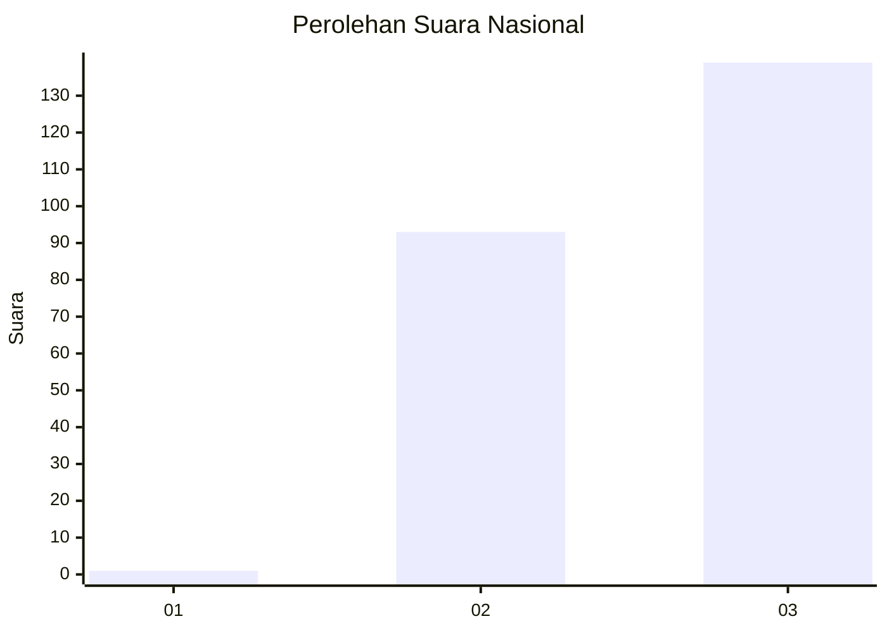
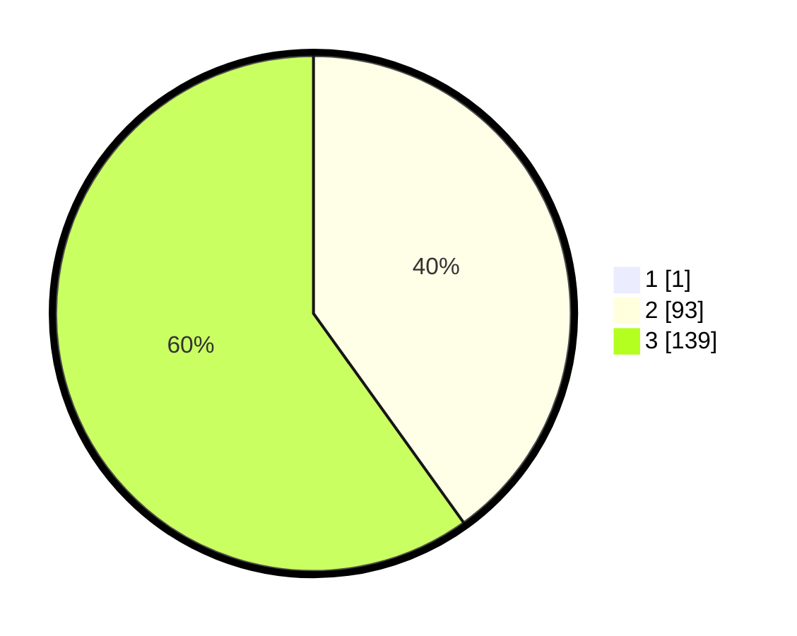

# Hasil

## Grafik

## Tabel

| No. | Nama Paslon    | Suara | Suara (raw) | Persentase |
|:--- |:-------------- | -----:| -----------:| ----------:|
| 1   | ANIES MUHAIMIN | 1     | [1][p-1]    | 0,43       |
| 2   | PRABOWO GIBRAN | 93    | [93][p-2]   | 39,91      |
| 3   | GANJAR MAHFUD  | 139   | [139][p-3]  | 59,66      |

[p-1]: https://github.com/gigit-pemilu/pemilu-2024/blob/main/pilpres/hitung-suara/sub/51-bali/sub/71-kota-denpasar/sub/01-denpasar-selatan/sub/2010-sanur-kauh/sub/002-tps/sub/paslon-1.txt
[p-2]: https://github.com/gigit-pemilu/pemilu-2024/blob/main/pilpres/hitung-suara/sub/51-bali/sub/71-kota-denpasar/sub/01-denpasar-selatan/sub/2010-sanur-kauh/sub/002-tps/sub/paslon-2.txt
[p-3]: https://github.com/gigit-pemilu/pemilu-2024/blob/main/pilpres/hitung-suara/sub/51-bali/sub/71-kota-denpasar/sub/01-denpasar-selatan/sub/2010-sanur-kauh/sub/002-tps/sub/paslon-3.txt

## Foto C Plano

https://sirekap-obj-formc.kpu.go.id/542c/pemilu/ppwp/51/71/01/20/10/5171012010002-20240216-103117--d15735f6-9b39-42b4-bd36-8d2d68861a3d.jpg

https://sirekap-obj-formc.kpu.go.id/542c/pemilu/ppwp/51/71/01/20/10/5171012010002-20240215-023435--b072c237-6675-47cd-8f00-622d59f54abc.jpg

https://sirekap-obj-formc.kpu.go.id/542c/pemilu/ppwp/51/71/01/20/10/5171012010002-20240215-024011--f2b76b50-d9f7-476c-85cd-9570550d2cf5.jpg

## Metadata

| Key        | Value               |
| ---------- | ------------------- |
| Time Stamp | 2024-02-16 11:00:29 |

