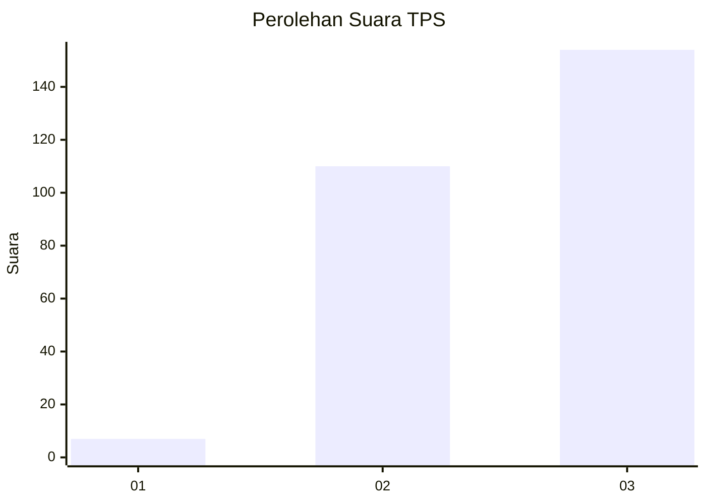
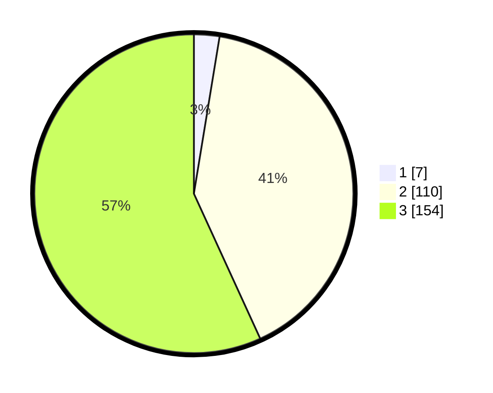

# Hasil

## Grafik

## Tabel

| No. | Nama Paslon    | Suara | Suara (raw) | Persentase |
|:--- |:-------------- | -----:| -----------:| ----------:|
| 1   | ANIES MUHAIMIN | 7     | [7][p-1]    | 2,58       |
| 2   | PRABOWO GIBRAN | 110   | [110][p-2]  | 40,59      |
| 3   | GANJAR MAHFUD  | 154   | [154][p-3]  | 56,83      |

[p-1]: https://github.com/gigit-pemilu/pemilu-2024-51-bali/blob/main/pilpres/hitung-suara/sub/51-bali/sub/71-kota-denpasar/sub/01-denpasar-selatan/sub/2010-sanur-kauh/sub/003-tps/sub/paslon-1.txt
[p-2]: https://github.com/gigit-pemilu/pemilu-2024-51-bali/blob/main/pilpres/hitung-suara/sub/51-bali/sub/71-kota-denpasar/sub/01-denpasar-selatan/sub/2010-sanur-kauh/sub/003-tps/sub/paslon-2.txt
[p-3]: https://github.com/gigit-pemilu/pemilu-2024-51-bali/blob/main/pilpres/hitung-suara/sub/51-bali/sub/71-kota-denpasar/sub/01-denpasar-selatan/sub/2010-sanur-kauh/sub/003-tps/sub/paslon-3.txt

## Foto C Plano

https://sirekap-obj-formc.kpu.go.id/6dbd/pemilu/ppwp/51/71/01/20/10/5171012010003-20240214-141343--6d0a616c-8fc6-40a6-8ad0-7e939a0cea7e.jpg

https://sirekap-obj-formc.kpu.go.id/6dbd/pemilu/ppwp/51/71/01/20/10/5171012010003-20240214-141424--d392b30e-3ed7-4ace-942f-aac8c4deda55.jpg

https://sirekap-obj-formc.kpu.go.id/6dbd/pemilu/ppwp/51/71/01/20/10/5171012010003-20240214-141436--18c543de-3eaf-4ffd-9b07-d32c7147db44.jpg

## Metadata

| Key        | Value               |
| ---------- | ------------------- |
| Time Stamp | 2024-02-16 14:30:33 |

## DATA PEMILIH TETAP

Jumlah pemilih dalam DPT: **282**.
 * L: **141**.
 * P: **141**.

## DATA PENGGUNA HAK PILIH

Jumlah pengguna hak pilih dalam DPT: **258**.
 * L: **130**.
 * P: **128**.

Jumlah pengguna hak pilih dalam DPTb: **5**.
 * L: **3**.
 * P: **2**.

Jumlah pengguna hak pilih dalam DPK: **14**.
 * L: **4**.
 * P: **10**.

Jumlah pengguna hak pilih: **277**.
 * L: **137**.
 * P: **140**.

## JUMLAH SUARA SAH DAN TIDAK SAH

JUMLAH SELURUH SUARA SAH: **271**.

JUMLAH SUARA TIDAK SAH: **6**.

JUMLAH SELURUH SUARA SAH DAN SUARA TIDAK SAH: **277**.

