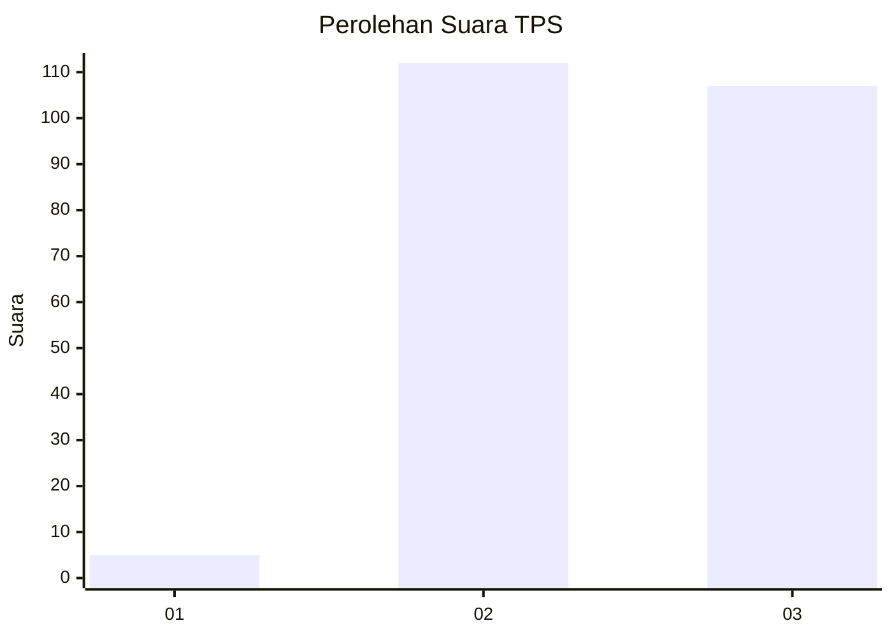
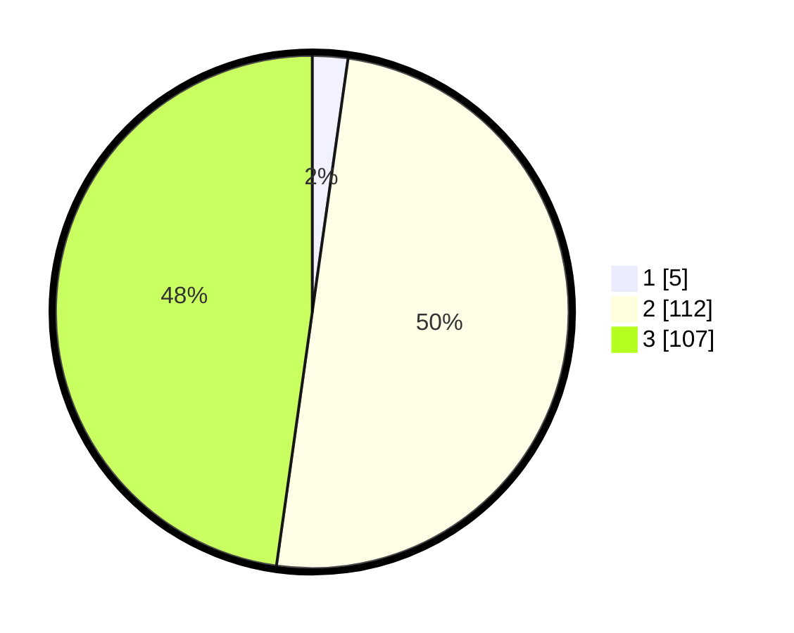

# Hasil

## Grafik

## Tabel

| No. | Nama Paslon    | Suara | Suara (raw) | Persentase |
|:--- |:-------------- | -----:| -----------:| ----------:|
| 1   | ANIES MUHAIMIN | 5     | [5][p-1]    | 2,23       |
| 2   | PRABOWO GIBRAN | 112   | [112][p-2]  | 50,00      |
| 3   | GANJAR MAHFUD  | 107   | [107][p-3]  | 47,77      |

[p-1]: https://github.com/gigit-pemilu/pemilu-2024-51-bali/blob/main/pilpres/hitung-suara/sub/51-bali/sub/71-kota-denpasar/sub/01-denpasar-selatan/sub/2010-sanur-kauh/sub/020-tps/sub/paslon-1.txt
[p-2]: https://github.com/gigit-pemilu/pemilu-2024-51-bali/blob/main/pilpres/hitung-suara/sub/51-bali/sub/71-kota-denpasar/sub/01-denpasar-selatan/sub/2010-sanur-kauh/sub/020-tps/sub/paslon-2.txt
[p-3]: https://github.com/gigit-pemilu/pemilu-2024-51-bali/blob/main/pilpres/hitung-suara/sub/51-bali/sub/71-kota-denpasar/sub/01-denpasar-selatan/sub/2010-sanur-kauh/sub/020-tps/sub/paslon-3.txt

## Foto C Plano

https://sirekap-obj-formc.kpu.go.id/0e45/pemilu/ppwp/51/71/01/20/10/5171012010020-20240214-201053--cb58b63c-0e4a-4ce3-accb-b2de9de73e93.jpg

https://sirekap-obj-formc.kpu.go.id/0e45/pemilu/ppwp/51/71/01/20/10/5171012010020-20240214-201119--b974e205-f948-401d-b9d0-284bec40049a.jpg

https://sirekap-obj-formc.kpu.go.id/0e45/pemilu/ppwp/51/71/01/20/10/5171012010020-20240214-201133--6b49a2f7-a3dc-44b3-85b0-2b895672aee4.jpg

## Metadata

| Key        | Value               |
| ---------- | ------------------- |
| Time Stamp | 2024-02-24 22:31:28 |

