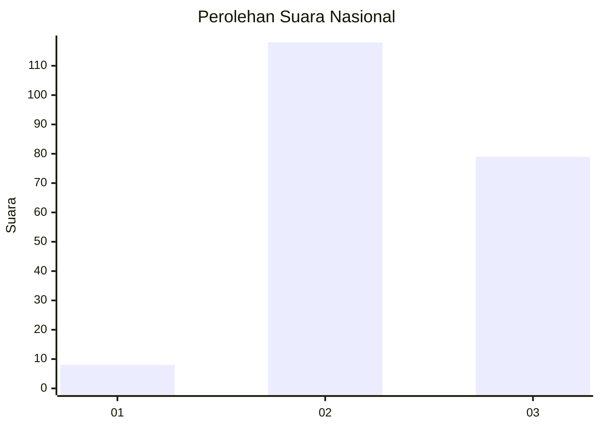
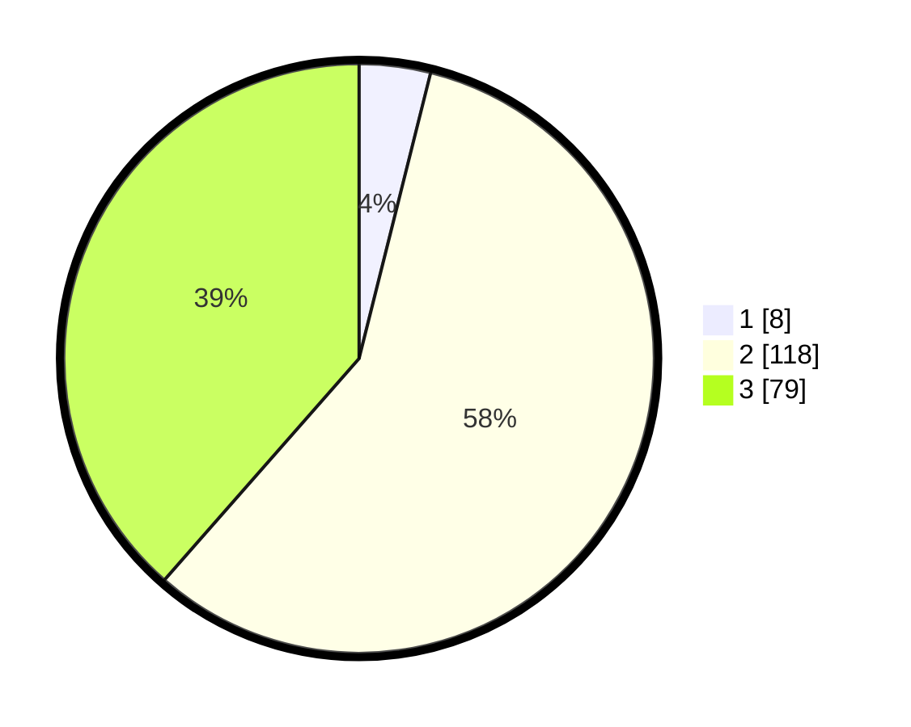

# Hasil

## Grafik

## Tabel

| No. | Nama Paslon    | Suara | Suara (raw) | Persentase |
|:--- |:-------------- | -----:| -----------:| ----------:|
| 1   | ANIES MUHAIMIN | 8     | [8][p-1]    | 3,90       |
| 2   | PRABOWO GIBRAN | 118   | [118][p-2]  | 57,56      |
| 3   | GANJAR MAHFUD  | 79    | [79][p-3]   | 38,54      |

[p-1]: https://github.com/gigit-pemilu/pemilu-2024/blob/main/pilpres/hitung-suara/sub/51-bali/sub/71-kota-denpasar/sub/01-denpasar-selatan/sub/2010-sanur-kauh/sub/022-tps/sub/paslon-1.txt
[p-2]: https://github.com/gigit-pemilu/pemilu-2024/blob/main/pilpres/hitung-suara/sub/51-bali/sub/71-kota-denpasar/sub/01-denpasar-selatan/sub/2010-sanur-kauh/sub/022-tps/sub/paslon-2.txt
[p-3]: https://github.com/gigit-pemilu/pemilu-2024/blob/main/pilpres/hitung-suara/sub/51-bali/sub/71-kota-denpasar/sub/01-denpasar-selatan/sub/2010-sanur-kauh/sub/022-tps/sub/paslon-3.txt

## Foto C Plano

https://sirekap-obj-formc.kpu.go.id/7a0f/pemilu/ppwp/51/71/01/20/10/5171012010022-20240214-232329--9a486524-d167-4bba-bdf0-592df1d341d9.jpg

https://sirekap-obj-formc.kpu.go.id/7a0f/pemilu/ppwp/51/71/01/20/10/5171012010022-20240214-232524--35ffceb7-6246-4f59-9f49-8b0b3388119a.jpg

## Metadata

| Key        | Value               |
| ---------- | ------------------- |
| Time Stamp | 2024-02-24 22:31:28 |

