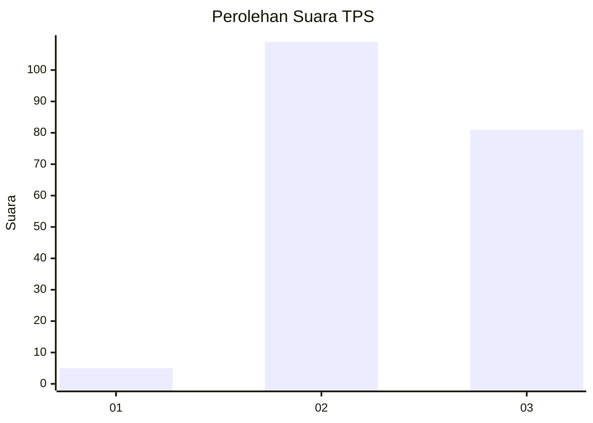
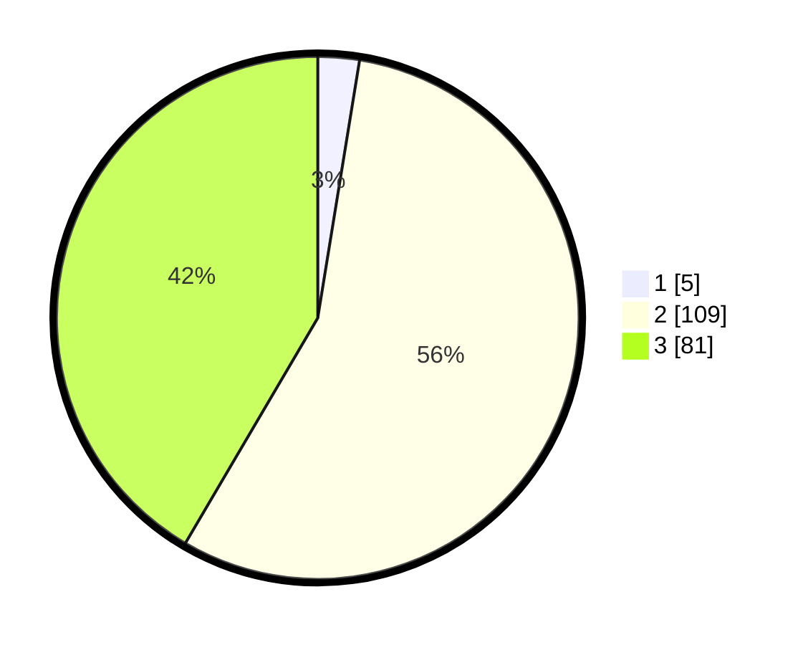

# Hasil

## Grafik

## Tabel

| No. | Nama Paslon    | Suara | Suara (raw) | Persentase |
|:--- |:-------------- | -----:| -----------:| ----------:|
| 1   | ANIES MUHAIMIN | 5     | [5][p-1]    | 2,56       |
| 2   | PRABOWO GIBRAN | 109   | [109][p-2]  | 55,90      |
| 3   | GANJAR MAHFUD  | 81    | [81][p-3]   | 41,54      |

[p-1]: https://github.com/gigit-pemilu/pemilu-2024-51-bali/blob/main/pilpres/hitung-suara/sub/51-bali/sub/71-kota-denpasar/sub/01-denpasar-selatan/sub/2010-sanur-kauh/sub/030-tps/sub/paslon-1.txt
[p-2]: https://github.com/gigit-pemilu/pemilu-2024-51-bali/blob/main/pilpres/hitung-suara/sub/51-bali/sub/71-kota-denpasar/sub/01-denpasar-selatan/sub/2010-sanur-kauh/sub/030-tps/sub/paslon-2.txt
[p-3]: https://github.com/gigit-pemilu/pemilu-2024-51-bali/blob/main/pilpres/hitung-suara/sub/51-bali/sub/71-kota-denpasar/sub/01-denpasar-selatan/sub/2010-sanur-kauh/sub/030-tps/sub/paslon-3.txt

## Foto C Plano

https://sirekap-obj-formc.kpu.go.id/4c80/pemilu/ppwp/51/71/01/20/10/5171012010030-20240214-131101--7bada172-819a-4385-85e9-bbb530b9336e.jpg

https://sirekap-obj-formc.kpu.go.id/4c80/pemilu/ppwp/51/71/01/20/10/5171012010030-20240214-132922--e1d0170e-7e5e-461f-8aa9-93aee7fe228a.jpg

https://sirekap-obj-formc.kpu.go.id/4c80/pemilu/ppwp/51/71/01/20/10/5171012010030-20240214-133115--2055baba-5446-4f7d-8d00-b6caa78c90e6.jpg

## Metadata

| Key        | Value               |
| ---------- | ------------------- |
| Time Stamp | 2024-02-24 22:31:28 |

