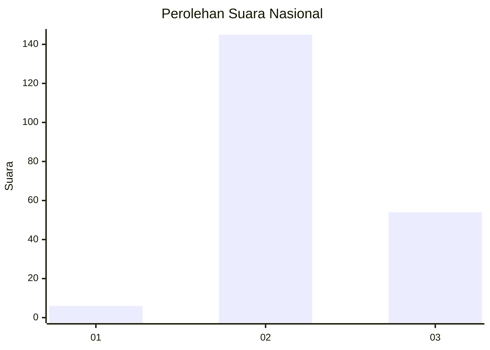
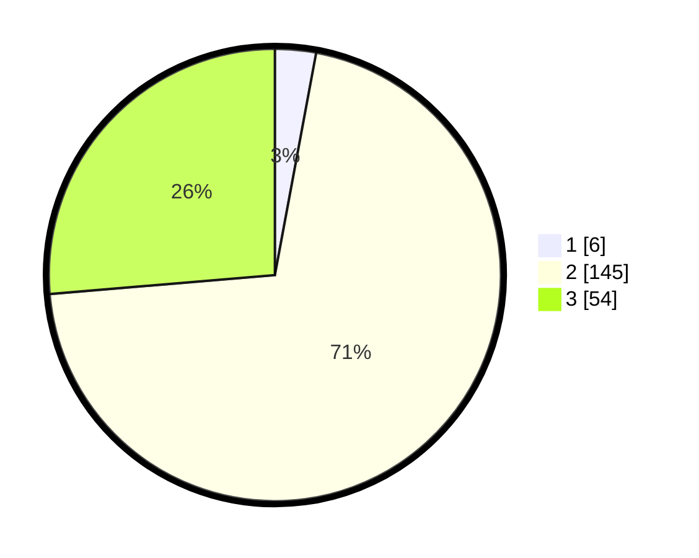

# Hasil

## Grafik

## Tabel

| No. | Nama Paslon    | Suara | Suara (raw) | Persentase |
|:--- |:-------------- | -----:| -----------:| ----------:|
| 1   | ANIES MUHAIMIN | 6     | [6][p-1]    | 2,93       |
| 2   | PRABOWO GIBRAN | 145   | [145][p-2]  | 70,73      |
| 3   | GANJAR MAHFUD  | 54    | [54][p-3]   | 26,34      |

[p-1]: https://github.com/gigit-pemilu/pemilu-2024/blob/main/pilpres/hitung-suara/sub/51-bali/sub/71-kota-denpasar/sub/01-denpasar-selatan/sub/2010-sanur-kauh/sub/032-tps/sub/paslon-1.txt
[p-2]: https://github.com/gigit-pemilu/pemilu-2024/blob/main/pilpres/hitung-suara/sub/51-bali/sub/71-kota-denpasar/sub/01-denpasar-selatan/sub/2010-sanur-kauh/sub/032-tps/sub/paslon-2.txt
[p-3]: https://github.com/gigit-pemilu/pemilu-2024/blob/main/pilpres/hitung-suara/sub/51-bali/sub/71-kota-denpasar/sub/01-denpasar-selatan/sub/2010-sanur-kauh/sub/032-tps/sub/paslon-3.txt

## Foto C Plano

https://sirekap-obj-formc.kpu.go.id/cafb/pemilu/ppwp/51/71/01/20/10/5171012010032-20240214-141056--568d9439-f8ce-4dd3-898e-d53900b1c359.jpg

https://sirekap-obj-formc.kpu.go.id/cafb/pemilu/ppwp/51/71/01/20/10/5171012010032-20240214-141118--05c483a5-1fd6-4c1b-886c-f00ba75ab436.jpg

https://sirekap-obj-formc.kpu.go.id/cafb/pemilu/ppwp/51/71/01/20/10/5171012010032-20240214-140938--d2a6763d-e815-48f5-aec1-a3f3601fd93b.jpg

## Metadata

| Key        | Value               |
| ---------- | ------------------- |
| Time Stamp | 2024-02-24 22:31:28 |

