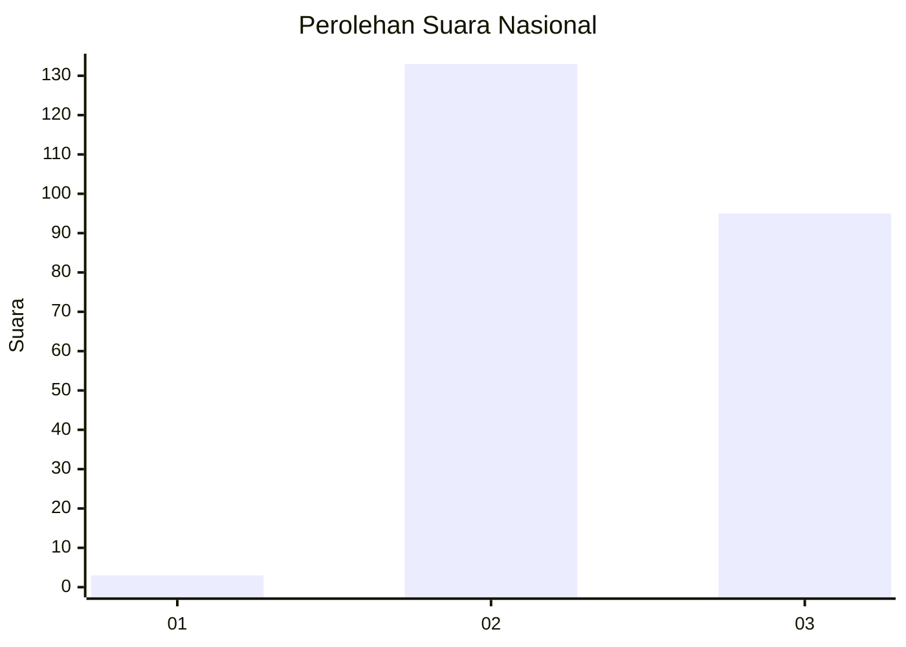
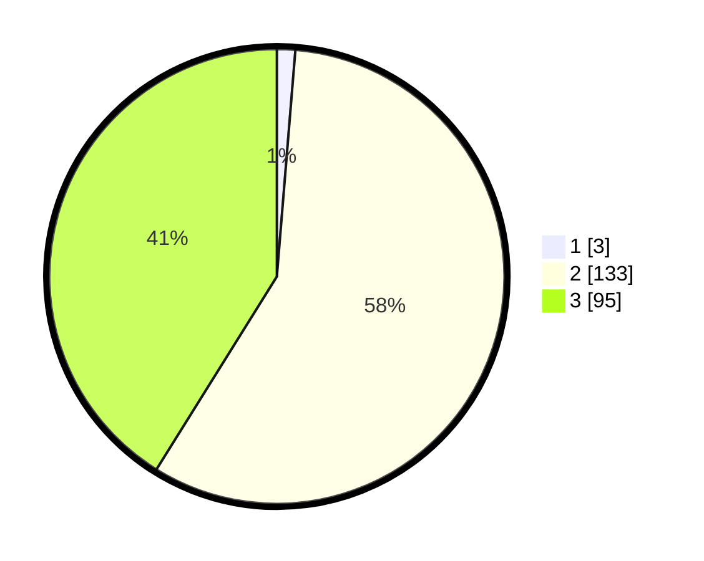

# Hasil

## Grafik

## Tabel

| No. | Nama Paslon    | Suara | Suara (raw) | Persentase |
|:--- |:-------------- | -----:| -----------:| ----------:|
| 1   | ANIES MUHAIMIN | 3     | [3][p-1]    | 1,30       |
| 2   | PRABOWO GIBRAN | 133   | [133][p-2]  | 57,58      |
| 3   | GANJAR MAHFUD  | 95    | [95][p-3]   | 41,13      |

[p-1]: https://github.com/gigit-pemilu/pemilu-2024/blob/main/pilpres/hitung-suara/sub/51-bali/sub/71-kota-denpasar/sub/02-denpasar-timur/sub/1003-kesiman/sub/003-tps/sub/paslon-1.txt
[p-2]: https://github.com/gigit-pemilu/pemilu-2024/blob/main/pilpres/hitung-suara/sub/51-bali/sub/71-kota-denpasar/sub/02-denpasar-timur/sub/1003-kesiman/sub/003-tps/sub/paslon-2.txt
[p-3]: https://github.com/gigit-pemilu/pemilu-2024/blob/main/pilpres/hitung-suara/sub/51-bali/sub/71-kota-denpasar/sub/02-denpasar-timur/sub/1003-kesiman/sub/003-tps/sub/paslon-3.txt

## Foto C Plano

https://sirekap-obj-formc.kpu.go.id/2315/pemilu/ppwp/51/71/02/10/03/5171021003003-20240214-215652--4fc00be5-7040-4754-9a50-7881157e72cc.jpg

https://sirekap-obj-formc.kpu.go.id/2315/pemilu/ppwp/51/71/02/10/03/5171021003003-20240214-215948--89d94103-a0b2-42af-9e4d-53b889fb8713.jpg

https://sirekap-obj-formc.kpu.go.id/2315/pemilu/ppwp/51/71/02/10/03/5171021003003-20240214-220414--59cbe759-fc45-4eb8-8e20-759f61ef1129.jpg

## Metadata

| Key        | Value               |
| ---------- | ------------------- |
| Time Stamp | 2024-02-16 23:45:47 |

## DATA PEMILIH TETAP

Jumlah pemilih dalam DPT: **271**.
 * L: **118**.
 * P: **113**.

## DATA PENGGUNA HAK PILIH

Jumlah pengguna hak pilih dalam DPT: **231**.
 * L: **118**.
 * P: **113**.

Jumlah pengguna hak pilih dalam DPTb: **2**.
 * L: **1**.
 * P: **1**.

Jumlah pengguna hak pilih dalam DPK: **0**.
 * L: **0**.
 * P: **0**.

Jumlah pengguna hak pilih: **233**.
 * L: **119**.
 * P: **114**.

## JUMLAH SUARA SAH DAN TIDAK SAH

JUMLAH SELURUH SUARA SAH: **231**.

JUMLAH SUARA TIDAK SAH: **2**.

JUMLAH SELURUH SUARA SAH DAN SUARA TIDAK SAH: **233**.

