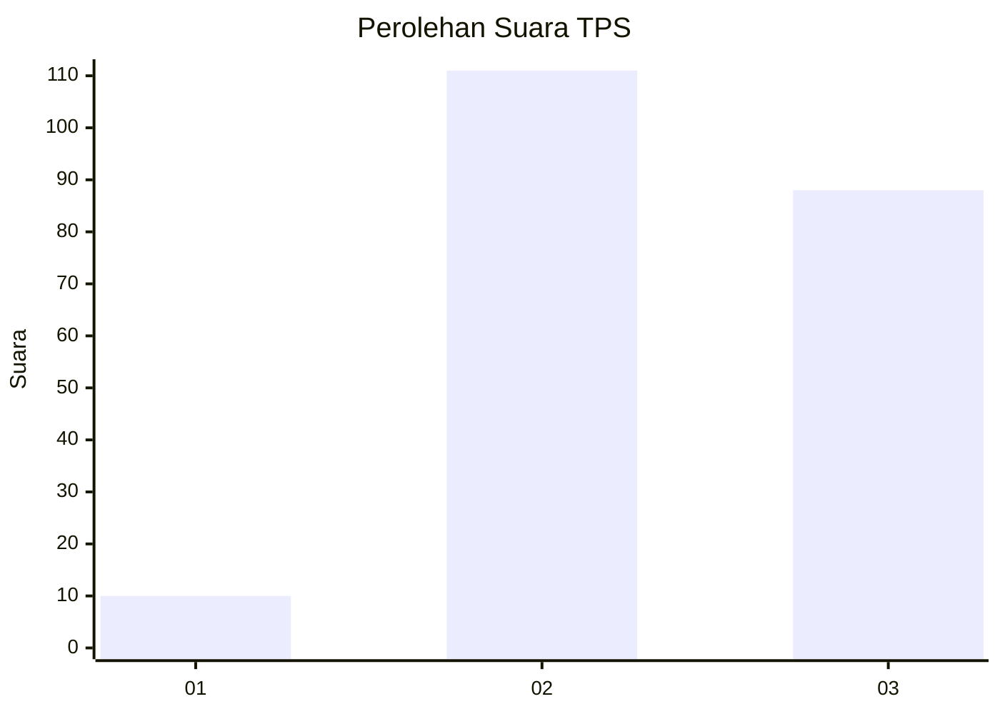
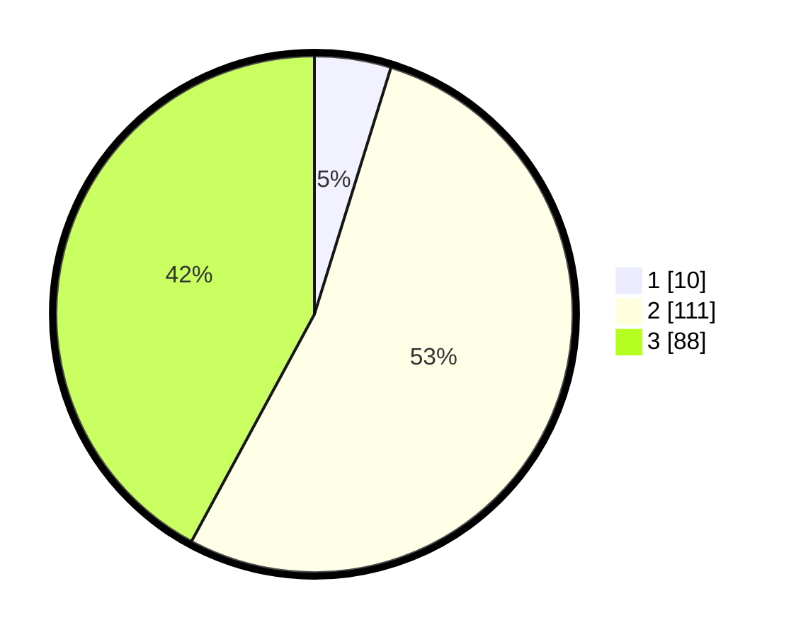

# Hasil

## Grafik

## Tabel

| No. | Nama Paslon    | Suara | Suara (raw) | Persentase |
|:--- |:-------------- | -----:| -----------:| ----------:|
| 1   | ANIES MUHAIMIN | 10    | [10][p-1]   | 4,78       |
| 2   | PRABOWO GIBRAN | 111   | [111][p-2]  | 53,11      |
| 3   | GANJAR MAHFUD  | 88    | [88][p-3]   | 42,11      |

[p-1]: https://github.com/gigit-pemilu/pemilu-2024-51-bali/blob/main/pilpres/hitung-suara/sub/51-bali/sub/71-kota-denpasar/sub/02-denpasar-timur/sub/1003-kesiman/sub/008-tps/sub/paslon-1.txt
[p-2]: https://github.com/gigit-pemilu/pemilu-2024-51-bali/blob/main/pilpres/hitung-suara/sub/51-bali/sub/71-kota-denpasar/sub/02-denpasar-timur/sub/1003-kesiman/sub/008-tps/sub/paslon-2.txt
[p-3]: https://github.com/gigit-pemilu/pemilu-2024-51-bali/blob/main/pilpres/hitung-suara/sub/51-bali/sub/71-kota-denpasar/sub/02-denpasar-timur/sub/1003-kesiman/sub/008-tps/sub/paslon-3.txt

## Foto C Plano

https://sirekap-obj-formc.kpu.go.id/b6f1/pemilu/ppwp/51/71/02/10/03/5171021003008-20240214-141430--5e30e2e3-f64a-4e76-aecb-3472ce0f2534.jpg

https://sirekap-obj-formc.kpu.go.id/b6f1/pemilu/ppwp/51/71/02/10/03/5171021003008-20240214-141501--94693b47-596c-41e5-8fdc-91b8987d4035.jpg

https://sirekap-obj-formc.kpu.go.id/b6f1/pemilu/ppwp/51/71/02/10/03/5171021003008-20240214-141718--6ef36e74-fd09-43f0-99d6-717ca5e30ee6.jpg

## Metadata

| Key        | Value               |
| ---------- | ------------------- |
| Time Stamp | 2024-02-16 22:01:00 |

## DATA PEMILIH TETAP

Jumlah pemilih dalam DPT: **240**.
 * L: **113**.
 * P: **127**.

## DATA PENGGUNA HAK PILIH

Jumlah pengguna hak pilih dalam DPT: **208**.
 * L: **111**.
 * P: **97**.

Jumlah pengguna hak pilih dalam DPTb: **2**.
 * L: **1**.
 * P: **1**.

Jumlah pengguna hak pilih dalam DPK: **1**.
 * L: **0**.
 * P: **1**.

Jumlah pengguna hak pilih: **211**.
 * L: **112**.
 * P: **99**.

## JUMLAH SUARA SAH DAN TIDAK SAH

JUMLAH SELURUH SUARA SAH: **209**.

JUMLAH SUARA TIDAK SAH: **2**.

JUMLAH SELURUH SUARA SAH DAN SUARA TIDAK SAH: **211**.

