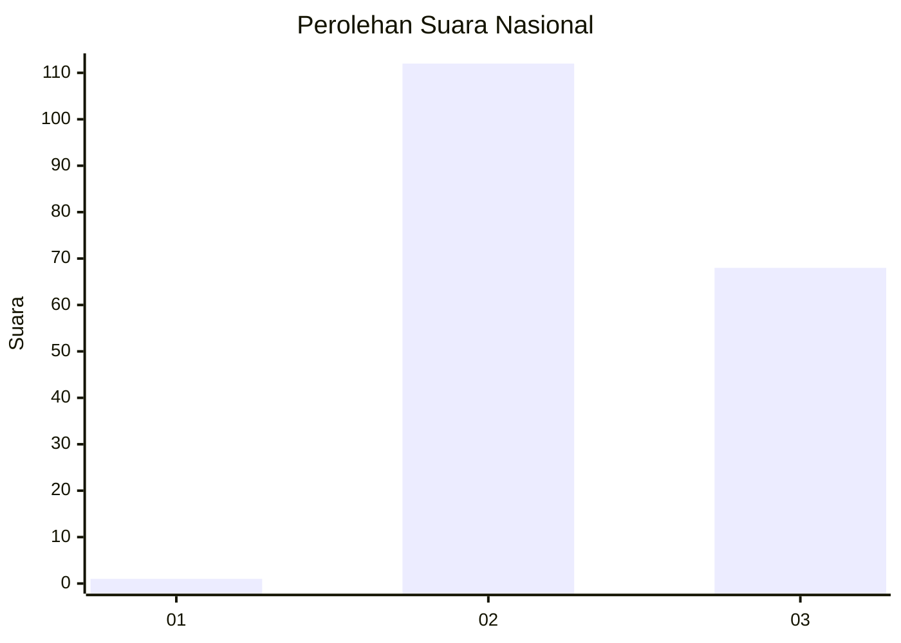
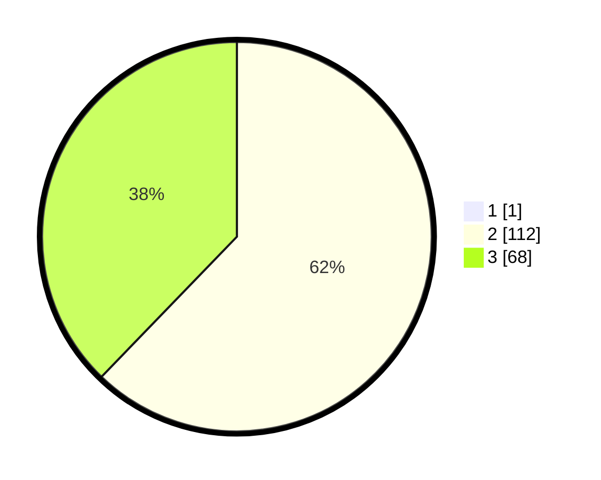

# Hasil

## Grafik

## Tabel

| No. | Nama Paslon    | Suara | Suara (raw) | Persentase |
|:--- |:-------------- | -----:| -----------:| ----------:|
| 1   | ANIES MUHAIMIN | 1     | [1][p-1]    | 0,55       |
| 2   | PRABOWO GIBRAN | 112   | [112][p-2]  | 61,88      |
| 3   | GANJAR MAHFUD  | 68    | [68][p-3]   | 37,57      |

[p-1]: https://github.com/gigit-pemilu/pemilu-2024/blob/main/pilpres/hitung-suara/sub/51-bali/sub/71-kota-denpasar/sub/02-denpasar-timur/sub/1003-kesiman/sub/009-tps/sub/paslon-1.txt
[p-2]: https://github.com/gigit-pemilu/pemilu-2024/blob/main/pilpres/hitung-suara/sub/51-bali/sub/71-kota-denpasar/sub/02-denpasar-timur/sub/1003-kesiman/sub/009-tps/sub/paslon-2.txt
[p-3]: https://github.com/gigit-pemilu/pemilu-2024/blob/main/pilpres/hitung-suara/sub/51-bali/sub/71-kota-denpasar/sub/02-denpasar-timur/sub/1003-kesiman/sub/009-tps/sub/paslon-3.txt

## Foto C Plano

https://sirekap-obj-formc.kpu.go.id/ad00/pemilu/ppwp/51/71/02/10/03/5171021003009-20240216-173403--507fbee8-4ff4-4f3e-a9b9-26288195c33c.jpg

https://sirekap-obj-formc.kpu.go.id/ad00/pemilu/ppwp/51/71/02/10/03/5171021003009-20240216-174001--4047d561-5861-4e9b-bb00-104838e9f686.jpg

https://sirekap-obj-formc.kpu.go.id/ad00/pemilu/ppwp/51/71/02/10/03/5171021003009-20240216-174219--b4631e8d-e8ef-4206-a048-b6fa67a6e2c4.jpg

## Metadata

| Key        | Value               |
| ---------- | ------------------- |
| Time Stamp | 2024-02-16 23:45:47 |

## DATA PEMILIH TETAP

Jumlah pemilih dalam DPT: **233**.
 * L: **120**.
 * P: **113**.

## DATA PENGGUNA HAK PILIH

Jumlah pengguna hak pilih dalam DPT: **181**.
 * L: **91**.
 * P: **90**.

Jumlah pengguna hak pilih dalam DPTb: **1**.
 * L: **0**.
 * P: **1**.

Jumlah pengguna hak pilih dalam DPK: **0**.
 * L: **0**.
 * P: **0**.

Jumlah pengguna hak pilih: **182**.
 * L: **91**.
 * P: **91**.

## JUMLAH SUARA SAH DAN TIDAK SAH

JUMLAH SELURUH SUARA SAH: **181**.

JUMLAH SUARA TIDAK SAH: **1**.

JUMLAH SELURUH SUARA SAH DAN SUARA TIDAK SAH: **182**.

