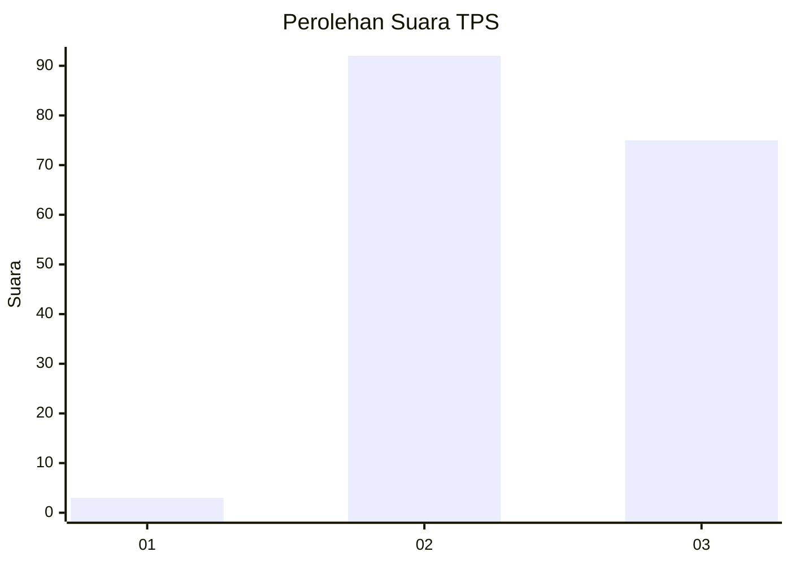
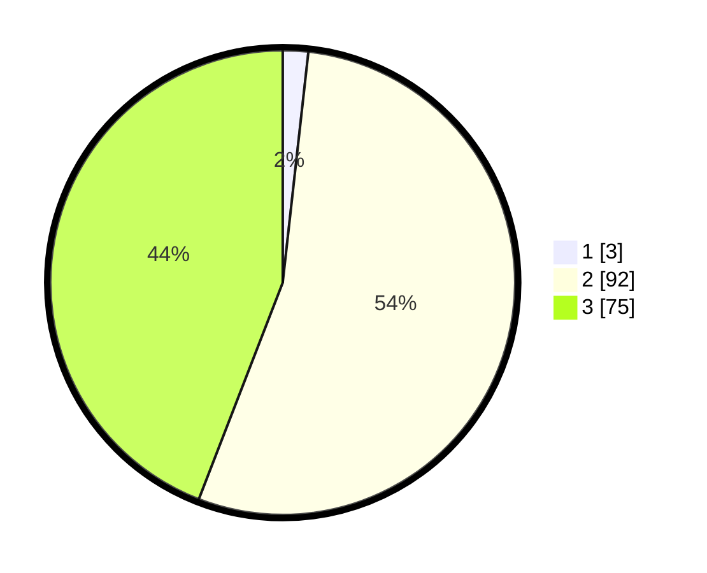

# Hasil

## Grafik

## Tabel

| No. | Nama Paslon    | Suara | Suara (raw) | Persentase |
|:--- |:-------------- | -----:| -----------:| ----------:|
| 1   | ANIES MUHAIMIN | 3     | [3][p-1]    | 1,76       |
| 2   | PRABOWO GIBRAN | 92    | [92][p-2]   | 54,12      |
| 3   | GANJAR MAHFUD  | 75    | [75][p-3]   | 44,12      |

[p-1]: https://github.com/gigit-pemilu/pemilu-2024-51-bali/blob/main/pilpres/hitung-suara/sub/51-bali/sub/71-kota-denpasar/sub/02-denpasar-timur/sub/1003-kesiman/sub/011-tps/sub/paslon-1.txt
[p-2]: https://github.com/gigit-pemilu/pemilu-2024-51-bali/blob/main/pilpres/hitung-suara/sub/51-bali/sub/71-kota-denpasar/sub/02-denpasar-timur/sub/1003-kesiman/sub/011-tps/sub/paslon-2.txt
[p-3]: https://github.com/gigit-pemilu/pemilu-2024-51-bali/blob/main/pilpres/hitung-suara/sub/51-bali/sub/71-kota-denpasar/sub/02-denpasar-timur/sub/1003-kesiman/sub/011-tps/sub/paslon-3.txt

## Foto C Plano

https://sirekap-obj-formc.kpu.go.id/e1c9/pemilu/ppwp/51/71/02/10/03/5171021003011-20240215-004630--88d4fe2c-773f-4e1f-ab97-03a8505e78c6.jpg

https://sirekap-obj-formc.kpu.go.id/e1c9/pemilu/ppwp/51/71/02/10/03/5171021003011-20240215-004845--3abde7d8-4b2e-4454-9181-f79b4da3ea7a.jpg

https://sirekap-obj-formc.kpu.go.id/e1c9/pemilu/ppwp/51/71/02/10/03/5171021003011-20240215-004948--ea8c494d-dbad-4aa0-8bf5-95ffa378e119.jpg

## Metadata

| Key        | Value               |
| ---------- | ------------------- |
| Time Stamp | 2024-02-24 22:31:28 |

