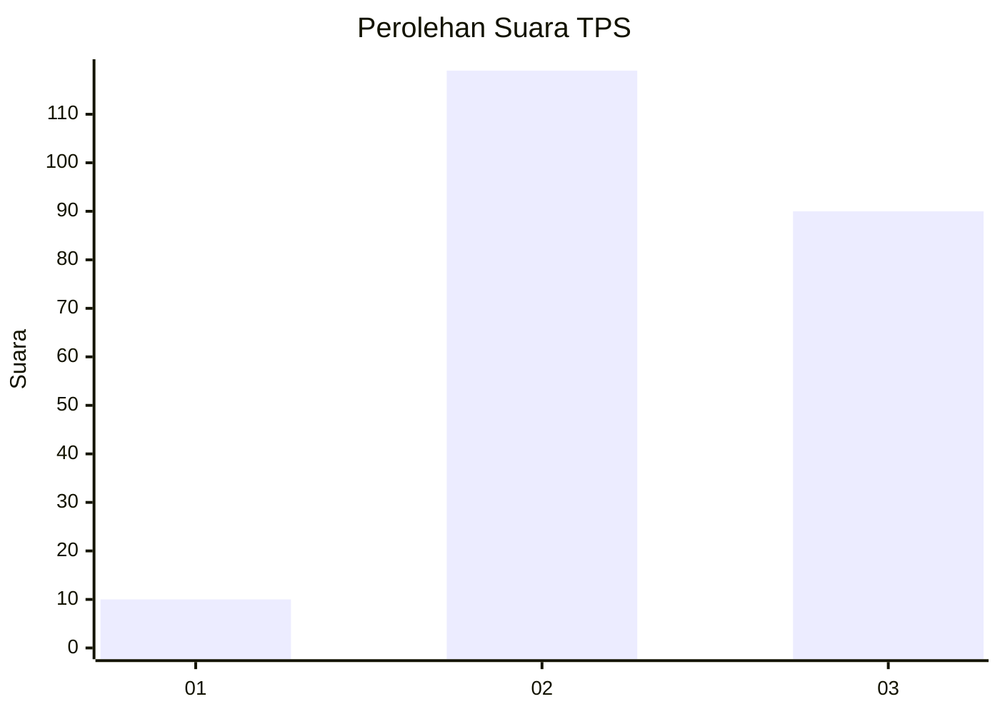
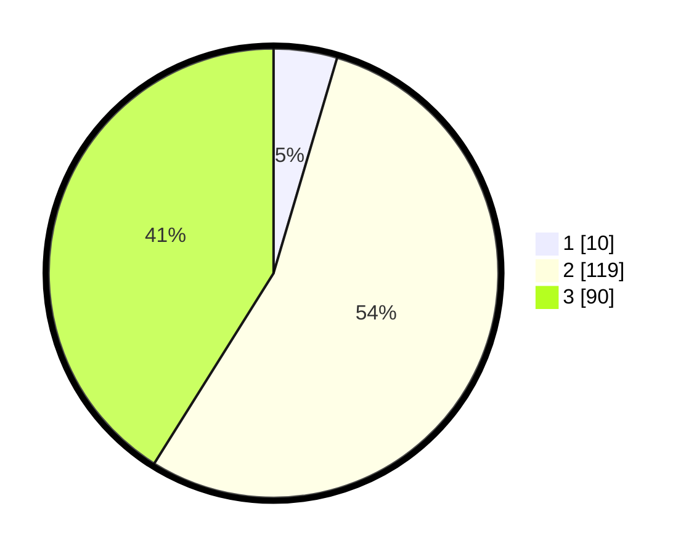

# Hasil

## Grafik

## Tabel

| No. | Nama Paslon    | Suara | Suara (raw) | Persentase |
|:--- |:-------------- | -----:| -----------:| ----------:|
| 1   | ANIES MUHAIMIN | 10    | [10][p-1]   | 4,57       |
| 2   | PRABOWO GIBRAN | 119   | [119][p-2]  | 54,34      |
| 3   | GANJAR MAHFUD  | 90    | [90][p-3]   | 41,10      |

[p-1]: https://github.com/gigit-pemilu/pemilu-2024-51-bali/blob/main/pilpres/hitung-suara/sub/51-bali/sub/71-kota-denpasar/sub/02-denpasar-timur/sub/1003-kesiman/sub/020-tps/sub/paslon-1.txt
[p-2]: https://github.com/gigit-pemilu/pemilu-2024-51-bali/blob/main/pilpres/hitung-suara/sub/51-bali/sub/71-kota-denpasar/sub/02-denpasar-timur/sub/1003-kesiman/sub/020-tps/sub/paslon-2.txt
[p-3]: https://github.com/gigit-pemilu/pemilu-2024-51-bali/blob/main/pilpres/hitung-suara/sub/51-bali/sub/71-kota-denpasar/sub/02-denpasar-timur/sub/1003-kesiman/sub/020-tps/sub/paslon-3.txt

## Foto C Plano

https://sirekap-obj-formc.kpu.go.id/89d3/pemilu/ppwp/51/71/02/10/03/5171021003020-20240214-220308--7200ea02-19aa-433c-93fb-a745d2afedaa.jpg

https://sirekap-obj-formc.kpu.go.id/89d3/pemilu/ppwp/51/71/02/10/03/5171021003020-20240214-200154--25a50efb-a3a9-43cb-bfc5-274bb1711b34.jpg

https://sirekap-obj-formc.kpu.go.id/89d3/pemilu/ppwp/51/71/02/10/03/5171021003020-20240214-200148--a3fb42f6-d3af-4818-b983-d818174c6dd6.jpg

## Metadata

| Key        | Value               |
| ---------- | ------------------- |
| Time Stamp | 2024-02-16 22:30:00 |

