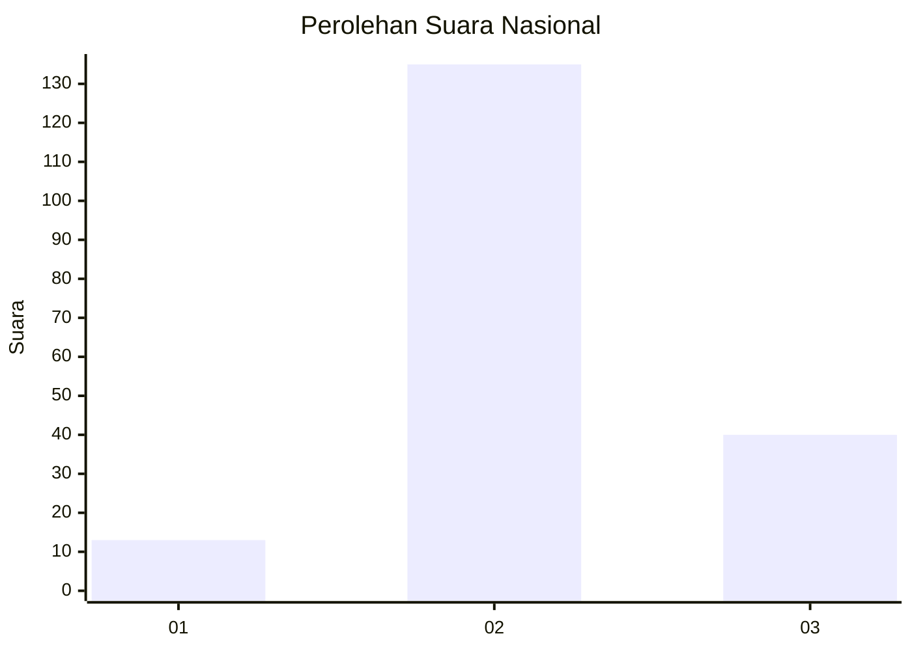

# Hasil

## Grafik

## Tabel

| No. | Nama Paslon    | Suara | Suara (raw) | Persentase |
|:--- |:-------------- | -----:| -----------:| ----------:|
| 1   | ANIES MUHAIMIN | 13    | [13][p-1]   | 6,91       |
| 2   | PRABOWO GIBRAN | 135   | [135][p-2]  | 71,81      |
| 3   | GANJAR MAHFUD  | 40    | [40][p-3]   | 21,28      |

[p-1]: https://github.com/gigit-pemilu/pemilu-2024/blob/main/pilpres/hitung-suara/sub/51-bali/sub/71-kota-denpasar/sub/02-denpasar-timur/sub/1003-kesiman/sub/030-tps/sub/paslon-1.txt
[p-2]: https://github.com/gigit-pemilu/pemilu-2024/blob/main/pilpres/hitung-suara/sub/51-bali/sub/71-kota-denpasar/sub/02-denpasar-timur/sub/1003-kesiman/sub/030-tps/sub/paslon-2.txt
[p-3]: https://github.com/gigit-pemilu/pemilu-2024/blob/main/pilpres/hitung-suara/sub/51-bali/sub/71-kota-denpasar/sub/02-denpasar-timur/sub/1003-kesiman/sub/030-tps/sub/paslon-3.txt

## Foto C Plano

https://sirekap-obj-formc.kpu.go.id/1dc9/pemilu/ppwp/51/71/02/10/03/5171021003030-20240214-235001--1b8d3aef-1a27-44c8-86b3-70caeb6c4d7f.jpg

https://sirekap-obj-formc.kpu.go.id/1dc9/pemilu/ppwp/51/71/02/10/03/5171021003030-20240214-235102--cf157431-d43c-473b-99f2-5af31d1346af.jpg

https://sirekap-obj-formc.kpu.go.id/1dc9/pemilu/ppwp/51/71/02/10/03/5171021003030-20240214-235130--3f7083aa-d3da-4c12-a6a6-6b38d6689828.jpg

## Metadata

| Key        | Value               |
| ---------- | ------------------- |
| Time Stamp | 2024-02-20 10:00:00 |

