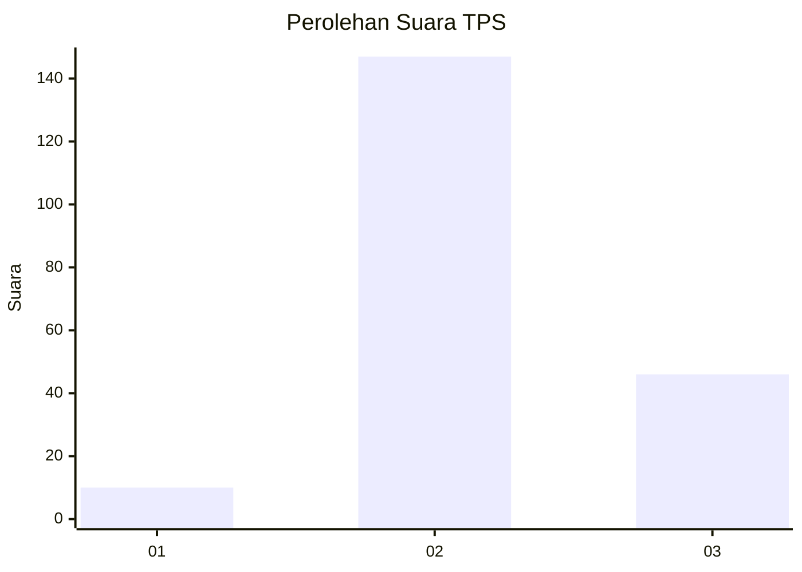
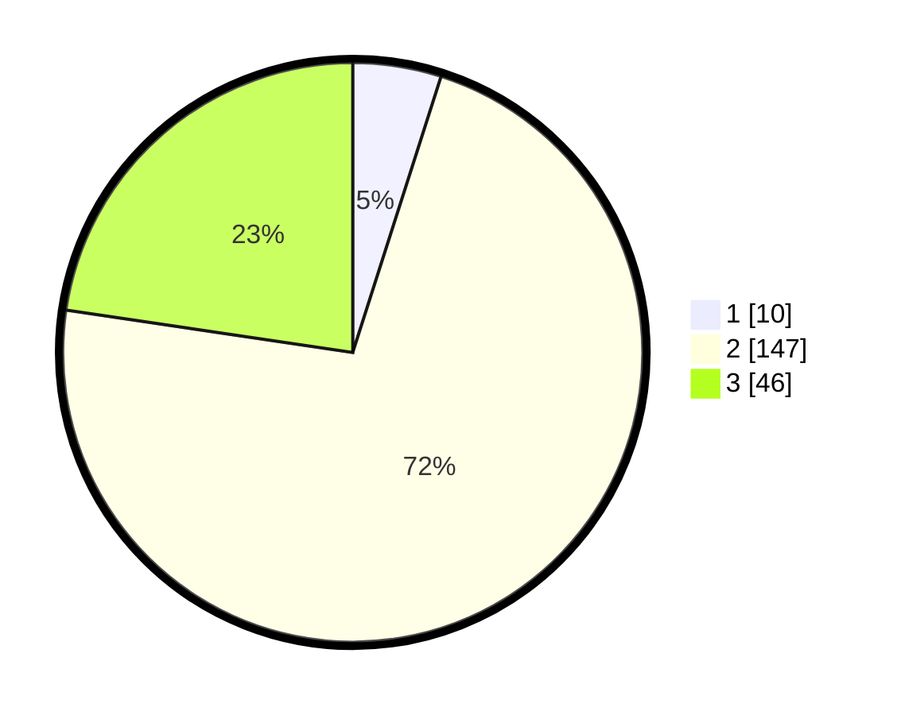

# Hasil

## Grafik

## Tabel

| No. | Nama Paslon    | Suara | Suara (raw) | Persentase |
|:--- |:-------------- | -----:| -----------:| ----------:|
| 1   | ANIES MUHAIMIN | 10    | [10][p-1]   | 4,93       |
| 2   | PRABOWO GIBRAN | 147   | [147][p-2]  | 72,41      |
| 3   | GANJAR MAHFUD  | 46    | [46][p-3]   | 22,66      |

[p-1]: https://github.com/gigit-pemilu/pemilu-2024-51-bali/blob/main/pilpres/hitung-suara/sub/51-bali/sub/71-kota-denpasar/sub/02-denpasar-timur/sub/1003-kesiman/sub/032-tps/sub/paslon-1.txt
[p-2]: https://github.com/gigit-pemilu/pemilu-2024-51-bali/blob/main/pilpres/hitung-suara/sub/51-bali/sub/71-kota-denpasar/sub/02-denpasar-timur/sub/1003-kesiman/sub/032-tps/sub/paslon-2.txt
[p-3]: https://github.com/gigit-pemilu/pemilu-2024-51-bali/blob/main/pilpres/hitung-suara/sub/51-bali/sub/71-kota-denpasar/sub/02-denpasar-timur/sub/1003-kesiman/sub/032-tps/sub/paslon-3.txt

## Foto C Plano

https://sirekap-obj-formc.kpu.go.id/c62d/pemilu/ppwp/51/71/02/10/03/5171021003032-20240214-235759--1203eeb8-f16a-4371-b2b1-0fca7dcd46e5.jpg

https://sirekap-obj-formc.kpu.go.id/c62d/pemilu/ppwp/51/71/02/10/03/5171021003032-20240214-235807--913dc36e-f03d-46d2-96f5-f59aec35cac0.jpg

https://sirekap-obj-formc.kpu.go.id/c62d/pemilu/ppwp/51/71/02/10/03/5171021003032-20240214-235834--7e22f195-bc55-4027-ae5f-d71e7a27904b.jpg

## Metadata

| Key        | Value               |
| ---------- | ------------------- |
| Time Stamp | 2024-02-24 22:31:28 |

