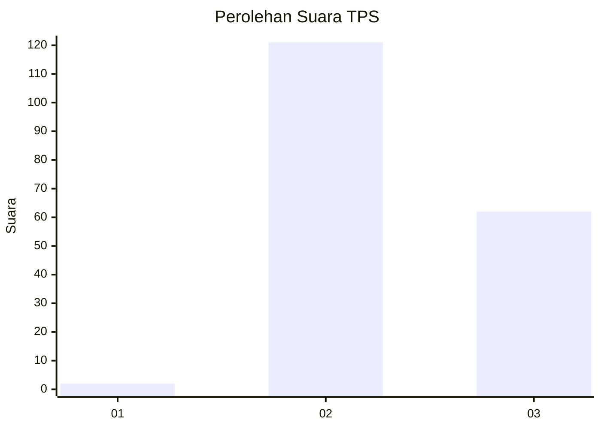
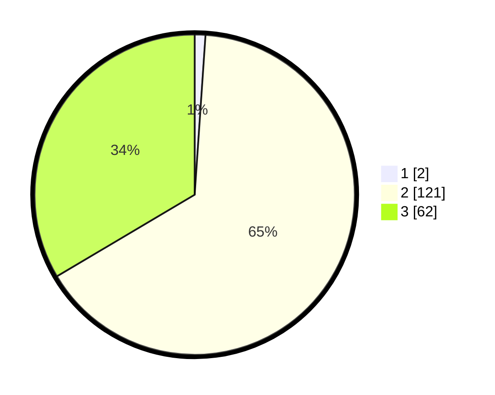

# Hasil

## Grafik

## Tabel

| No. | Nama Paslon    | Suara | Suara (raw) | Persentase |
|:--- |:-------------- | -----:| -----------:| ----------:|
| 1   | ANIES MUHAIMIN | 2     | [2][p-1]    | 1,08       |
| 2   | PRABOWO GIBRAN | 121   | [121][p-2]  | 65,41      |
| 3   | GANJAR MAHFUD  | 62    | [62][p-3]   | 33,51      |

[p-1]: https://github.com/gigit-pemilu/pemilu-2024-51-bali/blob/main/pilpres/hitung-suara/sub/51-bali/sub/71-kota-denpasar/sub/02-denpasar-timur/sub/1003-kesiman/sub/034-tps/sub/paslon-1.txt
[p-2]: https://github.com/gigit-pemilu/pemilu-2024-51-bali/blob/main/pilpres/hitung-suara/sub/51-bali/sub/71-kota-denpasar/sub/02-denpasar-timur/sub/1003-kesiman/sub/034-tps/sub/paslon-2.txt
[p-3]: https://github.com/gigit-pemilu/pemilu-2024-51-bali/blob/main/pilpres/hitung-suara/sub/51-bali/sub/71-kota-denpasar/sub/02-denpasar-timur/sub/1003-kesiman/sub/034-tps/sub/paslon-3.txt

## Foto C Plano

https://sirekap-obj-formc.kpu.go.id/ee1d/pemilu/ppwp/51/71/02/10/03/5171021003034-20240215-021708--0b9267cd-febe-4ef2-b5b3-671a93093e73.jpg

https://sirekap-obj-formc.kpu.go.id/ee1d/pemilu/ppwp/51/71/02/10/03/5171021003034-20240215-021717--dedf4ff6-5418-42fb-9008-35b1fd80c6d4.jpg

https://sirekap-obj-formc.kpu.go.id/ee1d/pemilu/ppwp/51/71/02/10/03/5171021003034-20240215-021724--d697da00-f7cd-4c7e-bb64-3ebebab33173.jpg

## Metadata

| Key        | Value               |
| ---------- | ------------------- |
| Time Stamp | 2024-02-24 22:31:28 |

