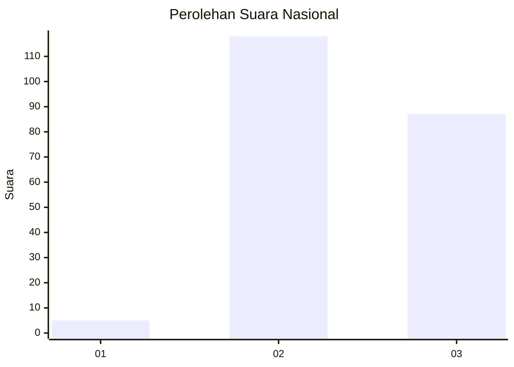
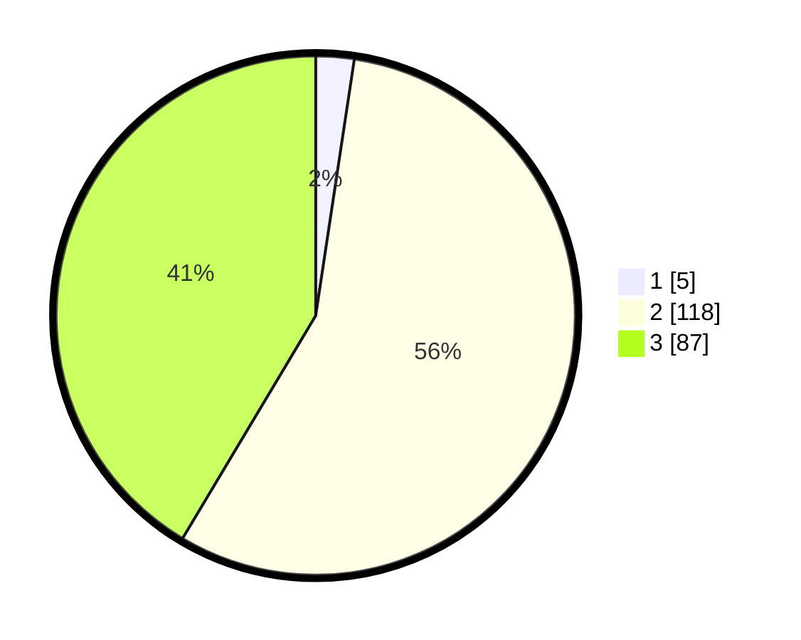

# Hasil

## Grafik

## Tabel

| No. | Nama Paslon    | Suara | Suara (raw) | Persentase |
|:--- |:-------------- | -----:| -----------:| ----------:|
| 1   | ANIES MUHAIMIN | 5     | [5][p-1]    | 2,38       |
| 2   | PRABOWO GIBRAN | 118   | [118][p-2]  | 56,19      |
| 3   | GANJAR MAHFUD  | 87    | [87][p-3]   | 41,43      |

[p-1]: https://github.com/gigit-pemilu/pemilu-2024/blob/main/pilpres/hitung-suara/sub/51-bali/sub/71-kota-denpasar/sub/02-denpasar-timur/sub/1003-kesiman/sub/036-tps/sub/paslon-1.txt
[p-2]: https://github.com/gigit-pemilu/pemilu-2024/blob/main/pilpres/hitung-suara/sub/51-bali/sub/71-kota-denpasar/sub/02-denpasar-timur/sub/1003-kesiman/sub/036-tps/sub/paslon-2.txt
[p-3]: https://github.com/gigit-pemilu/pemilu-2024/blob/main/pilpres/hitung-suara/sub/51-bali/sub/71-kota-denpasar/sub/02-denpasar-timur/sub/1003-kesiman/sub/036-tps/sub/paslon-3.txt

## Foto C Plano

https://sirekap-obj-formc.kpu.go.id/0e24/pemilu/ppwp/51/71/02/10/03/5171021003036-20240214-141341--4b6d8d81-8637-4c27-bf9e-9f9c753abc37.jpg

https://sirekap-obj-formc.kpu.go.id/0e24/pemilu/ppwp/51/71/02/10/03/5171021003036-20240214-141428--f8ea0ef0-40c6-4475-be71-b74f265a336f.jpg

https://sirekap-obj-formc.kpu.go.id/0e24/pemilu/ppwp/51/71/02/10/03/5171021003036-20240214-141525--2d1c673d-4cc2-4d7d-b896-fee61e79c522.jpg

## Metadata

| Key        | Value               |
| ---------- | ------------------- |
| Time Stamp | 2024-02-15 00:41:44 |

## DATA PEMILIH TETAP

Jumlah pemilih dalam DPT: **254**.
 * L: **124**.
 * P: **130**.

## DATA PENGGUNA HAK PILIH

Jumlah pengguna hak pilih dalam DPT: **204**.
 * L: **101**.
 * P: **103**.

Jumlah pengguna hak pilih dalam DPTb: **0**.
 * L: **0**.
 * P: **0**.

Jumlah pengguna hak pilih dalam DPK: **8**.
 * L: **6**.
 * P: **2**.

Jumlah pengguna hak pilih: **212**.
 * L: **107**.
 * P: **105**.

## JUMLAH SUARA SAH DAN TIDAK SAH

JUMLAH SELURUH SUARA SAH: **210**.

JUMLAH SUARA TIDAK SAH: **2**.

JUMLAH SELURUH SUARA SAH DAN SUARA TIDAK SAH: **212**.

