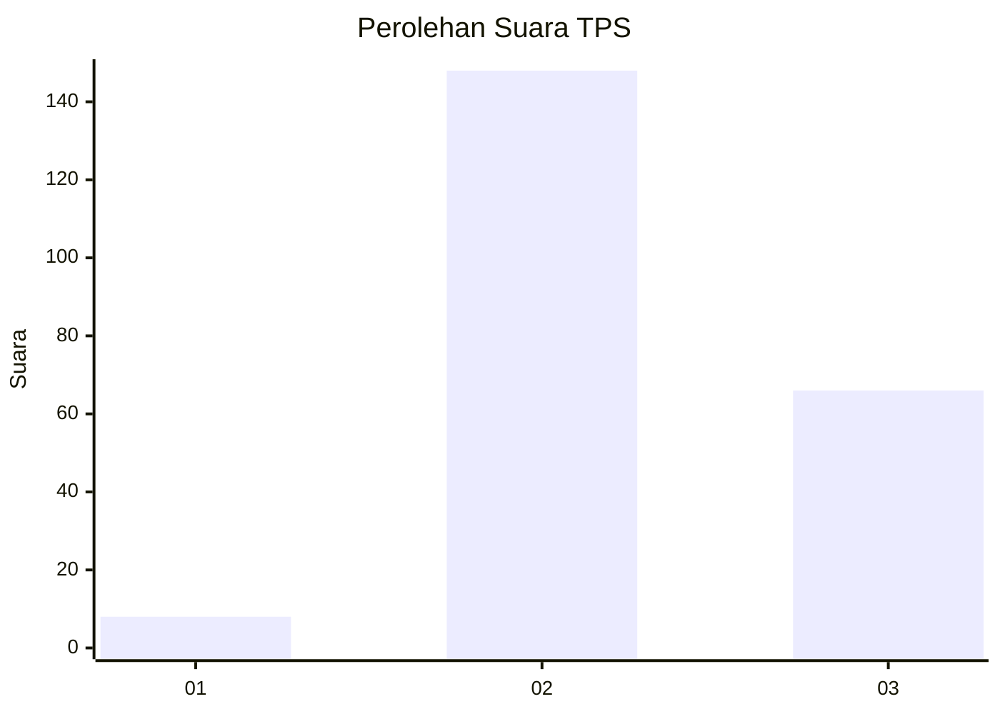

# Hasil

## Grafik

## Tabel

| No. | Nama Paslon    | Suara | Suara (raw) | Persentase |
|:--- |:-------------- | -----:| -----------:| ----------:|
| 1   | ANIES MUHAIMIN | 8     | [8][p-1]    | 3,60       |
| 2   | PRABOWO GIBRAN | 148   | [148][p-2]  | 66,67      |
| 3   | GANJAR MAHFUD  | 66    | [66][p-3]   | 29,73      |

[p-1]: https://github.com/gigit-pemilu/pemilu-2024-51-bali/blob/main/pilpres/hitung-suara/sub/51-bali/sub/71-kota-denpasar/sub/02-denpasar-timur/sub/1006-sumerta/sub/002-tps/sub/paslon-1.txt
[p-2]: https://github.com/gigit-pemilu/pemilu-2024-51-bali/blob/main/pilpres/hitung-suara/sub/51-bali/sub/71-kota-denpasar/sub/02-denpasar-timur/sub/1006-sumerta/sub/002-tps/sub/paslon-2.txt
[p-3]: https://github.com/gigit-pemilu/pemilu-2024-51-bali/blob/main/pilpres/hitung-suara/sub/51-bali/sub/71-kota-denpasar/sub/02-denpasar-timur/sub/1006-sumerta/sub/002-tps/sub/paslon-3.txt

## Foto C Plano

https://sirekap-obj-formc.kpu.go.id/01fc/pemilu/ppwp/51/71/02/10/06/5171021006002-20240214-235430--aaf7aadc-815d-41d1-ba3d-eafe33aaa1bd.jpg

https://sirekap-obj-formc.kpu.go.id/01fc/pemilu/ppwp/51/71/02/10/06/5171021006002-20240214-235508--9cb69c5a-593e-4f24-ab09-c7a5c1e9d347.jpg

https://sirekap-obj-formc.kpu.go.id/01fc/pemilu/ppwp/51/71/02/10/06/5171021006002-20240214-235523--22982de8-b600-4a0a-9451-4db295aa13cd.jpg

## Metadata

| Key        | Value               |
| ---------- | ------------------- |
| Time Stamp | 2024-02-24 22:31:28 |

