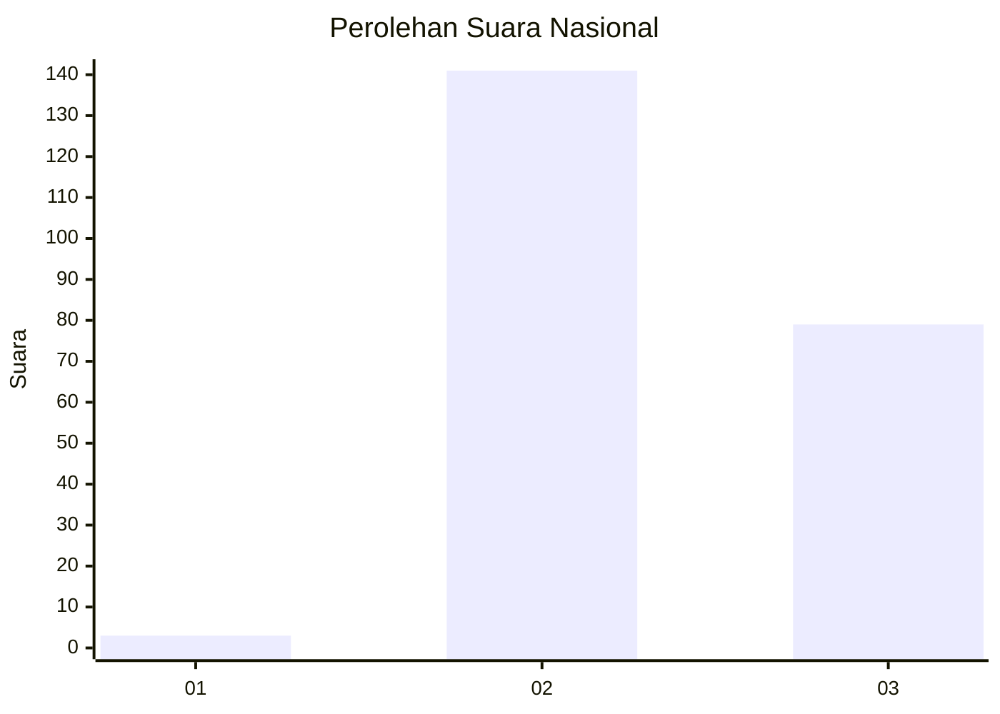
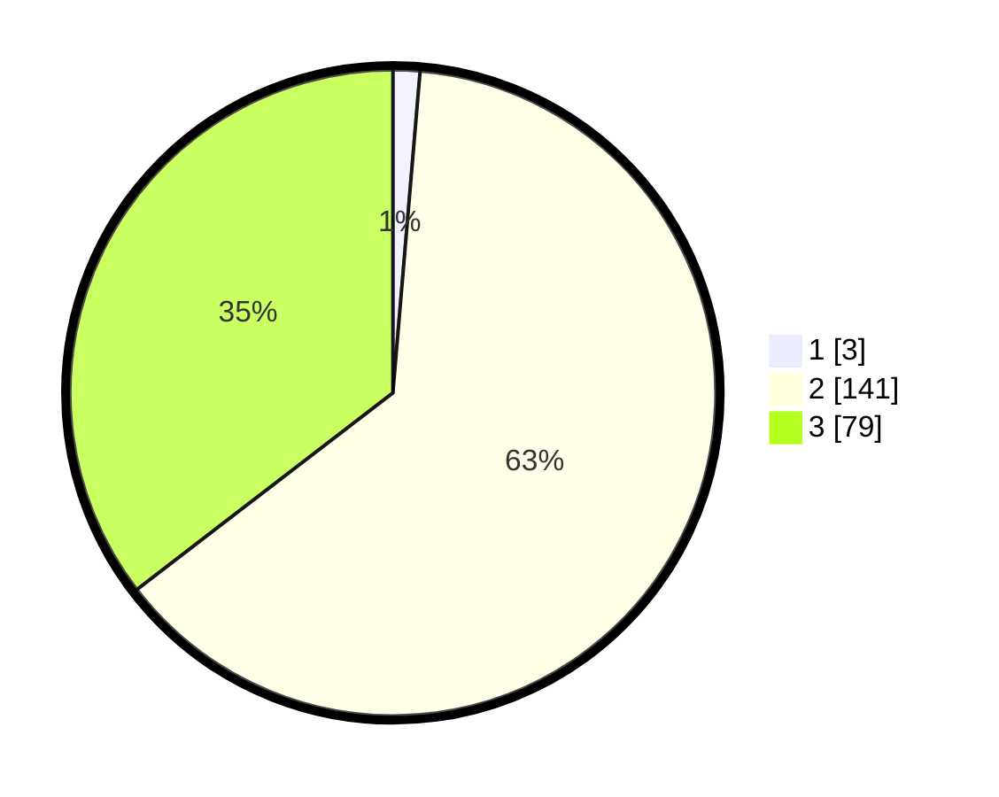

# Hasil

## Grafik

## Tabel

| No. | Nama Paslon    | Suara | Suara (raw) | Persentase |
|:--- |:-------------- | -----:| -----------:| ----------:|
| 1   | ANIES MUHAIMIN | 3     | [3][p-1]    | 1,35       |
| 2   | PRABOWO GIBRAN | 141   | [141][p-2]  | 63,23      |
| 3   | GANJAR MAHFUD  | 79    | [79][p-3]   | 35,43      |

[p-1]: https://github.com/gigit-pemilu/pemilu-2024/blob/main/pilpres/hitung-suara/sub/51-bali/sub/71-kota-denpasar/sub/02-denpasar-timur/sub/1006-sumerta/sub/003-tps/sub/paslon-1.txt
[p-2]: https://github.com/gigit-pemilu/pemilu-2024/blob/main/pilpres/hitung-suara/sub/51-bali/sub/71-kota-denpasar/sub/02-denpasar-timur/sub/1006-sumerta/sub/003-tps/sub/paslon-2.txt
[p-3]: https://github.com/gigit-pemilu/pemilu-2024/blob/main/pilpres/hitung-suara/sub/51-bali/sub/71-kota-denpasar/sub/02-denpasar-timur/sub/1006-sumerta/sub/003-tps/sub/paslon-3.txt

## Foto C Plano

https://sirekap-obj-formc.kpu.go.id/e128/pemilu/ppwp/51/71/02/10/06/5171021006003-20240214-132500--a2aa570d-6725-4dd8-973c-0859e476a1b4.jpg

https://sirekap-obj-formc.kpu.go.id/e128/pemilu/ppwp/51/71/02/10/06/5171021006003-20240214-132616--8ba0e596-ecba-4e61-b913-ba2dfb6d313c.jpg

https://sirekap-obj-formc.kpu.go.id/e128/pemilu/ppwp/51/71/02/10/06/5171021006003-20240216-145321--56eafb35-4416-4282-8ee8-9431ae8fab79.jpg

## Metadata

| Key        | Value               |
| ---------- | ------------------- |
| Time Stamp | 2024-02-16 16:25:10 |

## DATA PEMILIH TETAP

Jumlah pemilih dalam DPT: **255**.
 * L: **127**.
 * P: **128**.

## DATA PENGGUNA HAK PILIH

Jumlah pengguna hak pilih dalam DPT: **214**.
 * L: **103**.
 * P: **111**.

Jumlah pengguna hak pilih dalam DPTb: **11**.
 * L: **4**.
 * P: **7**.

Jumlah pengguna hak pilih dalam DPK: **1**.
 * L: **0**.
 * P: **1**.

Jumlah pengguna hak pilih: **226**.
 * L: **107**.
 * P: **119**.

## JUMLAH SUARA SAH DAN TIDAK SAH

JUMLAH SELURUH SUARA SAH: **223**.

JUMLAH SUARA TIDAK SAH: **3**.

JUMLAH SELURUH SUARA SAH DAN SUARA TIDAK SAH: **226**.

