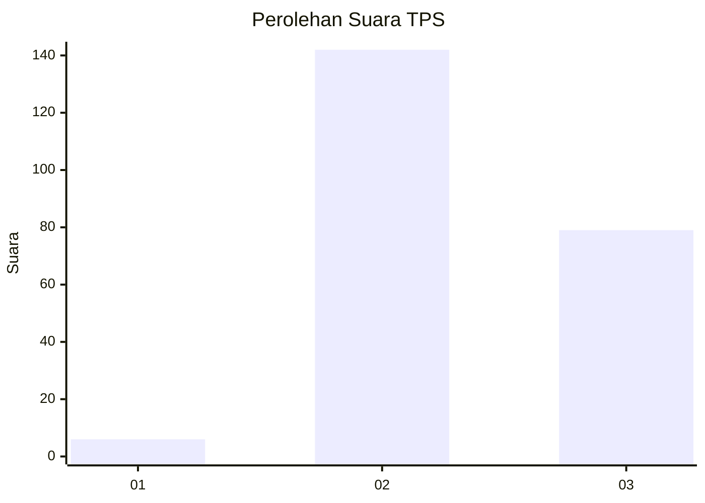
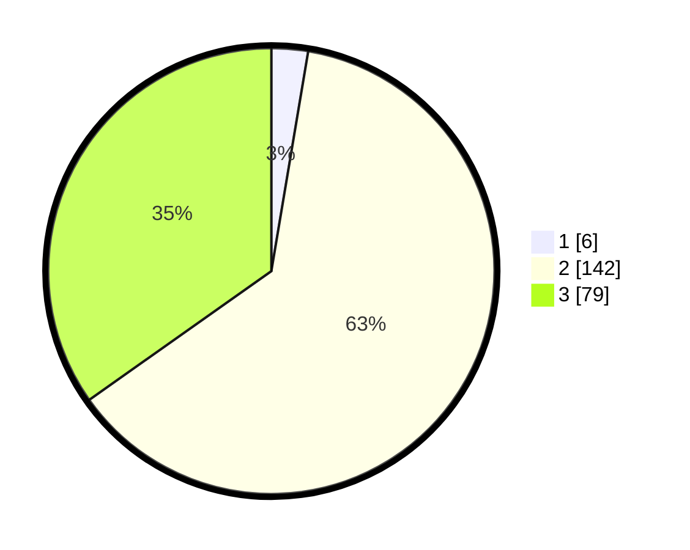

# Hasil

## Grafik

## Tabel

| No. | Nama Paslon    | Suara | Suara (raw) | Persentase |
|:--- |:-------------- | -----:| -----------:| ----------:|
| 1   | ANIES MUHAIMIN | 6     | [6][p-1]    | 2,64       |
| 2   | PRABOWO GIBRAN | 142   | [142][p-2]  | 62,56      |
| 3   | GANJAR MAHFUD  | 79    | [79][p-3]   | 34,80      |

[p-1]: https://github.com/gigit-pemilu/pemilu-2024-51-bali/blob/main/pilpres/hitung-suara/sub/51-bali/sub/71-kota-denpasar/sub/02-denpasar-timur/sub/1006-sumerta/sub/006-tps/sub/paslon-1.txt
[p-2]: https://github.com/gigit-pemilu/pemilu-2024-51-bali/blob/main/pilpres/hitung-suara/sub/51-bali/sub/71-kota-denpasar/sub/02-denpasar-timur/sub/1006-sumerta/sub/006-tps/sub/paslon-2.txt
[p-3]: https://github.com/gigit-pemilu/pemilu-2024-51-bali/blob/main/pilpres/hitung-suara/sub/51-bali/sub/71-kota-denpasar/sub/02-denpasar-timur/sub/1006-sumerta/sub/006-tps/sub/paslon-3.txt

## Foto C Plano

https://sirekap-obj-formc.kpu.go.id/3ac6/pemilu/ppwp/51/71/02/10/06/5171021006006-20240214-141006--72c1c47b-3d63-4703-b88c-905762d96656.jpg

https://sirekap-obj-formc.kpu.go.id/3ac6/pemilu/ppwp/51/71/02/10/06/5171021006006-20240214-193231--1db5e823-e776-4d84-9b93-25df447f6ff6.jpg

## Metadata

| Key        | Value               |
| ---------- | ------------------- |
| Time Stamp | 2024-02-16 14:30:33 |

