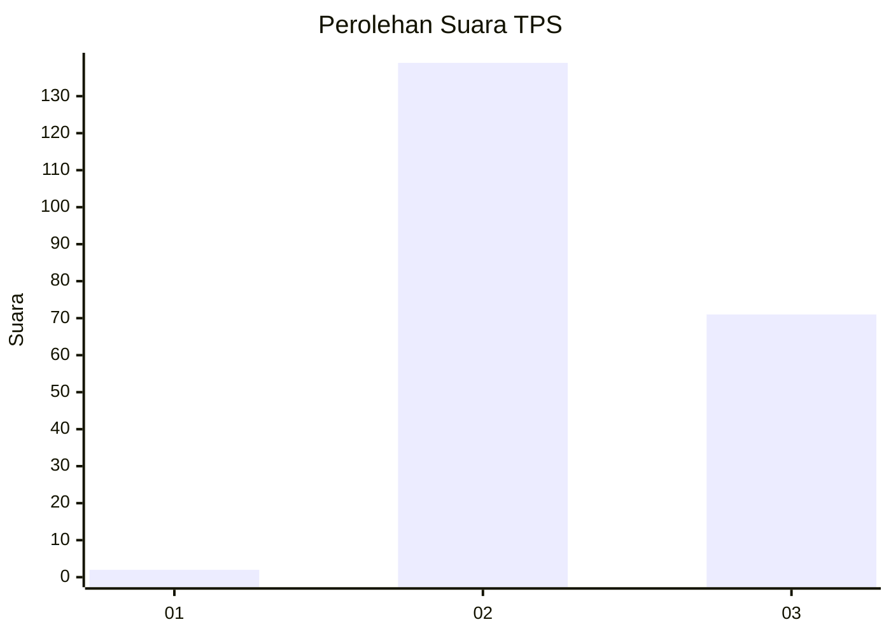
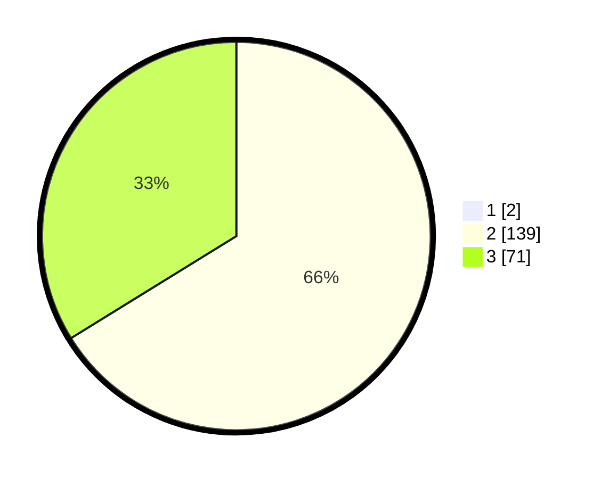

# Hasil

## Grafik

## Tabel

| No. | Nama Paslon    | Suara | Suara (raw) | Persentase |
|:--- |:-------------- | -----:| -----------:| ----------:|
| 1   | ANIES MUHAIMIN | 2     | [2][p-1]    | 0,94       |
| 2   | PRABOWO GIBRAN | 139   | [139][p-2]  | 65,57      |
| 3   | GANJAR MAHFUD  | 71    | [71][p-3]   | 33,49      |

[p-1]: https://github.com/gigit-pemilu/pemilu-2024-51-bali/blob/main/pilpres/hitung-suara/sub/51-bali/sub/71-kota-denpasar/sub/02-denpasar-timur/sub/1006-sumerta/sub/009-tps/sub/paslon-1.txt
[p-2]: https://github.com/gigit-pemilu/pemilu-2024-51-bali/blob/main/pilpres/hitung-suara/sub/51-bali/sub/71-kota-denpasar/sub/02-denpasar-timur/sub/1006-sumerta/sub/009-tps/sub/paslon-2.txt
[p-3]: https://github.com/gigit-pemilu/pemilu-2024-51-bali/blob/main/pilpres/hitung-suara/sub/51-bali/sub/71-kota-denpasar/sub/02-denpasar-timur/sub/1006-sumerta/sub/009-tps/sub/paslon-3.txt

## Foto C Plano

https://sirekap-obj-formc.kpu.go.id/defb/pemilu/ppwp/51/71/02/10/06/5171021006009-20240216-210403--3f84fe68-6579-4169-9d17-4455e8074174.jpg

https://sirekap-obj-formc.kpu.go.id/defb/pemilu/ppwp/51/71/02/10/06/5171021006009-20240216-210505--a01b4b4c-21f4-409a-82d6-e134c63fd660.jpg

https://sirekap-obj-formc.kpu.go.id/defb/pemilu/ppwp/51/71/02/10/06/5171021006009-20240216-211452--ad17a5b8-5518-4242-a772-f4e34296b85b.jpg

## Metadata

| Key        | Value               |
| ---------- | ------------------- |
| Time Stamp | 2024-02-24 22:31:28 |

