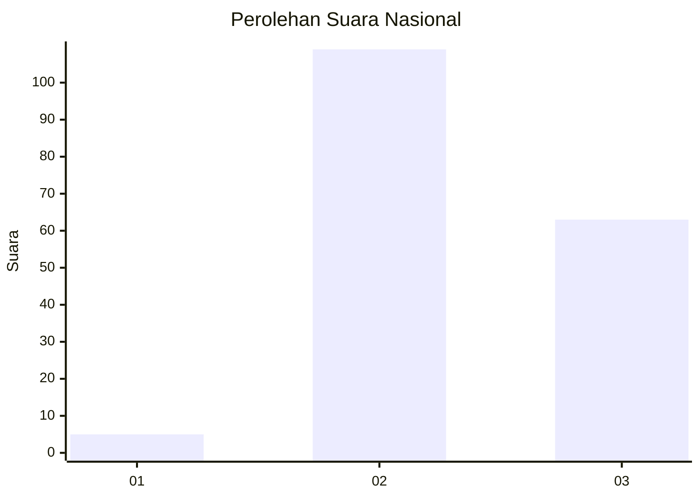
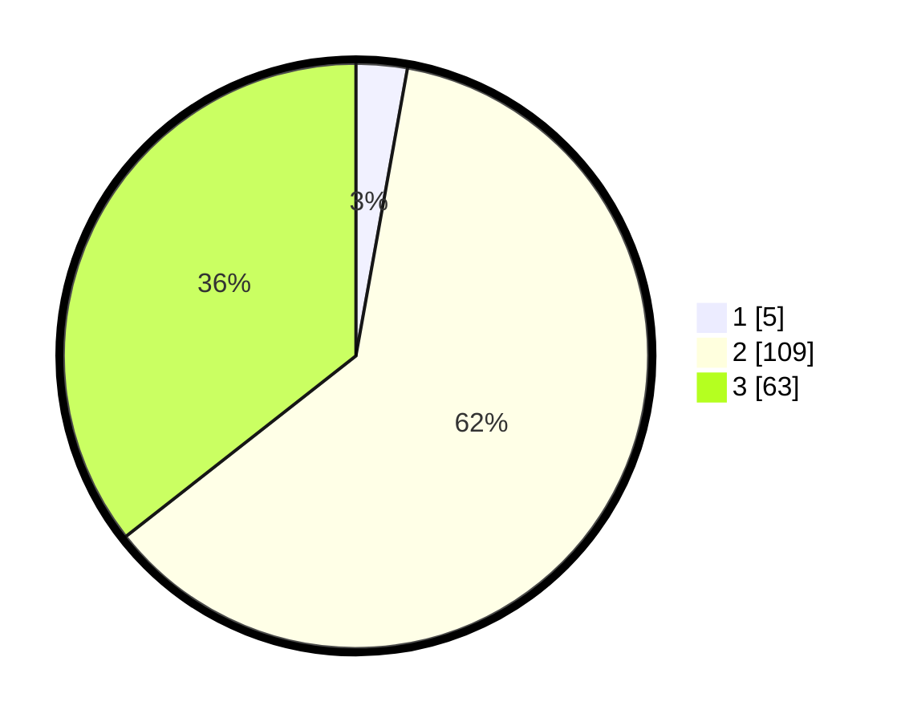

# Hasil

## Grafik

## Tabel

| No. | Nama Paslon    | Suara | Suara (raw) | Persentase |
|:--- |:-------------- | -----:| -----------:| ----------:|
| 1   | ANIES MUHAIMIN | 5     | [5][p-1]    | 2,82       |
| 2   | PRABOWO GIBRAN | 109   | [109][p-2]  | 61,58      |
| 3   | GANJAR MAHFUD  | 63    | [63][p-3]   | 35,59      |

[p-1]: https://github.com/gigit-pemilu/pemilu-2024/blob/main/pilpres/hitung-suara/sub/51-bali/sub/71-kota-denpasar/sub/02-denpasar-timur/sub/1006-sumerta/sub/015-tps/sub/paslon-1.txt
[p-2]: https://github.com/gigit-pemilu/pemilu-2024/blob/main/pilpres/hitung-suara/sub/51-bali/sub/71-kota-denpasar/sub/02-denpasar-timur/sub/1006-sumerta/sub/015-tps/sub/paslon-2.txt
[p-3]: https://github.com/gigit-pemilu/pemilu-2024/blob/main/pilpres/hitung-suara/sub/51-bali/sub/71-kota-denpasar/sub/02-denpasar-timur/sub/1006-sumerta/sub/015-tps/sub/paslon-3.txt

## Foto C Plano

https://sirekap-obj-formc.kpu.go.id/1304/pemilu/ppwp/51/71/02/10/06/5171021006015-20240214-203103--0a7471a9-943d-4986-8672-1dba62dac0ad.jpg

https://sirekap-obj-formc.kpu.go.id/1304/pemilu/ppwp/51/71/02/10/06/5171021006015-20240214-203121--7b0b01aa-0312-4f5c-a253-e488581a78f9.jpg

https://sirekap-obj-formc.kpu.go.id/1304/pemilu/ppwp/51/71/02/10/06/5171021006015-20240214-203136--b15e599e-d004-43b7-bd4f-e4f3365af638.jpg

## Metadata

| Key        | Value               |
| ---------- | ------------------- |
| Time Stamp | 2024-02-24 22:31:28 |

