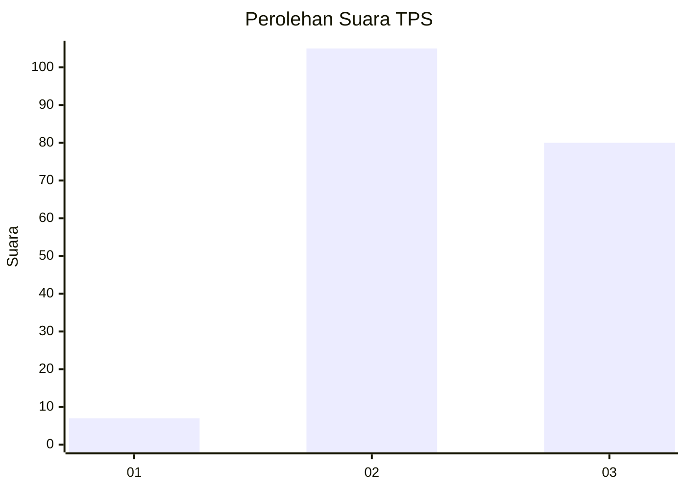
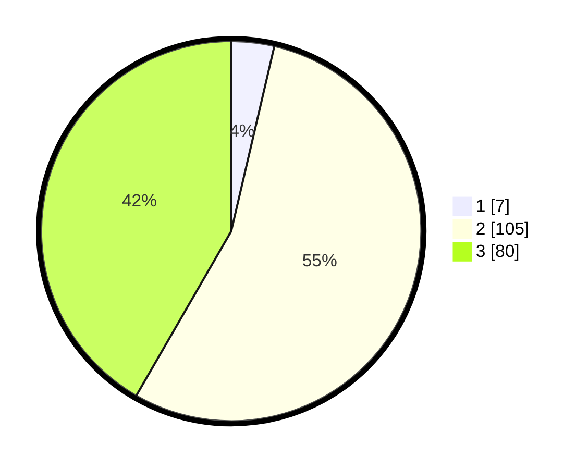

# Hasil

## Grafik

## Tabel

| No. | Nama Paslon    | Suara | Suara (raw) | Persentase |
|:--- |:-------------- | -----:| -----------:| ----------:|
| 1   | ANIES MUHAIMIN | 7     | [7][p-1]    | 3,65       |
| 2   | PRABOWO GIBRAN | 105   | [105][p-2]  | 54,69      |
| 3   | GANJAR MAHFUD  | 80    | [80][p-3]   | 41,67      |

[p-1]: https://github.com/gigit-pemilu/pemilu-2024-51-bali/blob/main/pilpres/hitung-suara/sub/51-bali/sub/71-kota-denpasar/sub/02-denpasar-timur/sub/1006-sumerta/sub/017-tps/sub/paslon-1.txt
[p-2]: https://github.com/gigit-pemilu/pemilu-2024-51-bali/blob/main/pilpres/hitung-suara/sub/51-bali/sub/71-kota-denpasar/sub/02-denpasar-timur/sub/1006-sumerta/sub/017-tps/sub/paslon-2.txt
[p-3]: https://github.com/gigit-pemilu/pemilu-2024-51-bali/blob/main/pilpres/hitung-suara/sub/51-bali/sub/71-kota-denpasar/sub/02-denpasar-timur/sub/1006-sumerta/sub/017-tps/sub/paslon-3.txt

## Foto C Plano

https://sirekap-obj-formc.kpu.go.id/64d1/pemilu/ppwp/51/71/02/10/06/5171021006017-20240214-193656--e013c4ac-cbaa-43ab-9f4e-0b577b484b39.jpg

https://sirekap-obj-formc.kpu.go.id/64d1/pemilu/ppwp/51/71/02/10/06/5171021006017-20240214-193710--fe2d73f6-d919-4560-a33d-8661812b7bc3.jpg

https://sirekap-obj-formc.kpu.go.id/64d1/pemilu/ppwp/51/71/02/10/06/5171021006017-20240214-193729--968ea3b8-2e31-4c23-884a-f6b99a57c472.jpg

## Metadata

| Key        | Value               |
| ---------- | ------------------- |
| Time Stamp | 2024-02-24 22:31:28 |

