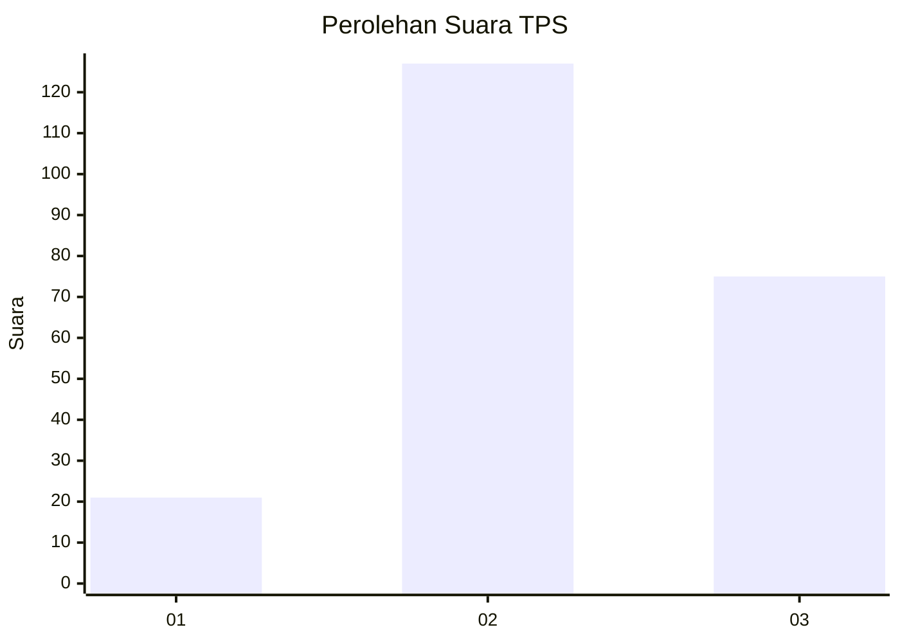
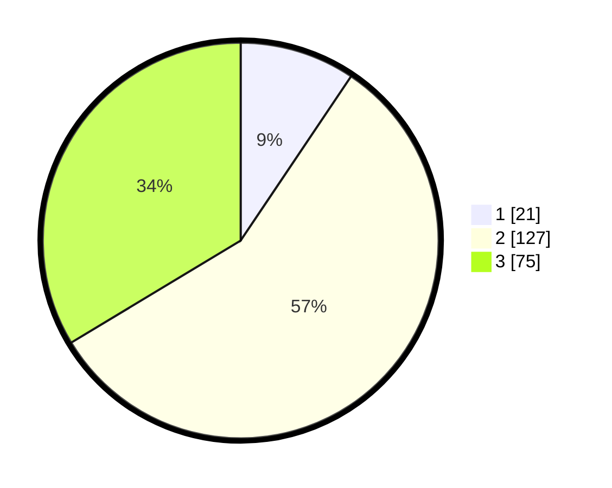

# Hasil

## Grafik

## Tabel

| No. | Nama Paslon    | Suara | Suara (raw) | Persentase |
|:--- |:-------------- | -----:| -----------:| ----------:|
| 1   | ANIES MUHAIMIN | 21    | [21][p-1]   | 9,42       |
| 2   | PRABOWO GIBRAN | 127   | [127][p-2]  | 56,95      |
| 3   | GANJAR MAHFUD  | 75    | [75][p-3]   | 33,63      |

[p-1]: https://github.com/gigit-pemilu/pemilu-2024-51-bali/blob/main/pilpres/hitung-suara/sub/51-bali/sub/71-kota-denpasar/sub/02-denpasar-timur/sub/1006-sumerta/sub/022-tps/sub/paslon-1.txt
[p-2]: https://github.com/gigit-pemilu/pemilu-2024-51-bali/blob/main/pilpres/hitung-suara/sub/51-bali/sub/71-kota-denpasar/sub/02-denpasar-timur/sub/1006-sumerta/sub/022-tps/sub/paslon-2.txt
[p-3]: https://github.com/gigit-pemilu/pemilu-2024-51-bali/blob/main/pilpres/hitung-suara/sub/51-bali/sub/71-kota-denpasar/sub/02-denpasar-timur/sub/1006-sumerta/sub/022-tps/sub/paslon-3.txt

## Foto C Plano

https://sirekap-obj-formc.kpu.go.id/bf27/pemilu/ppwp/51/71/02/10/06/5171021006022-20240215-030709--414e7d7d-4447-457c-8677-6306976501e0.jpg

https://sirekap-obj-formc.kpu.go.id/bf27/pemilu/ppwp/51/71/02/10/06/5171021006022-20240215-030724--ae77b519-ff08-485c-83d4-4624e2dda2de.jpg

https://sirekap-obj-formc.kpu.go.id/bf27/pemilu/ppwp/51/71/02/10/06/5171021006022-20240215-030745--358fcbb3-fe58-4d29-b1c2-6e60e6c3328b.jpg

## Metadata

| Key        | Value               |
| ---------- | ------------------- |
| Time Stamp | 2024-02-24 22:31:28 |

