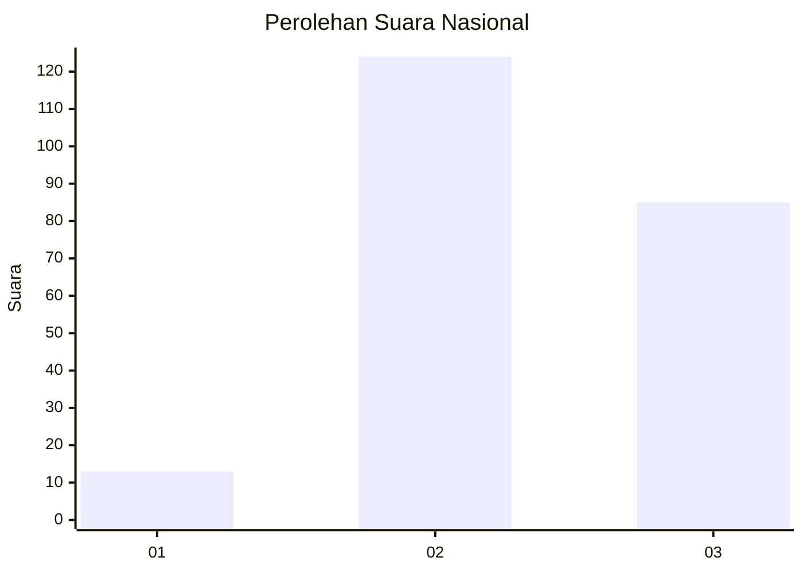
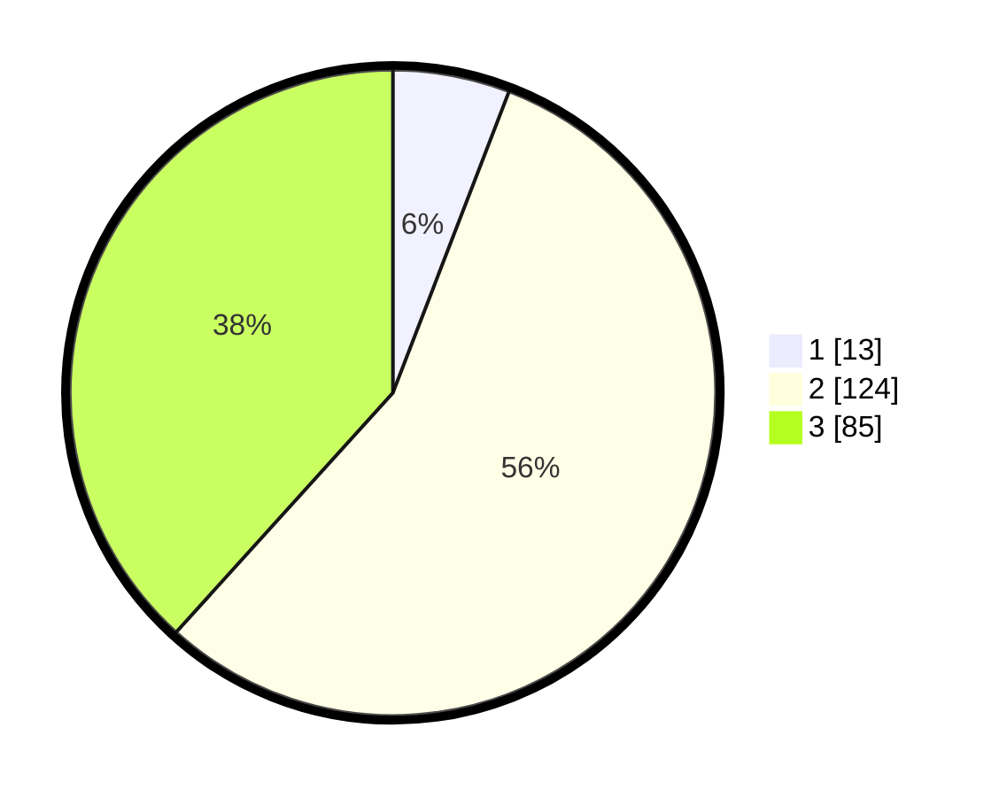

# Hasil

## Grafik

## Tabel

| No. | Nama Paslon    | Suara | Suara (raw) | Persentase |
|:--- |:-------------- | -----:| -----------:| ----------:|
| 1   | ANIES MUHAIMIN | 13    | [13][p-1]   | 5,86       |
| 2   | PRABOWO GIBRAN | 124   | [124][p-2]  | 55,86      |
| 3   | GANJAR MAHFUD  | 85    | [85][p-3]   | 38,29      |

[p-1]: https://github.com/gigit-pemilu/pemilu-2024/blob/main/pilpres/hitung-suara/sub/51-bali/sub/71-kota-denpasar/sub/02-denpasar-timur/sub/1006-sumerta/sub/023-tps/sub/paslon-1.txt
[p-2]: https://github.com/gigit-pemilu/pemilu-2024/blob/main/pilpres/hitung-suara/sub/51-bali/sub/71-kota-denpasar/sub/02-denpasar-timur/sub/1006-sumerta/sub/023-tps/sub/paslon-2.txt
[p-3]: https://github.com/gigit-pemilu/pemilu-2024/blob/main/pilpres/hitung-suara/sub/51-bali/sub/71-kota-denpasar/sub/02-denpasar-timur/sub/1006-sumerta/sub/023-tps/sub/paslon-3.txt

## Foto C Plano

https://sirekap-obj-formc.kpu.go.id/200e/pemilu/ppwp/51/71/02/10/06/5171021006023-20240214-155759--6e39e289-d63f-4427-96f9-a0e11d6b535d.jpg

https://sirekap-obj-formc.kpu.go.id/200e/pemilu/ppwp/51/71/02/10/06/5171021006023-20240214-155606--f90c6d1b-bc7b-4eaf-910f-8da40064bd8c.jpg

https://sirekap-obj-formc.kpu.go.id/200e/pemilu/ppwp/51/71/02/10/06/5171021006023-20240214-162221--66052206-4a72-4bf5-b1a1-08e46f4b9439.jpg

## Metadata

| Key        | Value               |
| ---------- | ------------------- |
| Time Stamp | 2024-02-25 12:00:00 |

## DATA PEMILIH TETAP

Jumlah pemilih dalam DPT: **277**.
 * L: **134**.
 * P: **143**.

## DATA PENGGUNA HAK PILIH

Jumlah pengguna hak pilih dalam DPT: **207**.
 * L: **104**.
 * P: **103**.

Jumlah pengguna hak pilih dalam DPTb: **14**.
 * L: **5**.
 * P: **9**.

Jumlah pengguna hak pilih dalam DPK: **2**.
 * L: **1**.
 * P: **1**.

Jumlah pengguna hak pilih: **223**.
 * L: **110**.
 * P: **113**.

## JUMLAH SUARA SAH DAN TIDAK SAH

JUMLAH SELURUH SUARA SAH: **222**.

JUMLAH SUARA TIDAK SAH: **1**.

JUMLAH SELURUH SUARA SAH DAN SUARA TIDAK SAH: **223**.

