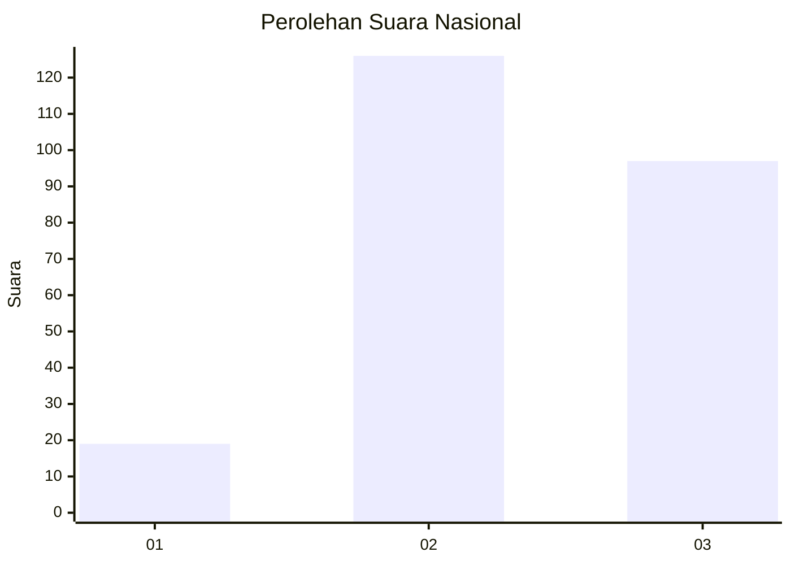
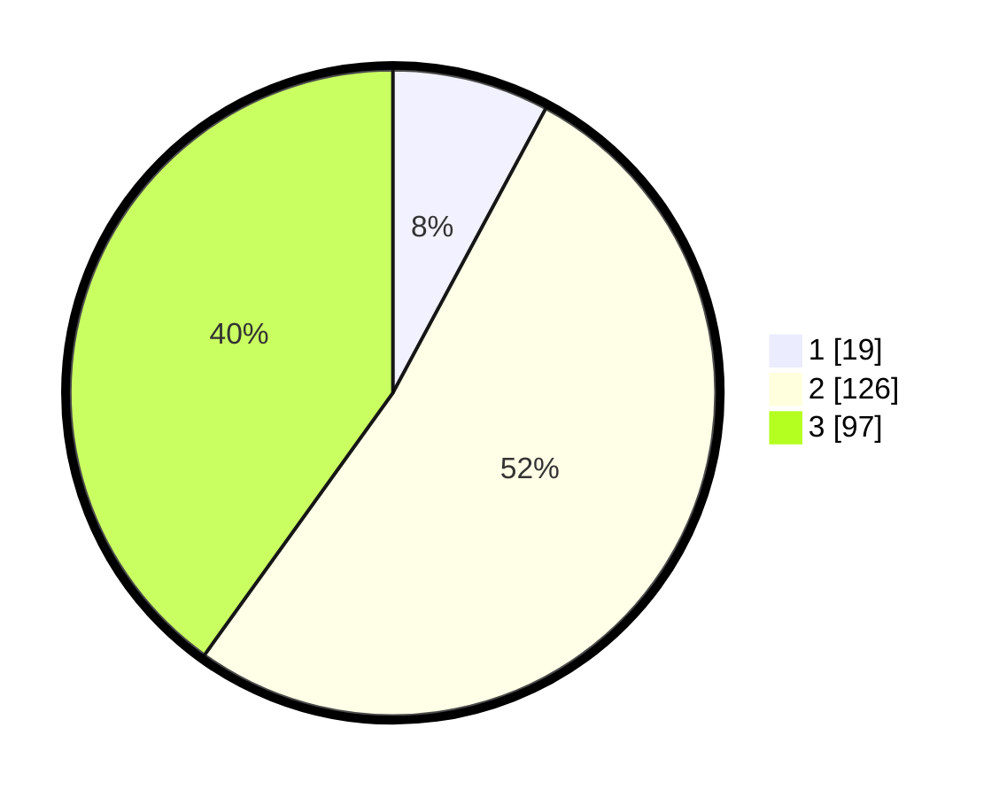

# Hasil

## Grafik

## Tabel

| No. | Nama Paslon    | Suara | Suara (raw) | Persentase |
|:--- |:-------------- | -----:| -----------:| ----------:|
| 1   | ANIES MUHAIMIN | 19    | [19][p-1]   | 7,85       |
| 2   | PRABOWO GIBRAN | 126   | [126][p-2]  | 52,07      |
| 3   | GANJAR MAHFUD  | 97    | [97][p-3]   | 40,08      |

[p-1]: https://github.com/gigit-pemilu/pemilu-2024/blob/main/pilpres/hitung-suara/sub/51-bali/sub/71-kota-denpasar/sub/02-denpasar-timur/sub/1006-sumerta/sub/024-tps/sub/paslon-1.txt
[p-2]: https://github.com/gigit-pemilu/pemilu-2024/blob/main/pilpres/hitung-suara/sub/51-bali/sub/71-kota-denpasar/sub/02-denpasar-timur/sub/1006-sumerta/sub/024-tps/sub/paslon-2.txt
[p-3]: https://github.com/gigit-pemilu/pemilu-2024/blob/main/pilpres/hitung-suara/sub/51-bali/sub/71-kota-denpasar/sub/02-denpasar-timur/sub/1006-sumerta/sub/024-tps/sub/paslon-3.txt

## Foto C Plano

https://sirekap-obj-formc.kpu.go.id/0128/pemilu/ppwp/51/71/02/10/06/5171021006024-20240216-133226--9a5b1403-e053-4f4b-b4e5-f9210cac221c.jpg

https://sirekap-obj-formc.kpu.go.id/0128/pemilu/ppwp/51/71/02/10/06/5171021006024-20240216-133228--51d0d377-1114-4f36-bfbe-c652720386a7.jpg

https://sirekap-obj-formc.kpu.go.id/0128/pemilu/ppwp/51/71/02/10/06/5171021006024-20240216-133227--c0751db4-07fe-4adb-8883-fc63a0b229b1.jpg

## Metadata

| Key        | Value               |
| ---------- | ------------------- |
| Time Stamp | 2024-02-16 14:30:33 |

## DATA PEMILIH TETAP

Jumlah pemilih dalam DPT: **281**.
 * L: **135**.
 * P: **146**.

## DATA PENGGUNA HAK PILIH

Jumlah pengguna hak pilih dalam DPT: **229**.
 * L: **114**.
 * P: **115**.

Jumlah pengguna hak pilih dalam DPTb: **7**.
 * L: **3**.
 * P: **4**.

Jumlah pengguna hak pilih dalam DPK: **8**.
 * L: **2**.
 * P: **6**.

Jumlah pengguna hak pilih: **244**.
 * L: **119**.
 * P: **125**.

## JUMLAH SUARA SAH DAN TIDAK SAH

JUMLAH SELURUH SUARA SAH: **242**.

JUMLAH SUARA TIDAK SAH: **2**.

JUMLAH SELURUH SUARA SAH DAN SUARA TIDAK SAH: **244**.

