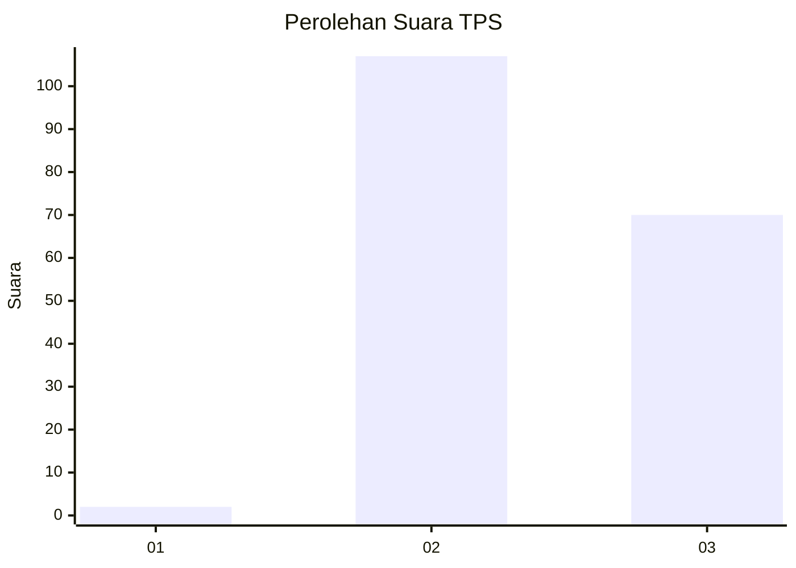
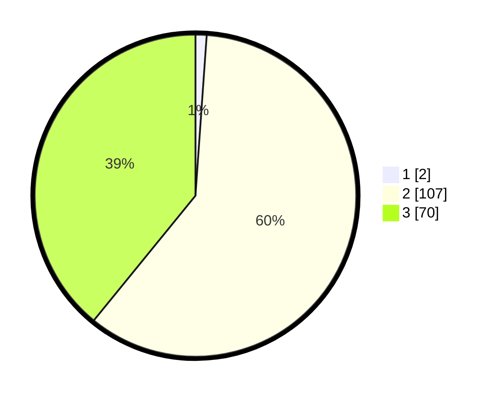

# Hasil

## Grafik

## Tabel

| No. | Nama Paslon    | Suara | Suara (raw) | Persentase |
|:--- |:-------------- | -----:| -----------:| ----------:|
| 1   | ANIES MUHAIMIN | 2     | [2][p-1]    | 1,12       |
| 2   | PRABOWO GIBRAN | 107   | [107][p-2]  | 59,78      |
| 3   | GANJAR MAHFUD  | 70    | [70][p-3]   | 39,11      |

[p-1]: https://github.com/gigit-pemilu/pemilu-2024-51-bali/blob/main/pilpres/hitung-suara/sub/51-bali/sub/71-kota-denpasar/sub/02-denpasar-timur/sub/1010-dangin-puri/sub/005-tps/sub/paslon-1.txt
[p-2]: https://github.com/gigit-pemilu/pemilu-2024-51-bali/blob/main/pilpres/hitung-suara/sub/51-bali/sub/71-kota-denpasar/sub/02-denpasar-timur/sub/1010-dangin-puri/sub/005-tps/sub/paslon-2.txt
[p-3]: https://github.com/gigit-pemilu/pemilu-2024-51-bali/blob/main/pilpres/hitung-suara/sub/51-bali/sub/71-kota-denpasar/sub/02-denpasar-timur/sub/1010-dangin-puri/sub/005-tps/sub/paslon-3.txt

## Foto C Plano

https://sirekap-obj-formc.kpu.go.id/86fb/pemilu/ppwp/51/71/02/10/10/5171021010005-20240214-235509--ee228fc6-85ba-4c2d-a4e2-669a1bd1fcc4.jpg

https://sirekap-obj-formc.kpu.go.id/86fb/pemilu/ppwp/51/71/02/10/10/5171021010005-20240214-235554--4cea9e51-aabd-48b4-8147-ba90c2690661.jpg

https://sirekap-obj-formc.kpu.go.id/86fb/pemilu/ppwp/51/71/02/10/10/5171021010005-20240214-235745--f2abd781-566f-4428-9b06-9409dafa72c1.jpg

## Metadata

| Key        | Value               |
| ---------- | ------------------- |
| Time Stamp | 2024-02-24 22:31:28 |

