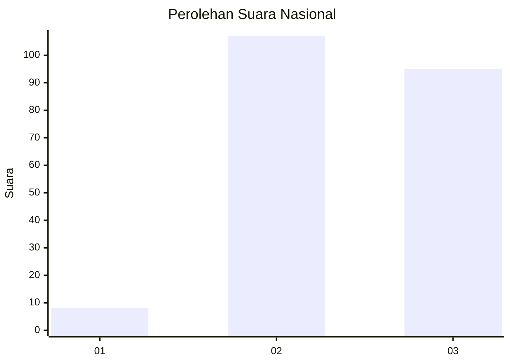
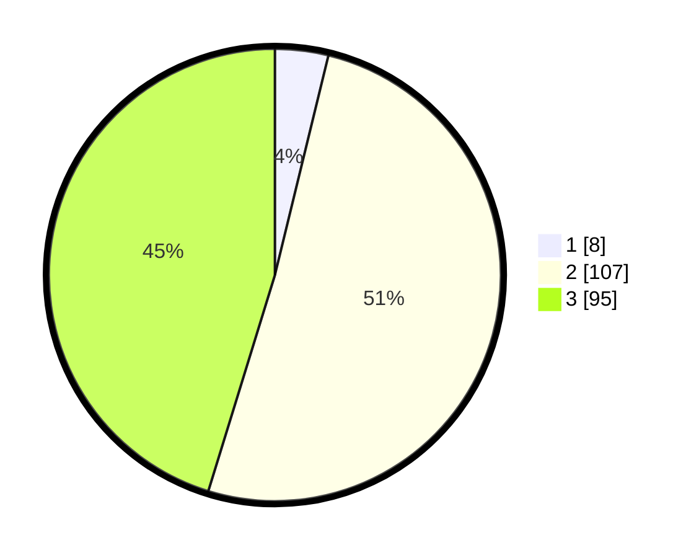

# Hasil

## Grafik

## Tabel

| No. | Nama Paslon    | Suara | Suara (raw) | Persentase |
|:--- |:-------------- | -----:| -----------:| ----------:|
| 1   | ANIES MUHAIMIN | 8     | [8][p-1]    | 3,81       |
| 2   | PRABOWO GIBRAN | 107   | [107][p-2]  | 50,95      |
| 3   | GANJAR MAHFUD  | 95    | [95][p-3]   | 45,24      |

[p-1]: https://github.com/gigit-pemilu/pemilu-2024/blob/main/pilpres/hitung-suara/sub/51-bali/sub/71-kota-denpasar/sub/02-denpasar-timur/sub/1010-dangin-puri/sub/007-tps/sub/paslon-1.txt
[p-2]: https://github.com/gigit-pemilu/pemilu-2024/blob/main/pilpres/hitung-suara/sub/51-bali/sub/71-kota-denpasar/sub/02-denpasar-timur/sub/1010-dangin-puri/sub/007-tps/sub/paslon-2.txt
[p-3]: https://github.com/gigit-pemilu/pemilu-2024/blob/main/pilpres/hitung-suara/sub/51-bali/sub/71-kota-denpasar/sub/02-denpasar-timur/sub/1010-dangin-puri/sub/007-tps/sub/paslon-3.txt

## Foto C Plano

https://sirekap-obj-formc.kpu.go.id/ef04/pemilu/ppwp/51/71/02/10/10/5171021010007-20240214-225503--f6ed0c28-02e4-4139-aea9-5143c1f4aeca.jpg

https://sirekap-obj-formc.kpu.go.id/ef04/pemilu/ppwp/51/71/02/10/10/5171021010007-20240214-225524--45601b2e-630c-41a3-938c-03a4c2b5e347.jpg

https://sirekap-obj-formc.kpu.go.id/ef04/pemilu/ppwp/51/71/02/10/10/5171021010007-20240214-225538--0041d7d5-693c-45d3-92a4-621665461a65.jpg

## Metadata

| Key        | Value               |
| ---------- | ------------------- |
| Time Stamp | 2024-02-24 22:31:28 |

