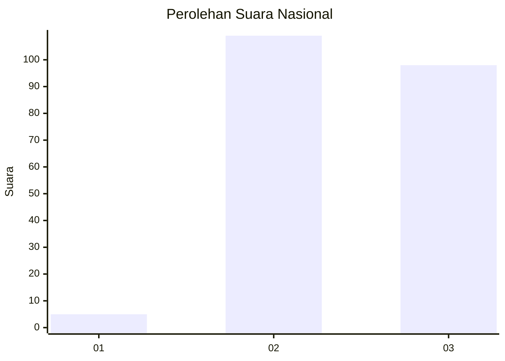
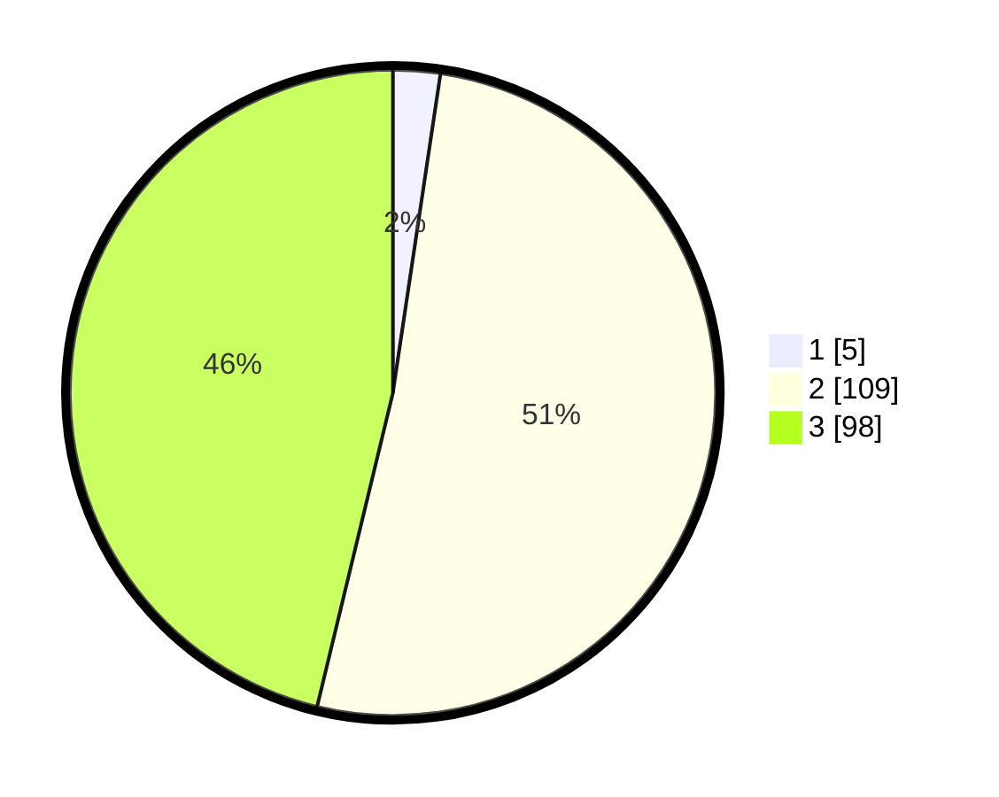

# Hasil

## Grafik

## Tabel

| No. | Nama Paslon    | Suara | Suara (raw) | Persentase |
|:--- |:-------------- | -----:| -----------:| ----------:|
| 1   | ANIES MUHAIMIN | 5     | [5][p-1]    | 2,36       |
| 2   | PRABOWO GIBRAN | 109   | [109][p-2]  | 51,42      |
| 3   | GANJAR MAHFUD  | 98    | [98][p-3]   | 46,23      |

[p-1]: https://github.com/gigit-pemilu/pemilu-2024/blob/main/pilpres/hitung-suara/sub/51-bali/sub/71-kota-denpasar/sub/02-denpasar-timur/sub/1010-dangin-puri/sub/011-tps/sub/paslon-1.txt
[p-2]: https://github.com/gigit-pemilu/pemilu-2024/blob/main/pilpres/hitung-suara/sub/51-bali/sub/71-kota-denpasar/sub/02-denpasar-timur/sub/1010-dangin-puri/sub/011-tps/sub/paslon-2.txt
[p-3]: https://github.com/gigit-pemilu/pemilu-2024/blob/main/pilpres/hitung-suara/sub/51-bali/sub/71-kota-denpasar/sub/02-denpasar-timur/sub/1010-dangin-puri/sub/011-tps/sub/paslon-3.txt

## Foto C Plano

https://sirekap-obj-formc.kpu.go.id/10b8/pemilu/ppwp/51/71/02/10/10/5171021010011-20240215-020520--7e872382-554a-4c56-90fe-7462e8507198.jpg

https://sirekap-obj-formc.kpu.go.id/10b8/pemilu/ppwp/51/71/02/10/10/5171021010011-20240215-001626--599e493f-7ea4-4f4a-aa9b-6b3bee2ebe75.jpg

https://sirekap-obj-formc.kpu.go.id/10b8/pemilu/ppwp/51/71/02/10/10/5171021010011-20240215-020718--da30b1d4-f78b-4bb0-a99f-1cc47ea8e890.jpg

## Metadata

| Key        | Value               |
| ---------- | ------------------- |
| Time Stamp | 2024-02-24 22:31:28 |

