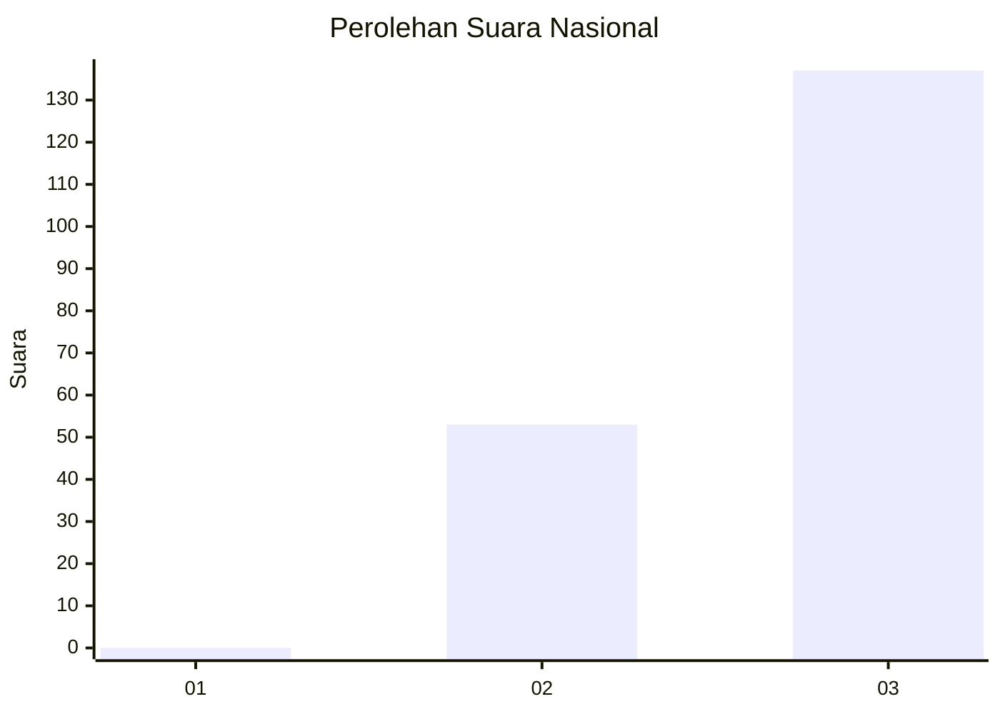
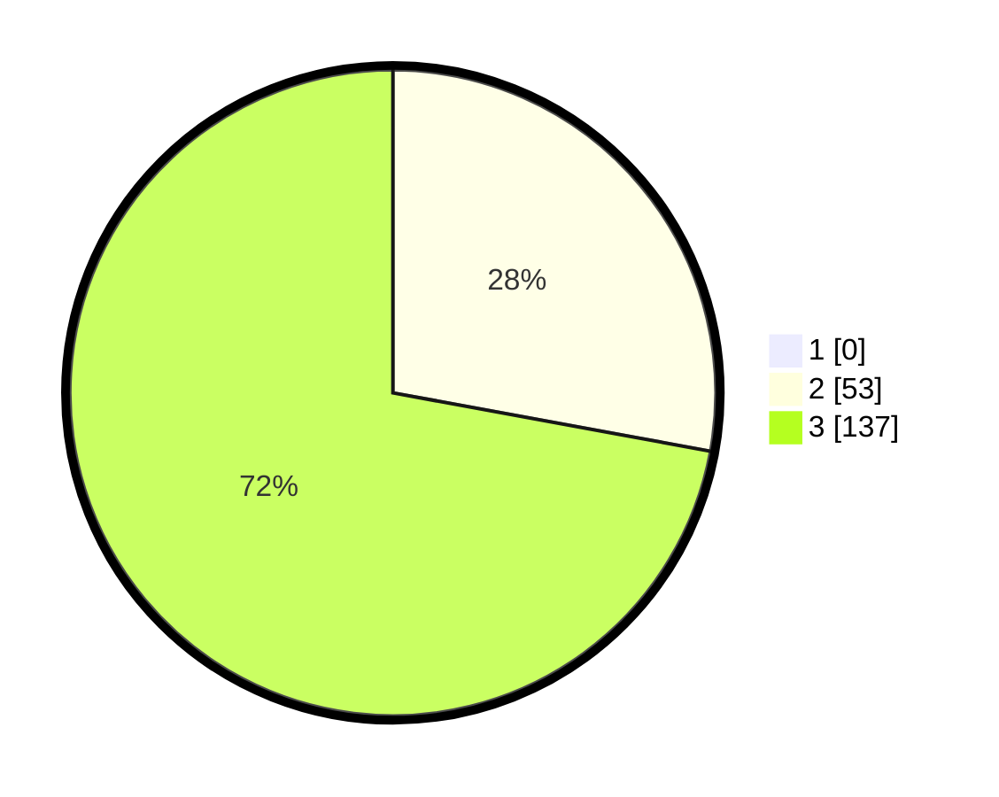

# Hasil

## Grafik

## Tabel

| No. | Nama Paslon    | Suara | Suara (raw) | Persentase |
|:--- |:-------------- | -----:| -----------:| ----------:|
| 1   | ANIES MUHAIMIN | 0     | [0][p-1]    | 0,00       |
| 2   | PRABOWO GIBRAN | 53    | [53][p-2]   | 27,89      |
| 3   | GANJAR MAHFUD  | 137   | [137][p-3]  | 72,11      |

[p-1]: https://github.com/gigit-pemilu/pemilu-2024/blob/main/pilpres/hitung-suara/sub/51-bali/sub/71-kota-denpasar/sub/02-denpasar-timur/sub/1014-penatih/sub/007-tps/sub/paslon-1.txt
[p-2]: https://github.com/gigit-pemilu/pemilu-2024/blob/main/pilpres/hitung-suara/sub/51-bali/sub/71-kota-denpasar/sub/02-denpasar-timur/sub/1014-penatih/sub/007-tps/sub/paslon-2.txt
[p-3]: https://github.com/gigit-pemilu/pemilu-2024/blob/main/pilpres/hitung-suara/sub/51-bali/sub/71-kota-denpasar/sub/02-denpasar-timur/sub/1014-penatih/sub/007-tps/sub/paslon-3.txt

## Foto C Plano

https://sirekap-obj-formc.kpu.go.id/7070/pemilu/ppwp/51/71/02/10/14/5171021014007-20240214-213726--355b4c19-b82e-460a-8f75-07329a8f9129.jpg

https://sirekap-obj-formc.kpu.go.id/7070/pemilu/ppwp/51/71/02/10/14/5171021014007-20240214-213850--b3ffd3c0-481a-4d68-a78b-cde3b9ea5d65.jpg

https://sirekap-obj-formc.kpu.go.id/7070/pemilu/ppwp/51/71/02/10/14/5171021014007-20240214-214151--2b18f5ce-bddd-4403-86c7-f2356cb73805.jpg

## Metadata

| Key        | Value               |
| ---------- | ------------------- |
| Time Stamp | 2024-02-24 22:31:28 |

