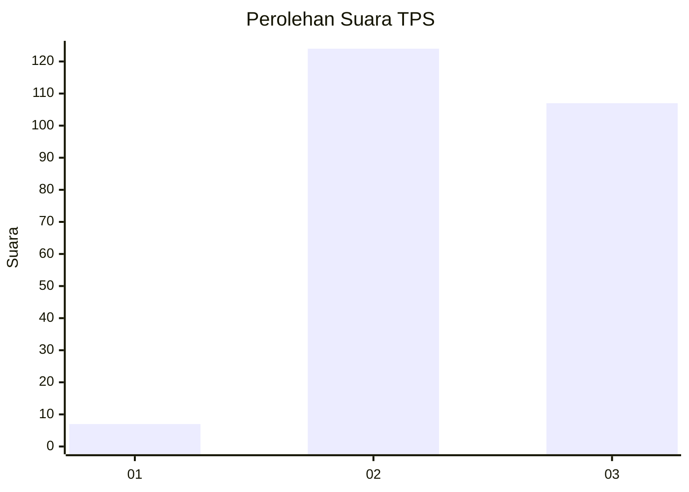
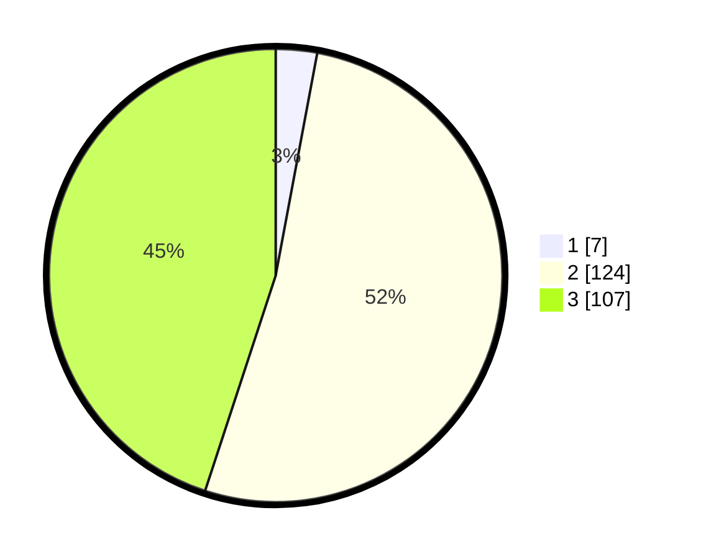

# Hasil

## Grafik

## Tabel

| No. | Nama Paslon    | Suara | Suara (raw) | Persentase |
|:--- |:-------------- | -----:| -----------:| ----------:|
| 1   | ANIES MUHAIMIN | 7     | [7][p-1]    | 2,94       |
| 2   | PRABOWO GIBRAN | 124   | [124][p-2]  | 52,10      |
| 3   | GANJAR MAHFUD  | 107   | [107][p-3]  | 44,96      |

[p-1]: https://github.com/gigit-pemilu/pemilu-2024-51-bali/blob/main/pilpres/hitung-suara/sub/51-bali/sub/71-kota-denpasar/sub/02-denpasar-timur/sub/1014-penatih/sub/011-tps/sub/paslon-1.txt
[p-2]: https://github.com/gigit-pemilu/pemilu-2024-51-bali/blob/main/pilpres/hitung-suara/sub/51-bali/sub/71-kota-denpasar/sub/02-denpasar-timur/sub/1014-penatih/sub/011-tps/sub/paslon-2.txt
[p-3]: https://github.com/gigit-pemilu/pemilu-2024-51-bali/blob/main/pilpres/hitung-suara/sub/51-bali/sub/71-kota-denpasar/sub/02-denpasar-timur/sub/1014-penatih/sub/011-tps/sub/paslon-3.txt

## Foto C Plano

https://sirekap-obj-formc.kpu.go.id/758e/pemilu/ppwp/51/71/02/10/14/5171021014011-20240214-214859--f31e9cfc-4b37-44e4-9a3b-19328797b0b4.jpg

https://sirekap-obj-formc.kpu.go.id/758e/pemilu/ppwp/51/71/02/10/14/5171021014011-20240214-214929--78bca6ed-e8e3-4380-b35f-756d457e6598.jpg

## Metadata

| Key        | Value               |
| ---------- | ------------------- |
| Time Stamp | 2024-02-24 22:31:28 |

