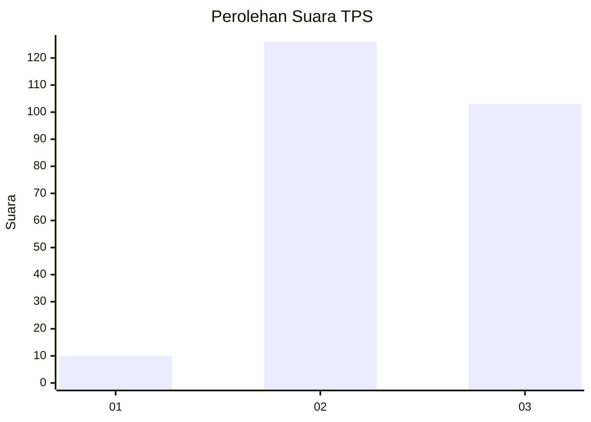
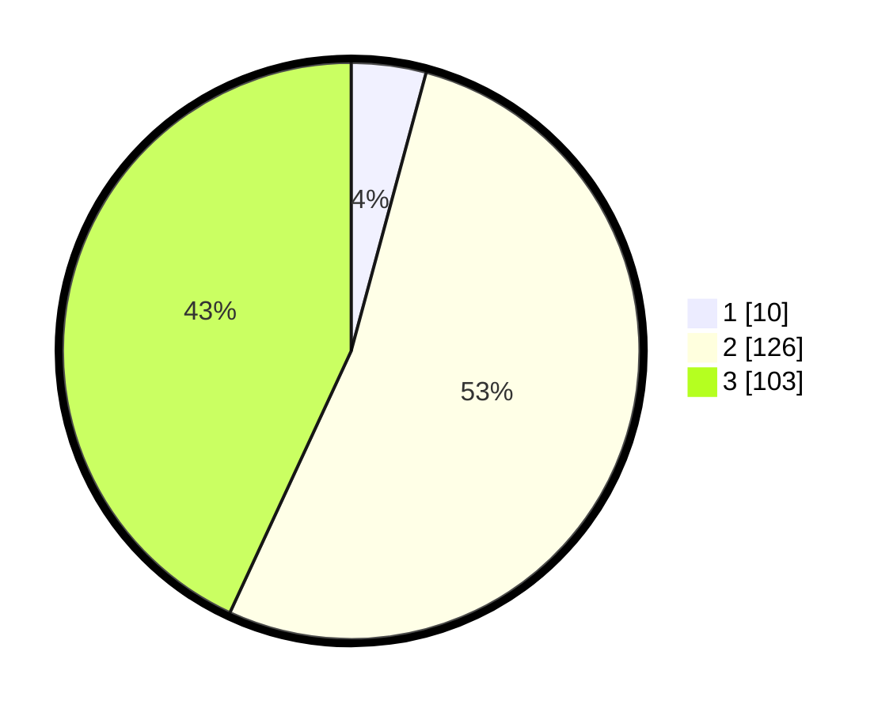

# Hasil

## Grafik

## Tabel

| No. | Nama Paslon    | Suara | Suara (raw) | Persentase |
|:--- |:-------------- | -----:| -----------:| ----------:|
| 1   | ANIES MUHAIMIN | 10    | [10][p-1]   | 4,18       |
| 2   | PRABOWO GIBRAN | 126   | [126][p-2]  | 52,72      |
| 3   | GANJAR MAHFUD  | 103   | [103][p-3]  | 43,10      |

[p-1]: https://github.com/gigit-pemilu/pemilu-2024-51-bali/blob/main/pilpres/hitung-suara/sub/51-bali/sub/71-kota-denpasar/sub/02-denpasar-timur/sub/1014-penatih/sub/015-tps/sub/paslon-1.txt
[p-2]: https://github.com/gigit-pemilu/pemilu-2024-51-bali/blob/main/pilpres/hitung-suara/sub/51-bali/sub/71-kota-denpasar/sub/02-denpasar-timur/sub/1014-penatih/sub/015-tps/sub/paslon-2.txt
[p-3]: https://github.com/gigit-pemilu/pemilu-2024-51-bali/blob/main/pilpres/hitung-suara/sub/51-bali/sub/71-kota-denpasar/sub/02-denpasar-timur/sub/1014-penatih/sub/015-tps/sub/paslon-3.txt

## Foto C Plano

https://sirekap-obj-formc.kpu.go.id/ff2e/pemilu/ppwp/51/71/02/10/14/5171021014015-20240216-093618--b97c8545-246a-4768-b24c-5969fcaddddc.jpg

https://sirekap-obj-formc.kpu.go.id/ff2e/pemilu/ppwp/51/71/02/10/14/5171021014015-20240216-094653--4ea42227-863f-4310-9060-301834436997.jpg

https://sirekap-obj-formc.kpu.go.id/ff2e/pemilu/ppwp/51/71/02/10/14/5171021014015-20240216-094825--65f9f124-0e15-4eee-a1bf-66835e435494.jpg

## Metadata

| Key        | Value               |
| ---------- | ------------------- |
| Time Stamp | 2024-02-16 22:30:00 |

