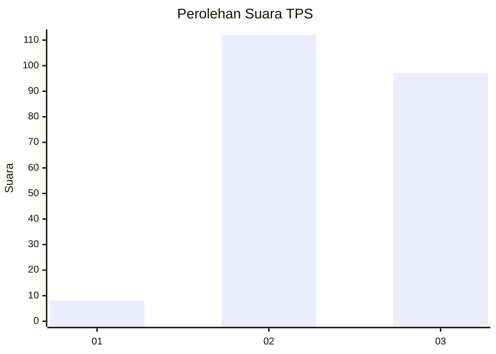
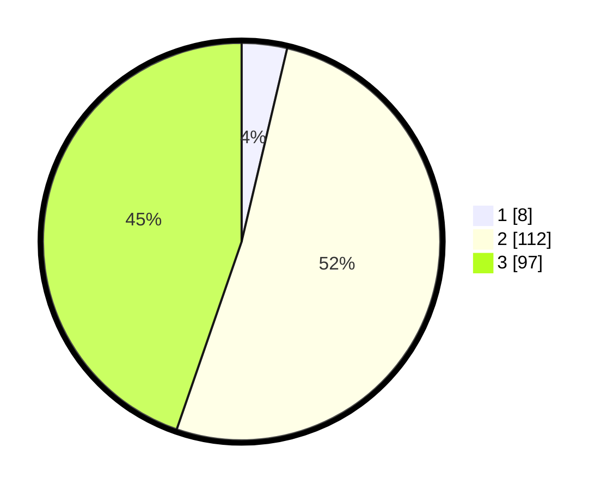

# Hasil

## Grafik

## Tabel

| No. | Nama Paslon    | Suara | Suara (raw) | Persentase |
|:--- |:-------------- | -----:| -----------:| ----------:|
| 1   | ANIES MUHAIMIN | 8     | [8][p-1]    | 3,69       |
| 2   | PRABOWO GIBRAN | 112   | [112][p-2]  | 51,61      |
| 3   | GANJAR MAHFUD  | 97    | [97][p-3]   | 44,70      |

[p-1]: https://github.com/gigit-pemilu/pemilu-2024-51-bali/blob/main/pilpres/hitung-suara/sub/51-bali/sub/71-kota-denpasar/sub/02-denpasar-timur/sub/1014-penatih/sub/020-tps/sub/paslon-1.txt
[p-2]: https://github.com/gigit-pemilu/pemilu-2024-51-bali/blob/main/pilpres/hitung-suara/sub/51-bali/sub/71-kota-denpasar/sub/02-denpasar-timur/sub/1014-penatih/sub/020-tps/sub/paslon-2.txt
[p-3]: https://github.com/gigit-pemilu/pemilu-2024-51-bali/blob/main/pilpres/hitung-suara/sub/51-bali/sub/71-kota-denpasar/sub/02-denpasar-timur/sub/1014-penatih/sub/020-tps/sub/paslon-3.txt

## Foto C Plano

https://sirekap-obj-formc.kpu.go.id/4a5a/pemilu/ppwp/51/71/02/10/14/5171021014020-20240214-202929--62feff3f-ca74-4e12-883a-6390a87217c0.jpg

https://sirekap-obj-formc.kpu.go.id/4a5a/pemilu/ppwp/51/71/02/10/14/5171021014020-20240214-203039--e749fca3-7f98-4944-92a1-b92eeb4258eb.jpg

https://sirekap-obj-formc.kpu.go.id/4a5a/pemilu/ppwp/51/71/02/10/14/5171021014020-20240214-203133--8c2138bc-fcb0-4af9-9967-d76adb7b034e.jpg

## Metadata

| Key        | Value               |
| ---------- | ------------------- |
| Time Stamp | 2024-02-24 22:31:28 |

