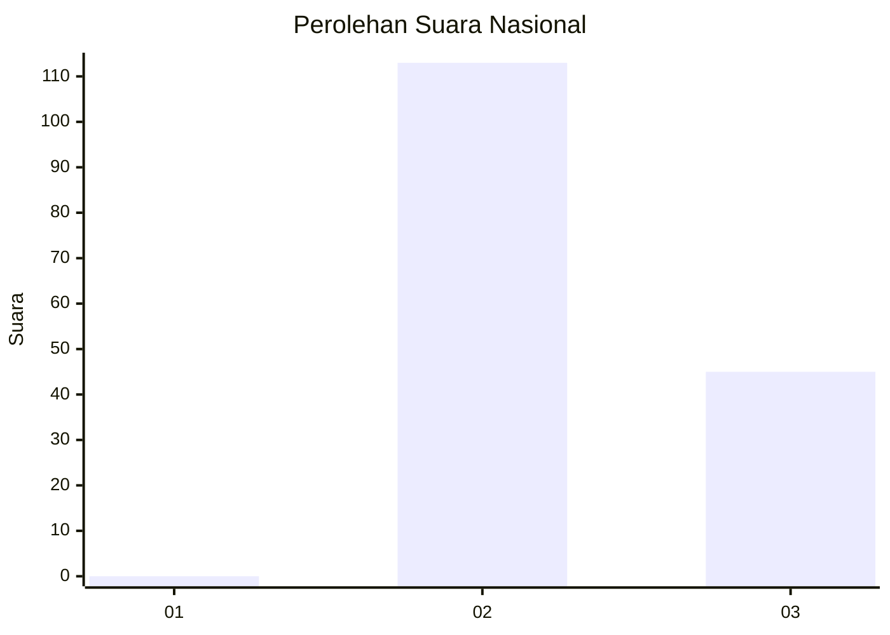
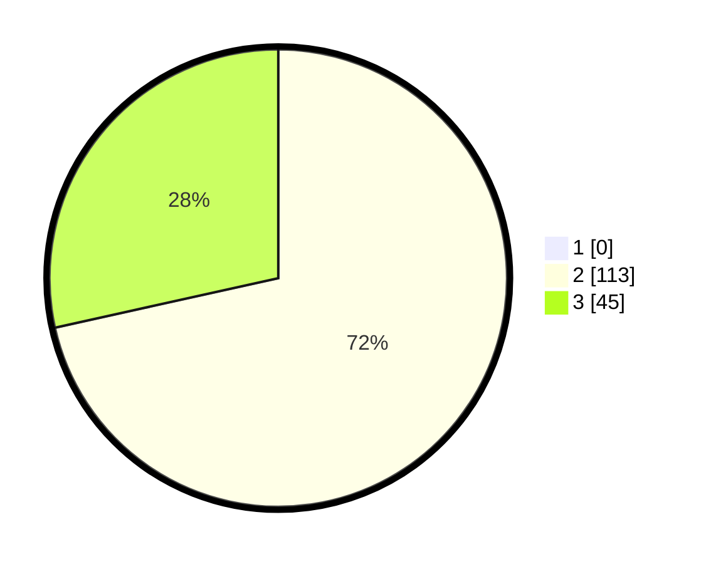

# Hasil

## Grafik

## Tabel

| No. | Nama Paslon    | Suara | Suara (raw) | Persentase |
|:--- |:-------------- | -----:| -----------:| ----------:|
| 1   | ANIES MUHAIMIN | 0     | [0][p-1]    | 0,00       |
| 2   | PRABOWO GIBRAN | 113   | [113][p-2]  | 71,52      |
| 3   | GANJAR MAHFUD  | 45    | [45][p-3]   | 28,48      |

[p-1]: https://github.com/gigit-pemilu/pemilu-2024/blob/main/pilpres/hitung-suara/sub/51-bali/sub/71-kota-denpasar/sub/02-denpasar-timur/sub/1014-penatih/sub/021-tps/sub/paslon-1.txt
[p-2]: https://github.com/gigit-pemilu/pemilu-2024/blob/main/pilpres/hitung-suara/sub/51-bali/sub/71-kota-denpasar/sub/02-denpasar-timur/sub/1014-penatih/sub/021-tps/sub/paslon-2.txt
[p-3]: https://github.com/gigit-pemilu/pemilu-2024/blob/main/pilpres/hitung-suara/sub/51-bali/sub/71-kota-denpasar/sub/02-denpasar-timur/sub/1014-penatih/sub/021-tps/sub/paslon-3.txt

## Foto C Plano

https://sirekap-obj-formc.kpu.go.id/6c03/pemilu/ppwp/51/71/02/10/14/5171021014021-20240216-125523--6c35a649-e8be-4282-be07-dfe97891125f.jpg

https://sirekap-obj-formc.kpu.go.id/6c03/pemilu/ppwp/51/71/02/10/14/5171021014021-20240216-125514--f3836b8a-52cf-42f4-89e8-38a2e46da87d.jpg

https://sirekap-obj-formc.kpu.go.id/6c03/pemilu/ppwp/51/71/02/10/14/5171021014021-20240216-130018--9c9a00df-8671-4870-b6e7-39f3037042d9.jpg

## Metadata

| Key        | Value               |
| ---------- | ------------------- |
| Time Stamp | 2024-02-24 22:31:28 |

