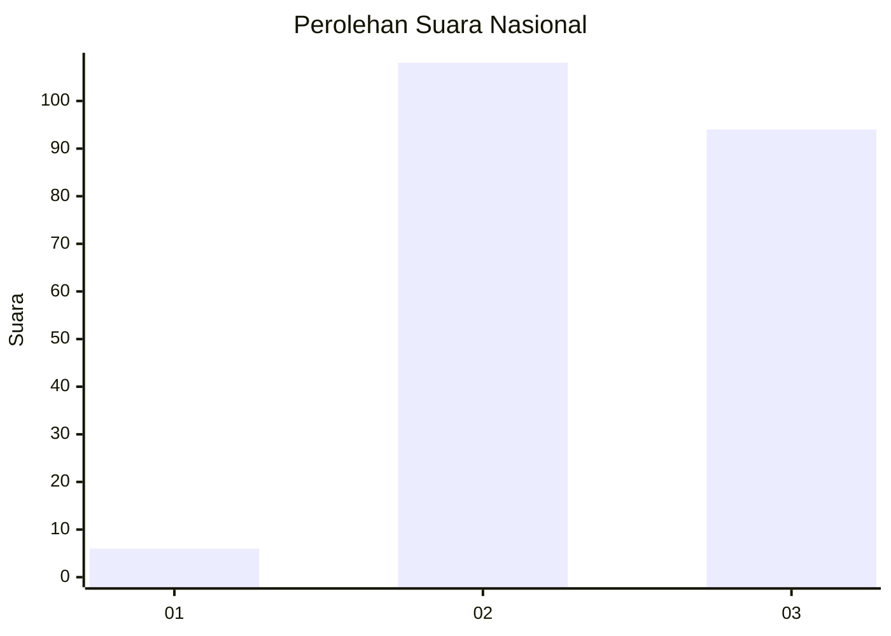
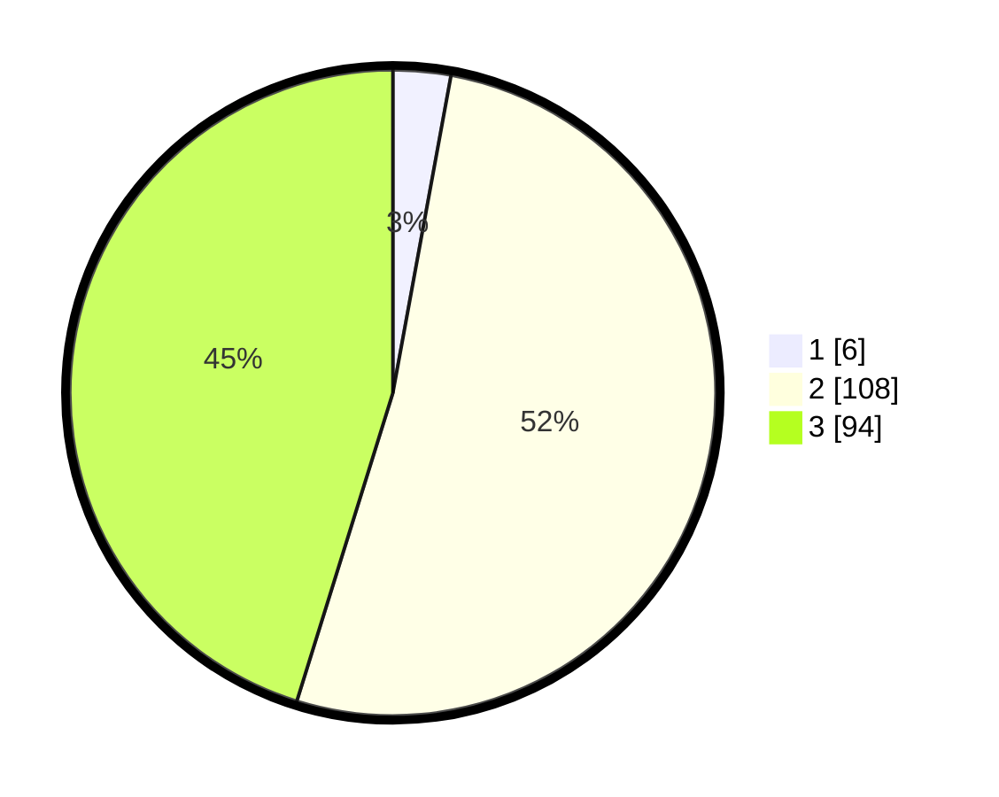

# Hasil

## Grafik

## Tabel

| No. | Nama Paslon    | Suara | Suara (raw) | Persentase |
|:--- |:-------------- | -----:| -----------:| ----------:|
| 1   | ANIES MUHAIMIN | 6     | [6][p-1]    | 2,88       |
| 2   | PRABOWO GIBRAN | 108   | [108][p-2]  | 51,92      |
| 3   | GANJAR MAHFUD  | 94    | [94][p-3]   | 45,19      |

[p-1]: https://github.com/gigit-pemilu/pemilu-2024/blob/main/pilpres/hitung-suara/sub/51-bali/sub/71-kota-denpasar/sub/02-denpasar-timur/sub/1014-penatih/sub/027-tps/sub/paslon-1.txt
[p-2]: https://github.com/gigit-pemilu/pemilu-2024/blob/main/pilpres/hitung-suara/sub/51-bali/sub/71-kota-denpasar/sub/02-denpasar-timur/sub/1014-penatih/sub/027-tps/sub/paslon-2.txt
[p-3]: https://github.com/gigit-pemilu/pemilu-2024/blob/main/pilpres/hitung-suara/sub/51-bali/sub/71-kota-denpasar/sub/02-denpasar-timur/sub/1014-penatih/sub/027-tps/sub/paslon-3.txt

## Foto C Plano

https://sirekap-obj-formc.kpu.go.id/3a34/pemilu/ppwp/51/71/02/10/14/5171021014027-20240214-192629--bf0c1c8e-2cad-4747-b3a1-5852c0a2b54d.jpg

https://sirekap-obj-formc.kpu.go.id/3a34/pemilu/ppwp/51/71/02/10/14/5171021014027-20240214-192701--799274ed-e648-4d72-8583-be24032b5e35.jpg

https://sirekap-obj-formc.kpu.go.id/3a34/pemilu/ppwp/51/71/02/10/14/5171021014027-20240214-192742--e64f8b6b-54ea-4cec-8f1d-6132fa897bd4.jpg

## Metadata

| Key        | Value               |
| ---------- | ------------------- |
| Time Stamp | 2024-02-24 22:31:28 |

