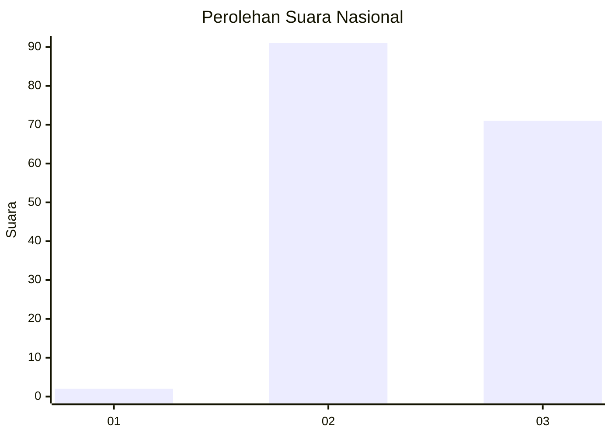
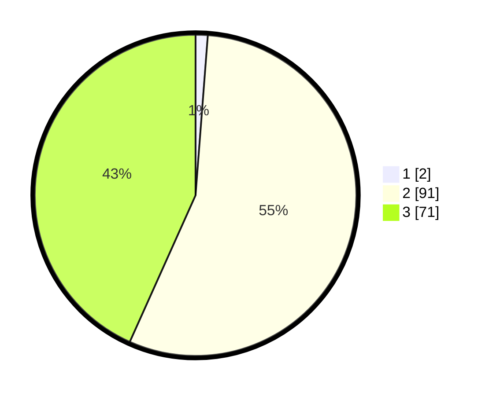

# Hasil

## Grafik

## Tabel

| No. | Nama Paslon    | Suara | Suara (raw) | Persentase |
|:--- |:-------------- | -----:| -----------:| ----------:|
| 1   | ANIES MUHAIMIN | 2     | [2][p-1]    | 1,22       |
| 2   | PRABOWO GIBRAN | 91    | [91][p-2]   | 55,49      |
| 3   | GANJAR MAHFUD  | 71    | [71][p-3]   | 43,29      |

[p-1]: https://github.com/gigit-pemilu/pemilu-2024/blob/main/pilpres/hitung-suara/sub/51-bali/sub/71-kota-denpasar/sub/02-denpasar-timur/sub/1014-penatih/sub/032-tps/sub/paslon-1.txt
[p-2]: https://github.com/gigit-pemilu/pemilu-2024/blob/main/pilpres/hitung-suara/sub/51-bali/sub/71-kota-denpasar/sub/02-denpasar-timur/sub/1014-penatih/sub/032-tps/sub/paslon-2.txt
[p-3]: https://github.com/gigit-pemilu/pemilu-2024/blob/main/pilpres/hitung-suara/sub/51-bali/sub/71-kota-denpasar/sub/02-denpasar-timur/sub/1014-penatih/sub/032-tps/sub/paslon-3.txt

## Foto C Plano

https://sirekap-obj-formc.kpu.go.id/1d4d/pemilu/ppwp/51/71/02/10/14/5171021014032-20240214-220003--2dccb095-32ff-4cbc-81eb-cf7288af9bed.jpg

https://sirekap-obj-formc.kpu.go.id/1d4d/pemilu/ppwp/51/71/02/10/14/5171021014032-20240214-220228--0544cd54-e005-4079-a70b-375548565aca.jpg

https://sirekap-obj-formc.kpu.go.id/1d4d/pemilu/ppwp/51/71/02/10/14/5171021014032-20240214-220501--36a9ce29-7481-4f6f-9e2f-49dacc55656d.jpg

## Metadata

| Key        | Value               |
| ---------- | ------------------- |
| Time Stamp | 2024-02-24 22:31:28 |

