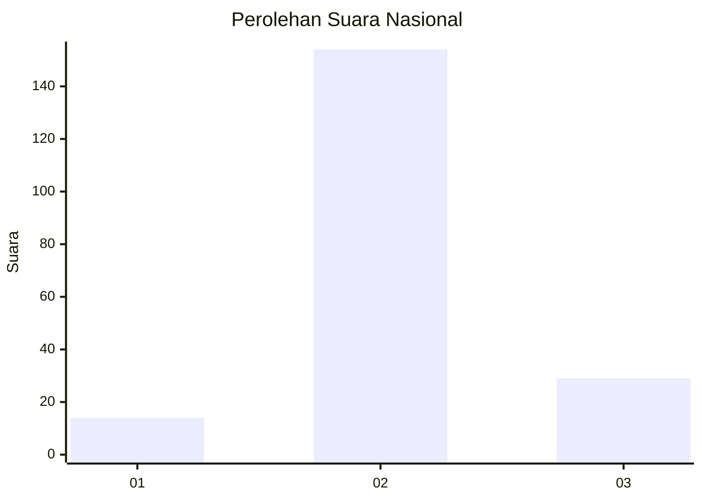

# Hasil

## Grafik

## Tabel

| No. | Nama Paslon    | Suara | Suara (raw) | Persentase |
|:--- |:-------------- | -----:| -----------:| ----------:|
| 1   | ANIES MUHAIMIN | 14    | [14][p-1]   | 7,11       |
| 2   | PRABOWO GIBRAN | 154   | [154][p-2]  | 78,17      |
| 3   | GANJAR MAHFUD  | 29    | [29][p-3]   | 14,72      |

[p-1]: https://github.com/gigit-pemilu/pemilu-2024/blob/main/pilpres/hitung-suara/sub/51-bali/sub/71-kota-denpasar/sub/02-denpasar-timur/sub/2001-dangin-puri-kelod/sub/003-tps/sub/paslon-1.txt
[p-2]: https://github.com/gigit-pemilu/pemilu-2024/blob/main/pilpres/hitung-suara/sub/51-bali/sub/71-kota-denpasar/sub/02-denpasar-timur/sub/2001-dangin-puri-kelod/sub/003-tps/sub/paslon-2.txt
[p-3]: https://github.com/gigit-pemilu/pemilu-2024/blob/main/pilpres/hitung-suara/sub/51-bali/sub/71-kota-denpasar/sub/02-denpasar-timur/sub/2001-dangin-puri-kelod/sub/003-tps/sub/paslon-3.txt

## Foto C Plano

https://sirekap-obj-formc.kpu.go.id/57f6/pemilu/ppwp/51/71/02/20/01/5171022001003-20240214-201836--4ed0f8d9-0bb6-4f57-9076-2080bb15f2a1.jpg

https://sirekap-obj-formc.kpu.go.id/57f6/pemilu/ppwp/51/71/02/20/01/5171022001003-20240214-201926--cf9102eb-94cb-436c-9655-9459b7e9e44a.jpg

https://sirekap-obj-formc.kpu.go.id/57f6/pemilu/ppwp/51/71/02/20/01/5171022001003-20240214-202007--0dab1bb5-fb77-4cb2-b71d-fb0deaf39657.jpg

## Metadata

| Key        | Value               |
| ---------- | ------------------- |
| Time Stamp | 2024-02-16 21:01:00 |

## DATA PEMILIH TETAP

Jumlah pemilih dalam DPT: **260**.
 * L: **124**.
 * P: **136**.

## DATA PENGGUNA HAK PILIH

Jumlah pengguna hak pilih dalam DPT: **204**.
 * L: **97**.
 * P: **107**.

Jumlah pengguna hak pilih dalam DPTb: **7**.
 * L: **6**.
 * P: **1**.

Jumlah pengguna hak pilih dalam DPK: **1**.
 * L: **0**.
 * P: **1**.

Jumlah pengguna hak pilih: **212**.
 * L: **103**.
 * P: **109**.

## JUMLAH SUARA SAH DAN TIDAK SAH

JUMLAH SELURUH SUARA SAH: **194**.

JUMLAH SUARA TIDAK SAH: **19**.

JUMLAH SELURUH SUARA SAH DAN SUARA TIDAK SAH: **213**.

