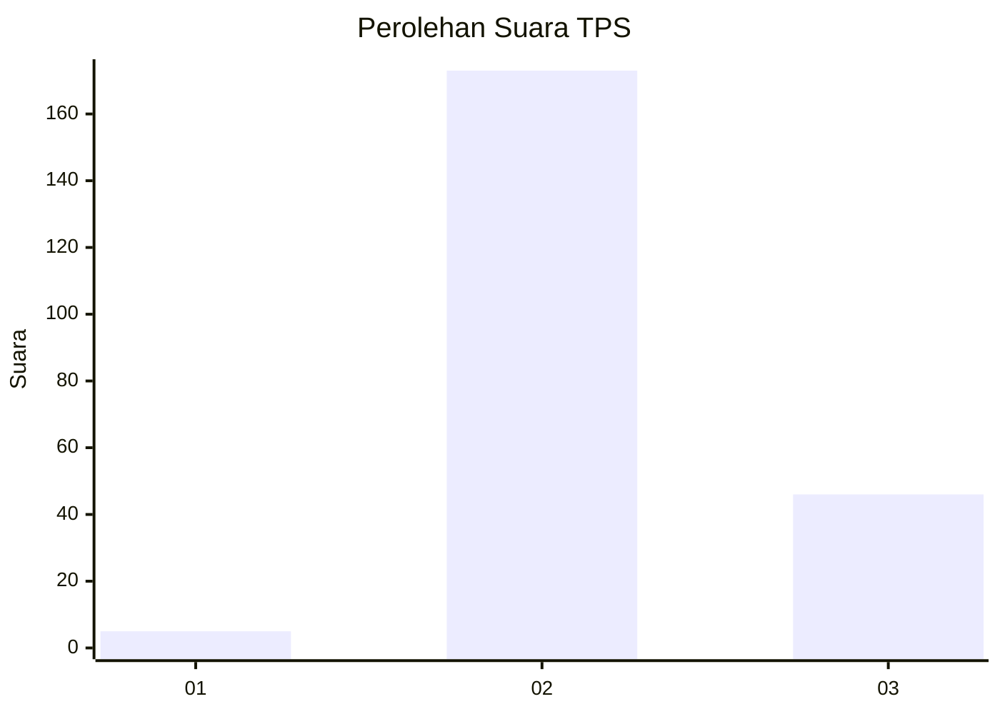

# Hasil

## Grafik

## Tabel

| No. | Nama Paslon    | Suara | Suara (raw) | Persentase |
|:--- |:-------------- | -----:| -----------:| ----------:|
| 1   | ANIES MUHAIMIN | 5     | [5][p-1]    | 2,23       |
| 2   | PRABOWO GIBRAN | 173   | [173][p-2]  | 77,23      |
| 3   | GANJAR MAHFUD  | 46    | [46][p-3]   | 20,54      |

[p-1]: https://github.com/gigit-pemilu/pemilu-2024-51-bali/blob/main/pilpres/hitung-suara/sub/51-bali/sub/71-kota-denpasar/sub/02-denpasar-timur/sub/2001-dangin-puri-kelod/sub/004-tps/sub/paslon-1.txt
[p-2]: https://github.com/gigit-pemilu/pemilu-2024-51-bali/blob/main/pilpres/hitung-suara/sub/51-bali/sub/71-kota-denpasar/sub/02-denpasar-timur/sub/2001-dangin-puri-kelod/sub/004-tps/sub/paslon-2.txt
[p-3]: https://github.com/gigit-pemilu/pemilu-2024-51-bali/blob/main/pilpres/hitung-suara/sub/51-bali/sub/71-kota-denpasar/sub/02-denpasar-timur/sub/2001-dangin-puri-kelod/sub/004-tps/sub/paslon-3.txt

## Foto C Plano

https://sirekap-obj-formc.kpu.go.id/f632/pemilu/ppwp/51/71/02/20/01/5171022001004-20240214-155308--45409621-9c95-4602-92eb-60a9822da5dd.jpg

https://sirekap-obj-formc.kpu.go.id/f632/pemilu/ppwp/51/71/02/20/01/5171022001004-20240214-155418--6add5409-f681-4398-affc-ffbccfc2f568.jpg

https://sirekap-obj-formc.kpu.go.id/f632/pemilu/ppwp/51/71/02/20/01/5171022001004-20240214-155508--e339eaf2-8509-42f5-9d60-c63eb033b6ab.jpg

## Metadata

| Key        | Value               |
| ---------- | ------------------- |
| Time Stamp | 2024-02-14 21:46:01 |

## DATA PEMILIH TETAP

Jumlah pemilih dalam DPT: **254**.
 * L: **136**.
 * P: **118**.

## DATA PENGGUNA HAK PILIH

Jumlah pengguna hak pilih dalam DPT: **226**.
 * L: **120**.
 * P: **106**.

Jumlah pengguna hak pilih dalam DPTb: **7**.
 * L: **6**.
 * P: **1**.

Jumlah pengguna hak pilih dalam DPK: **2**.
 * L: **0**.
 * P: **2**.

Jumlah pengguna hak pilih: **235**.
 * L: **126**.
 * P: **109**.

## JUMLAH SUARA SAH DAN TIDAK SAH

JUMLAH SELURUH SUARA SAH: **224**.

JUMLAH SUARA TIDAK SAH: **11**.

JUMLAH SELURUH SUARA SAH DAN SUARA TIDAK SAH: **235**.

