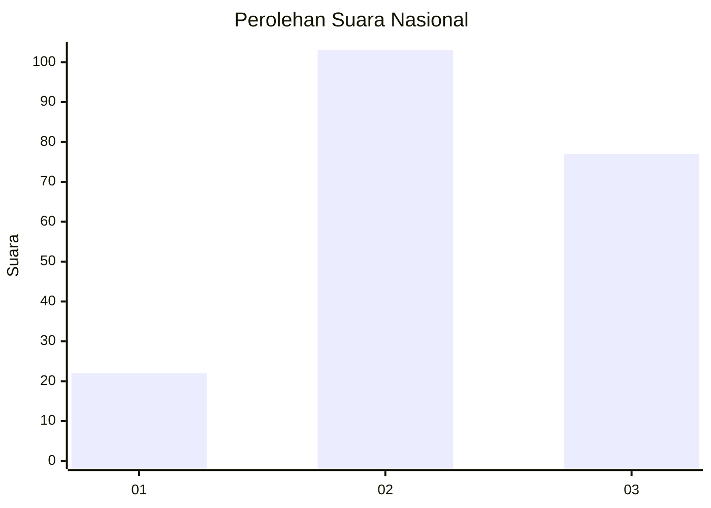
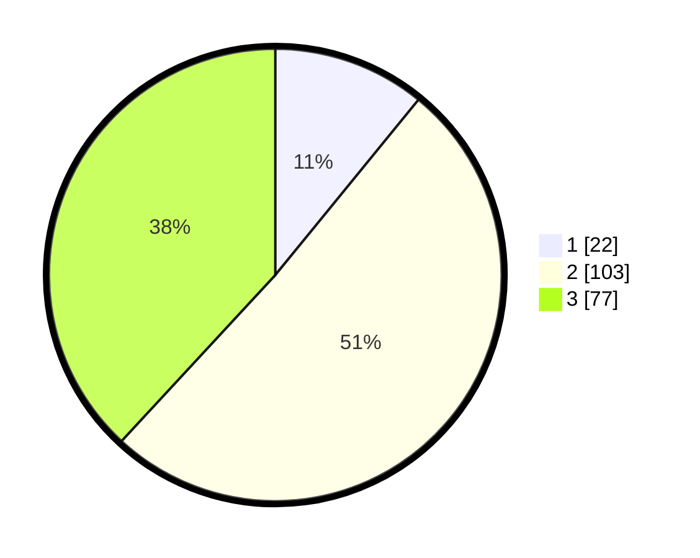

# Hasil

## Grafik

## Tabel

| No. | Nama Paslon    | Suara | Suara (raw) | Persentase |
|:--- |:-------------- | -----:| -----------:| ----------:|
| 1   | ANIES MUHAIMIN | 22    | [22][p-1]   | 10,89      |
| 2   | PRABOWO GIBRAN | 103   | [103][p-2]  | 50,99      |
| 3   | GANJAR MAHFUD  | 77    | [77][p-3]   | 38,12      |

[p-1]: https://github.com/gigit-pemilu/pemilu-2024/blob/main/pilpres/hitung-suara/sub/51-bali/sub/71-kota-denpasar/sub/02-denpasar-timur/sub/2001-dangin-puri-kelod/sub/011-tps/sub/paslon-1.txt
[p-2]: https://github.com/gigit-pemilu/pemilu-2024/blob/main/pilpres/hitung-suara/sub/51-bali/sub/71-kota-denpasar/sub/02-denpasar-timur/sub/2001-dangin-puri-kelod/sub/011-tps/sub/paslon-2.txt
[p-3]: https://github.com/gigit-pemilu/pemilu-2024/blob/main/pilpres/hitung-suara/sub/51-bali/sub/71-kota-denpasar/sub/02-denpasar-timur/sub/2001-dangin-puri-kelod/sub/011-tps/sub/paslon-3.txt

## Foto C Plano

https://sirekap-obj-formc.kpu.go.id/9b0e/pemilu/ppwp/51/71/02/20/01/5171022001011-20240214-211457--868383c1-906b-40f5-bd41-bf1edcd49c3a.jpg

https://sirekap-obj-formc.kpu.go.id/9b0e/pemilu/ppwp/51/71/02/20/01/5171022001011-20240214-211344--e5f48454-9986-47ec-b9f0-061a103c823e.jpg

https://sirekap-obj-formc.kpu.go.id/9b0e/pemilu/ppwp/51/71/02/20/01/5171022001011-20240214-211428--dc703416-39a8-47d8-81ec-b102175a31cc.jpg

## Metadata

| Key        | Value               |
| ---------- | ------------------- |
| Time Stamp | 2024-02-20 11:00:00 |

## DATA PEMILIH TETAP

Jumlah pemilih dalam DPT: **255**.
 * L: **135**.
 * P: **120**.

## DATA PENGGUNA HAK PILIH

Jumlah pengguna hak pilih dalam DPT: **196**.
 * L: **99**.
 * P: **97**.

Jumlah pengguna hak pilih dalam DPTb: **11**.
 * L: **6**.
 * P: **5**.

Jumlah pengguna hak pilih dalam DPK: **0**.
 * L: **0**.
 * P: **0**.

Jumlah pengguna hak pilih: **207**.
 * L: **105**.
 * P: **102**.

## JUMLAH SUARA SAH DAN TIDAK SAH

JUMLAH SELURUH SUARA SAH: **202**.

JUMLAH SUARA TIDAK SAH: **5**.

JUMLAH SELURUH SUARA SAH DAN SUARA TIDAK SAH: **207**.

