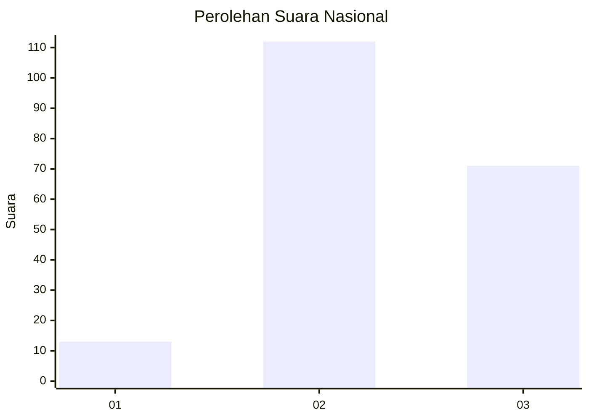
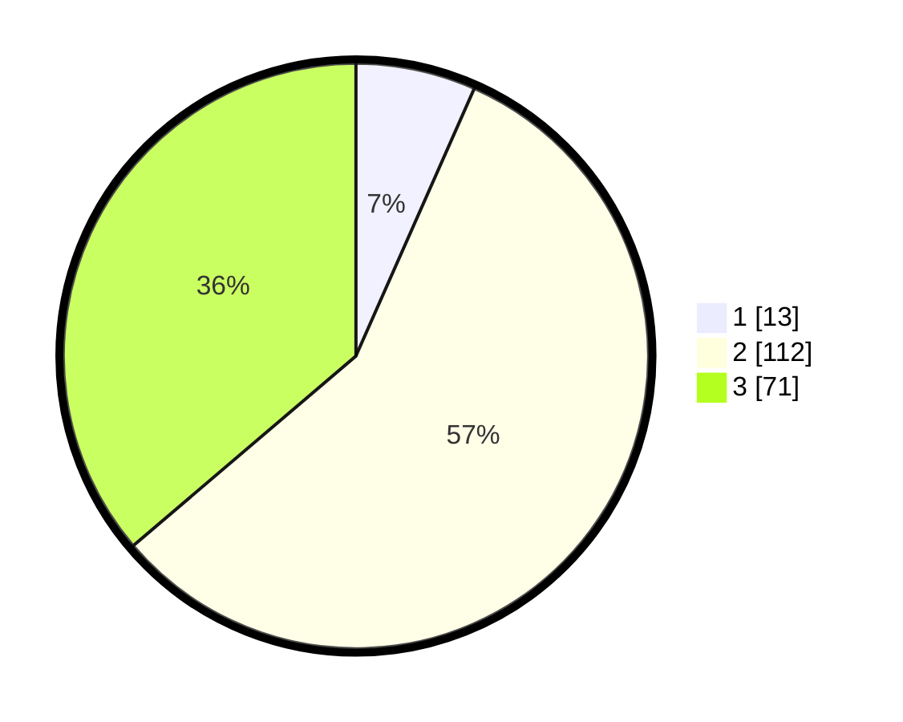

# Hasil

## Grafik

## Tabel

| No. | Nama Paslon    | Suara | Suara (raw) | Persentase |
|:--- |:-------------- | -----:| -----------:| ----------:|
| 1   | ANIES MUHAIMIN | 13    | [13][p-1]   | 6,63       |
| 2   | PRABOWO GIBRAN | 112   | [112][p-2]  | 57,14      |
| 3   | GANJAR MAHFUD  | 71    | [71][p-3]   | 36,22      |

[p-1]: https://github.com/gigit-pemilu/pemilu-2024/blob/main/pilpres/hitung-suara/sub/51-bali/sub/71-kota-denpasar/sub/02-denpasar-timur/sub/2001-dangin-puri-kelod/sub/014-tps/sub/paslon-1.txt
[p-2]: https://github.com/gigit-pemilu/pemilu-2024/blob/main/pilpres/hitung-suara/sub/51-bali/sub/71-kota-denpasar/sub/02-denpasar-timur/sub/2001-dangin-puri-kelod/sub/014-tps/sub/paslon-2.txt
[p-3]: https://github.com/gigit-pemilu/pemilu-2024/blob/main/pilpres/hitung-suara/sub/51-bali/sub/71-kota-denpasar/sub/02-denpasar-timur/sub/2001-dangin-puri-kelod/sub/014-tps/sub/paslon-3.txt

## Foto C Plano

https://sirekap-obj-formc.kpu.go.id/210a/pemilu/ppwp/51/71/02/20/01/5171022001014-20240214-141518--343e84e3-49fa-4d47-847b-1640e6d042a0.jpg

https://sirekap-obj-formc.kpu.go.id/210a/pemilu/ppwp/51/71/02/20/01/5171022001014-20240214-200807--c2643c9a-7ad8-445b-9f1d-022549e1ee1a.jpg

https://sirekap-obj-formc.kpu.go.id/210a/pemilu/ppwp/51/71/02/20/01/5171022001014-20240214-200827--7ba00ae6-706e-4915-a456-62235fd4a705.jpg

## Metadata

| Key        | Value               |
| ---------- | ------------------- |
| Time Stamp | 2024-02-24 22:31:28 |

## DATA PEMILIH TETAP

Jumlah pemilih dalam DPT: **269**.
 * L: **133**.
 * P: **136**.

## DATA PENGGUNA HAK PILIH

Jumlah pengguna hak pilih dalam DPT: **190**.
 * L: **95**.
 * P: **95**.

Jumlah pengguna hak pilih dalam DPTb: **4**.
 * L: **1**.
 * P: **3**.

Jumlah pengguna hak pilih dalam DPK: **6**.
 * L: **3**.
 * P: **3**.

Jumlah pengguna hak pilih: **200**.
 * L: **99**.
 * P: **101**.

## JUMLAH SUARA SAH DAN TIDAK SAH

JUMLAH SELURUH SUARA SAH: **196**.

JUMLAH SUARA TIDAK SAH: **4**.

JUMLAH SELURUH SUARA SAH DAN SUARA TIDAK SAH: **200**.

