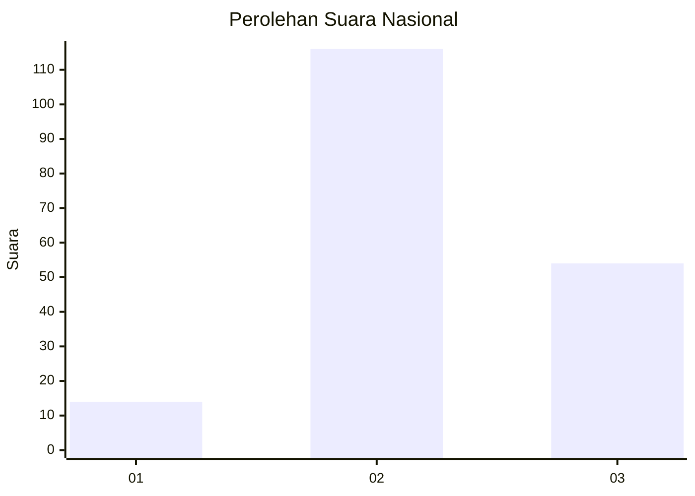
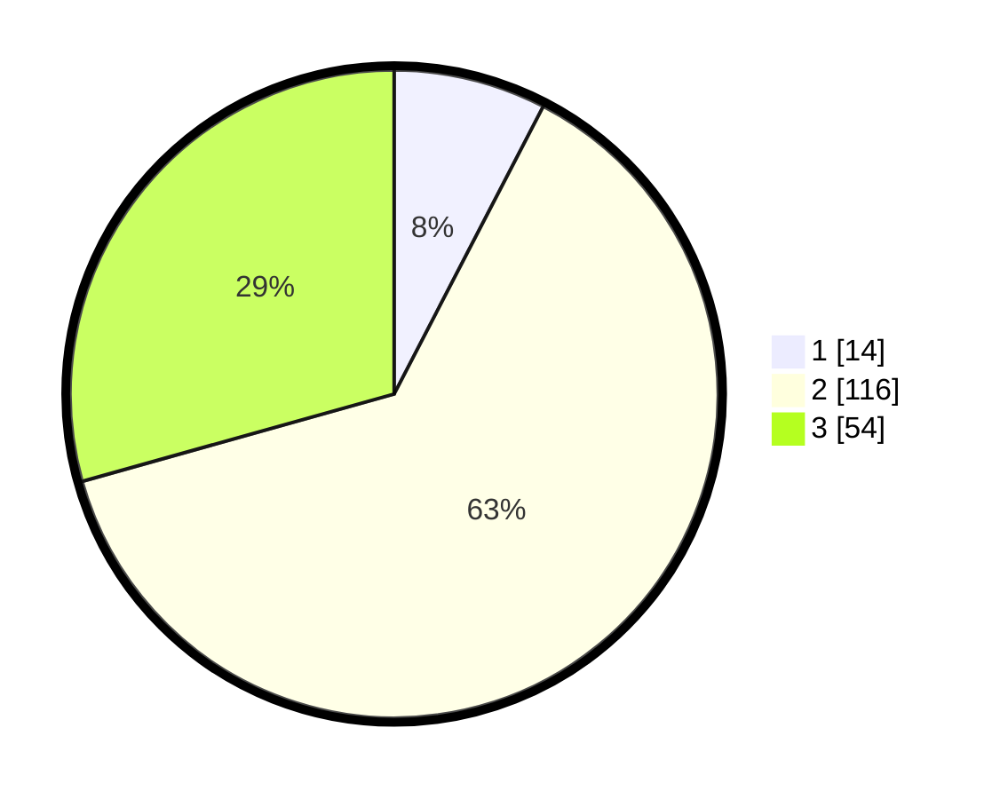

# Hasil

## Grafik

## Tabel

| No. | Nama Paslon    | Suara | Suara (raw) | Persentase |
|:--- |:-------------- | -----:| -----------:| ----------:|
| 1   | ANIES MUHAIMIN | 14    | [14][p-1]   | 7,61       |
| 2   | PRABOWO GIBRAN | 116   | [116][p-2]  | 63,04      |
| 3   | GANJAR MAHFUD  | 54    | [54][p-3]   | 29,35      |

[p-1]: https://github.com/gigit-pemilu/pemilu-2024/blob/main/pilpres/hitung-suara/sub/51-bali/sub/71-kota-denpasar/sub/02-denpasar-timur/sub/2001-dangin-puri-kelod/sub/015-tps/sub/paslon-1.txt
[p-2]: https://github.com/gigit-pemilu/pemilu-2024/blob/main/pilpres/hitung-suara/sub/51-bali/sub/71-kota-denpasar/sub/02-denpasar-timur/sub/2001-dangin-puri-kelod/sub/015-tps/sub/paslon-2.txt
[p-3]: https://github.com/gigit-pemilu/pemilu-2024/blob/main/pilpres/hitung-suara/sub/51-bali/sub/71-kota-denpasar/sub/02-denpasar-timur/sub/2001-dangin-puri-kelod/sub/015-tps/sub/paslon-3.txt

## Foto C Plano

https://sirekap-obj-formc.kpu.go.id/3a26/pemilu/ppwp/51/71/02/20/01/5171022001015-20240214-212423--10f8e22c-1f16-4407-a8a4-1c59e2f792b1.jpg

https://sirekap-obj-formc.kpu.go.id/3a26/pemilu/ppwp/51/71/02/20/01/5171022001015-20240214-212620--916dc85c-2b23-48bc-8d78-a9d306322150.jpg

https://sirekap-obj-formc.kpu.go.id/3a26/pemilu/ppwp/51/71/02/20/01/5171022001015-20240214-212732--da6cdddf-26bd-481e-9acf-af18a35744f8.jpg

## Metadata

| Key        | Value               |
| ---------- | ------------------- |
| Time Stamp | 2024-02-24 22:31:28 |

