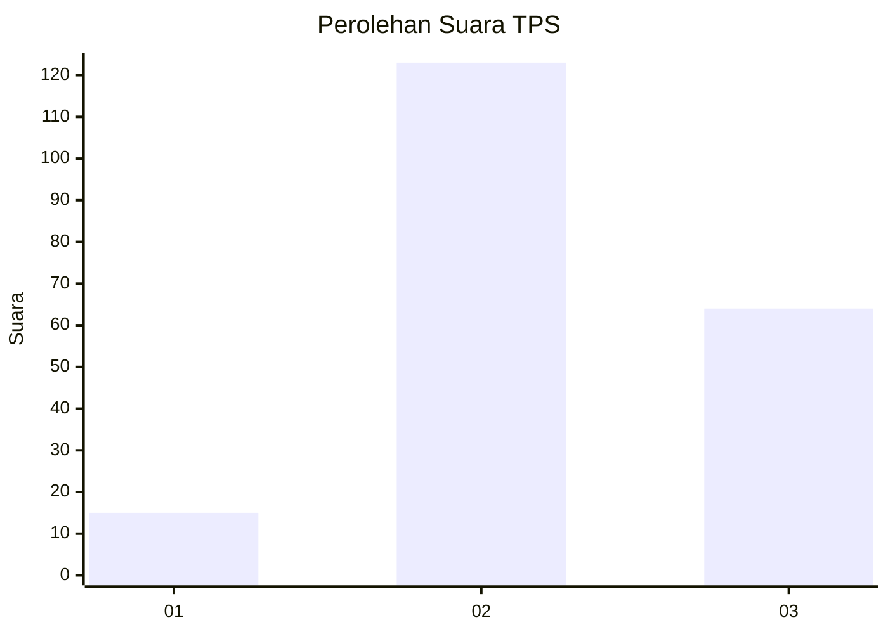
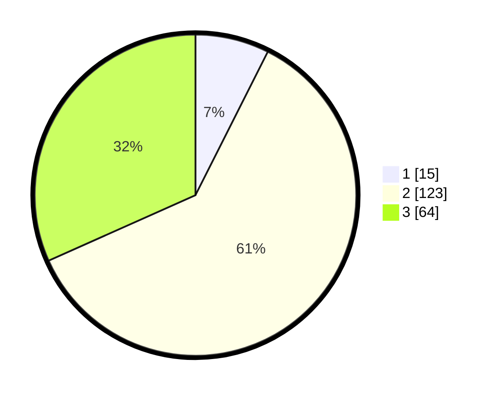

# Hasil

## Grafik

## Tabel

| No. | Nama Paslon    | Suara | Suara (raw) | Persentase |
|:--- |:-------------- | -----:| -----------:| ----------:|
| 1   | ANIES MUHAIMIN | 15    | [15][p-1]   | 7,43       |
| 2   | PRABOWO GIBRAN | 123   | [123][p-2]  | 60,89      |
| 3   | GANJAR MAHFUD  | 64    | [64][p-3]   | 31,68      |

[p-1]: https://github.com/gigit-pemilu/pemilu-2024-51-bali/blob/main/pilpres/hitung-suara/sub/51-bali/sub/71-kota-denpasar/sub/02-denpasar-timur/sub/2001-dangin-puri-kelod/sub/030-tps/sub/paslon-1.txt
[p-2]: https://github.com/gigit-pemilu/pemilu-2024-51-bali/blob/main/pilpres/hitung-suara/sub/51-bali/sub/71-kota-denpasar/sub/02-denpasar-timur/sub/2001-dangin-puri-kelod/sub/030-tps/sub/paslon-2.txt
[p-3]: https://github.com/gigit-pemilu/pemilu-2024-51-bali/blob/main/pilpres/hitung-suara/sub/51-bali/sub/71-kota-denpasar/sub/02-denpasar-timur/sub/2001-dangin-puri-kelod/sub/030-tps/sub/paslon-3.txt

## Foto C Plano

https://sirekap-obj-formc.kpu.go.id/b5d3/pemilu/ppwp/51/71/02/20/01/5171022001030-20240214-231715--46c411e5-6d27-4ba4-9c7a-adf8da3fbc6a.jpg

https://sirekap-obj-formc.kpu.go.id/b5d3/pemilu/ppwp/51/71/02/20/01/5171022001030-20240214-133357--d48971d1-9a43-4597-a400-00f6879cc7f8.jpg

https://sirekap-obj-formc.kpu.go.id/b5d3/pemilu/ppwp/51/71/02/20/01/5171022001030-20240214-133353--13cd752f-e6a4-4ecb-8ba6-cbf1376dd86e.jpg

## Metadata

| Key        | Value               |
| ---------- | ------------------- |
| Time Stamp | 2024-02-16 22:30:00 |

## DATA PEMILIH TETAP

Jumlah pemilih dalam DPT: **275**.
 * L: **133**.
 * P: **142**.

## DATA PENGGUNA HAK PILIH

Jumlah pengguna hak pilih dalam DPT: **202**.
 * L: **96**.
 * P: **106**.

Jumlah pengguna hak pilih dalam DPTb: **2**.
 * L: **0**.
 * P: **2**.

Jumlah pengguna hak pilih dalam DPK: **882**.
 * L: **1**.
 * P: **881**.

Jumlah pengguna hak pilih: **206**.
 * L: **97**.
 * P: **109**.

## JUMLAH SUARA SAH DAN TIDAK SAH

JUMLAH SELURUH SUARA SAH: **202**.

JUMLAH SUARA TIDAK SAH: **4**.

JUMLAH SELURUH SUARA SAH DAN SUARA TIDAK SAH: **206**.

