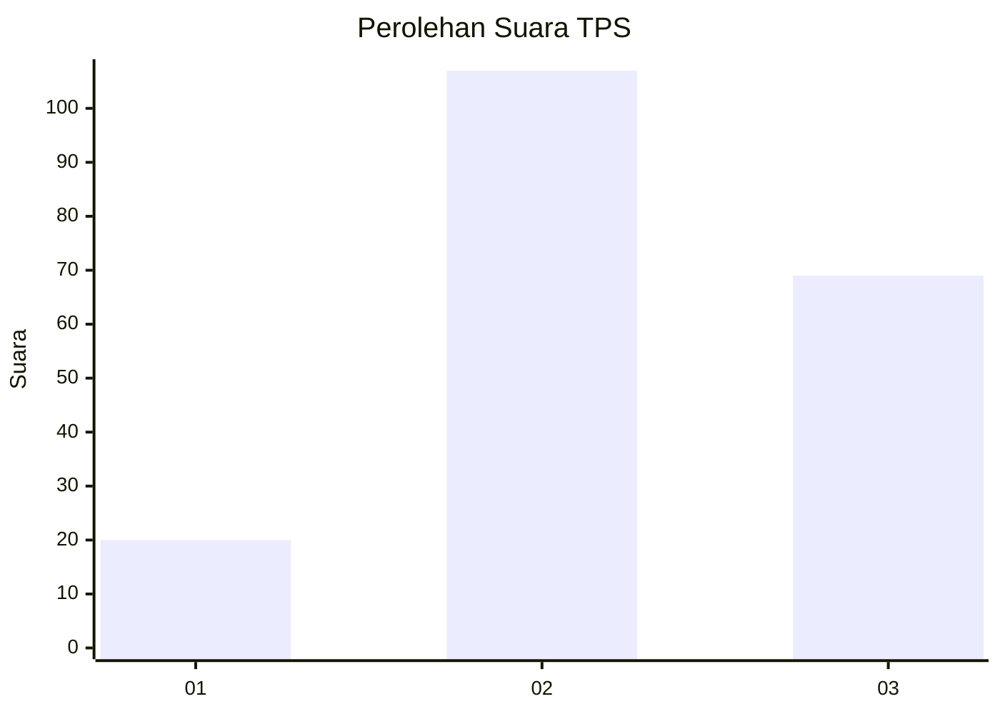
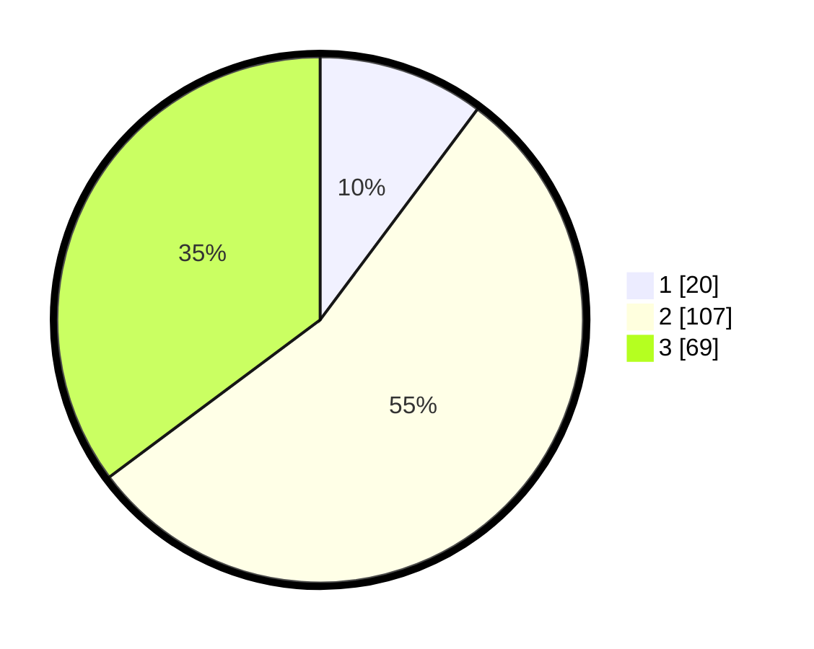

# Hasil

## Grafik

## Tabel

| No. | Nama Paslon    | Suara | Suara (raw) | Persentase |
|:--- |:-------------- | -----:| -----------:| ----------:|
| 1   | ANIES MUHAIMIN | 20    | [20][p-1]   | 10,20      |
| 2   | PRABOWO GIBRAN | 107   | [107][p-2]  | 54,59      |
| 3   | GANJAR MAHFUD  | 69    | [69][p-3]   | 35,20      |

[p-1]: https://github.com/gigit-pemilu/pemilu-2024-51-bali/blob/main/pilpres/hitung-suara/sub/51-bali/sub/71-kota-denpasar/sub/02-denpasar-timur/sub/2001-dangin-puri-kelod/sub/031-tps/sub/paslon-1.txt
[p-2]: https://github.com/gigit-pemilu/pemilu-2024-51-bali/blob/main/pilpres/hitung-suara/sub/51-bali/sub/71-kota-denpasar/sub/02-denpasar-timur/sub/2001-dangin-puri-kelod/sub/031-tps/sub/paslon-2.txt
[p-3]: https://github.com/gigit-pemilu/pemilu-2024-51-bali/blob/main/pilpres/hitung-suara/sub/51-bali/sub/71-kota-denpasar/sub/02-denpasar-timur/sub/2001-dangin-puri-kelod/sub/031-tps/sub/paslon-3.txt

## Foto C Plano

https://sirekap-obj-formc.kpu.go.id/f67e/pemilu/ppwp/51/71/02/20/01/5171022001031-20240216-193252--9b2f3f38-b74d-4d95-b0be-da7fb77f74b4.jpg

https://sirekap-obj-formc.kpu.go.id/f67e/pemilu/ppwp/51/71/02/20/01/5171022001031-20240214-132939--acd9ca0c-5f96-4d50-9857-2946fd455d14.jpg

https://sirekap-obj-formc.kpu.go.id/f67e/pemilu/ppwp/51/71/02/20/01/5171022001031-20240216-195741--60638fda-86f8-4270-aae2-5a8766f17490.jpg

## Metadata

| Key        | Value               |
| ---------- | ------------------- |
| Time Stamp | 2024-02-24 22:31:28 |

