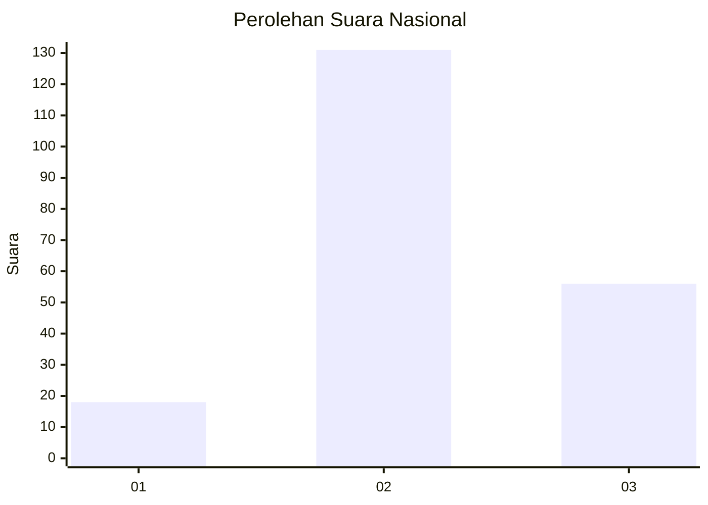
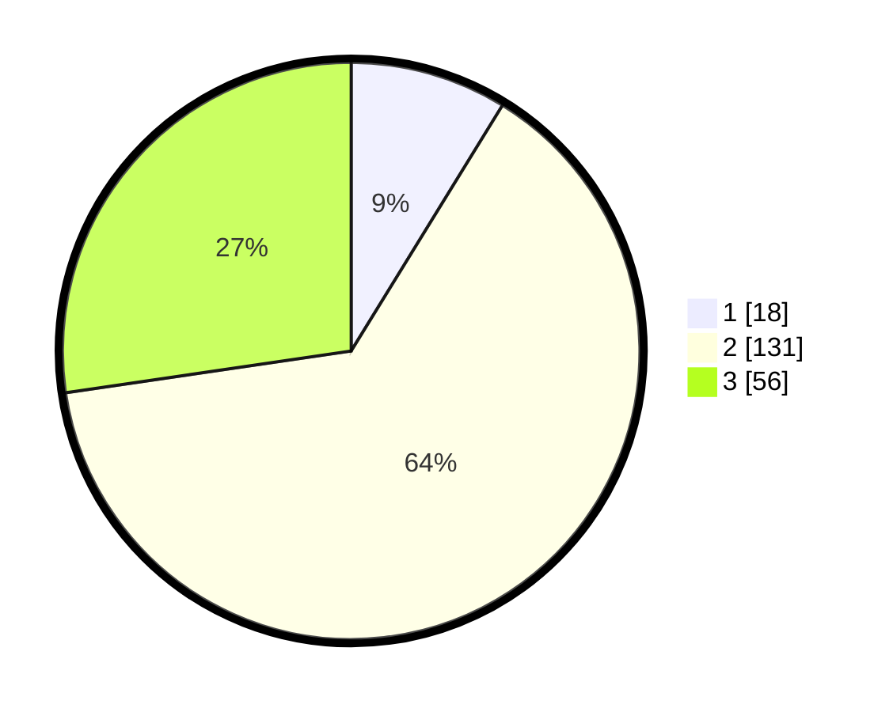

# Hasil

## Grafik

## Tabel

| No. | Nama Paslon    | Suara | Suara (raw) | Persentase |
|:--- |:-------------- | -----:| -----------:| ----------:|
| 1   | ANIES MUHAIMIN | 18    | [18][p-1]   | 8,78       |
| 2   | PRABOWO GIBRAN | 131   | [131][p-2]  | 63,90      |
| 3   | GANJAR MAHFUD  | 56    | [56][p-3]   | 27,32      |

[p-1]: https://github.com/gigit-pemilu/pemilu-2024/blob/main/pilpres/hitung-suara/sub/51-bali/sub/71-kota-denpasar/sub/02-denpasar-timur/sub/2001-dangin-puri-kelod/sub/033-tps/sub/paslon-1.txt
[p-2]: https://github.com/gigit-pemilu/pemilu-2024/blob/main/pilpres/hitung-suara/sub/51-bali/sub/71-kota-denpasar/sub/02-denpasar-timur/sub/2001-dangin-puri-kelod/sub/033-tps/sub/paslon-2.txt
[p-3]: https://github.com/gigit-pemilu/pemilu-2024/blob/main/pilpres/hitung-suara/sub/51-bali/sub/71-kota-denpasar/sub/02-denpasar-timur/sub/2001-dangin-puri-kelod/sub/033-tps/sub/paslon-3.txt

## Foto C Plano

https://sirekap-obj-formc.kpu.go.id/9f0b/pemilu/ppwp/51/71/02/20/01/5171022001033-20240214-141646--339b5bd1-78c4-484a-b691-12215f48c664.jpg

https://sirekap-obj-formc.kpu.go.id/9f0b/pemilu/ppwp/51/71/02/20/01/5171022001033-20240214-141724--350b2b6f-dd19-4bd4-ba6a-dcf9fe4dd7c4.jpg

https://sirekap-obj-formc.kpu.go.id/9f0b/pemilu/ppwp/51/71/02/20/01/5171022001033-20240214-141751--25d9c0d5-a841-4c0b-971b-73ccdfde00a3.jpg

## Metadata

| Key        | Value               |
| ---------- | ------------------- |
| Time Stamp | 2024-02-24 22:31:28 |

