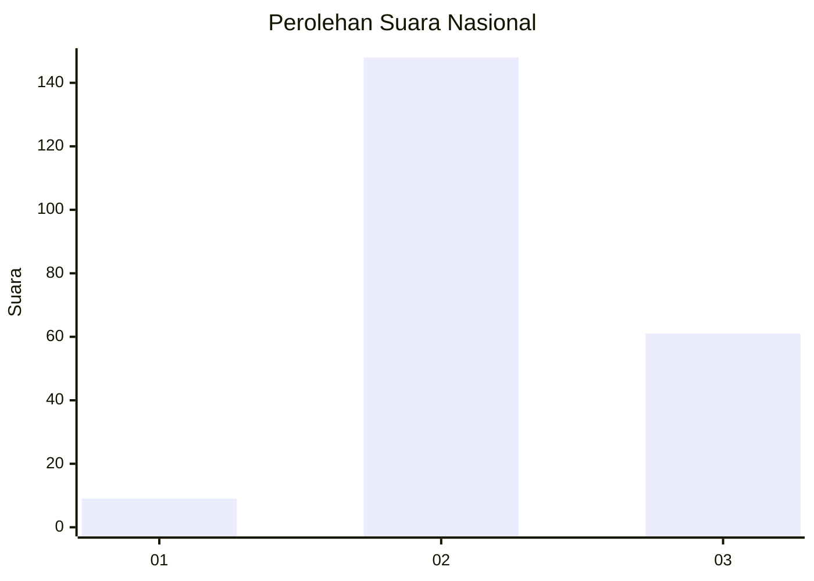
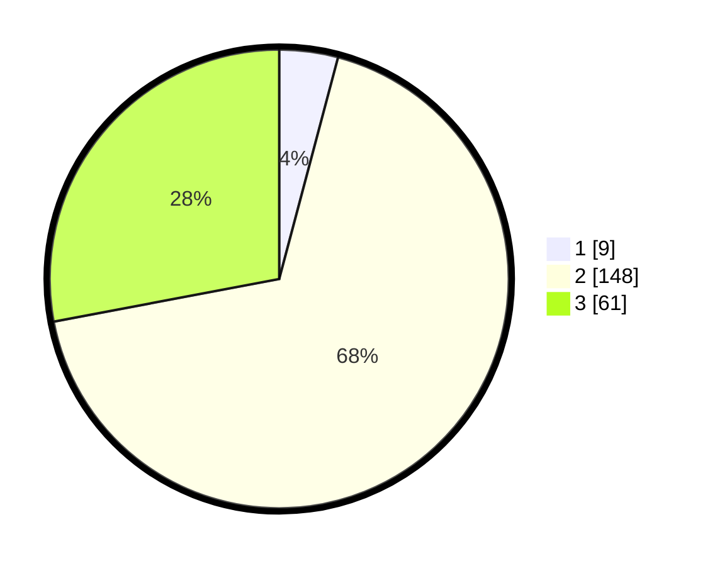

# Hasil

## Grafik

## Tabel

| No. | Nama Paslon    | Suara | Suara (raw) | Persentase |
|:--- |:-------------- | -----:| -----------:| ----------:|
| 1   | ANIES MUHAIMIN | 9     | [9][p-1]    | 4,13       |
| 2   | PRABOWO GIBRAN | 148   | [148][p-2]  | 67,89      |
| 3   | GANJAR MAHFUD  | 61    | [61][p-3]   | 27,98      |

[p-1]: https://github.com/gigit-pemilu/pemilu-2024/blob/main/pilpres/hitung-suara/sub/51-bali/sub/71-kota-denpasar/sub/02-denpasar-timur/sub/2001-dangin-puri-kelod/sub/034-tps/sub/paslon-1.txt
[p-2]: https://github.com/gigit-pemilu/pemilu-2024/blob/main/pilpres/hitung-suara/sub/51-bali/sub/71-kota-denpasar/sub/02-denpasar-timur/sub/2001-dangin-puri-kelod/sub/034-tps/sub/paslon-2.txt
[p-3]: https://github.com/gigit-pemilu/pemilu-2024/blob/main/pilpres/hitung-suara/sub/51-bali/sub/71-kota-denpasar/sub/02-denpasar-timur/sub/2001-dangin-puri-kelod/sub/034-tps/sub/paslon-3.txt

## Foto C Plano

https://sirekap-obj-formc.kpu.go.id/8111/pemilu/ppwp/51/71/02/20/01/5171022001034-20240214-141640--2022f8de-59da-4baa-8bdc-3f50f72eef49.jpg

https://sirekap-obj-formc.kpu.go.id/8111/pemilu/ppwp/51/71/02/20/01/5171022001034-20240214-141604--677f9c45-8f13-4d72-89ef-9fa7411f8e53.jpg

https://sirekap-obj-formc.kpu.go.id/8111/pemilu/ppwp/51/71/02/20/01/5171022001034-20240214-141659--86352817-e446-445c-a6e0-1e0384abf2a6.jpg

## Metadata

| Key        | Value               |
| ---------- | ------------------- |
| Time Stamp | 2024-02-24 22:31:28 |

