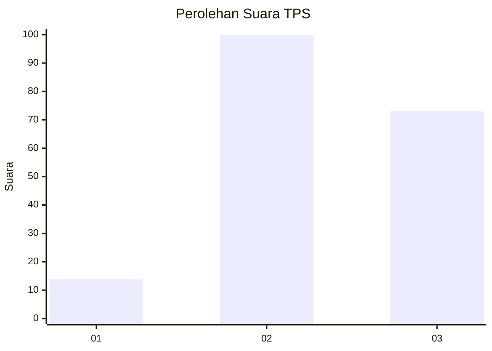
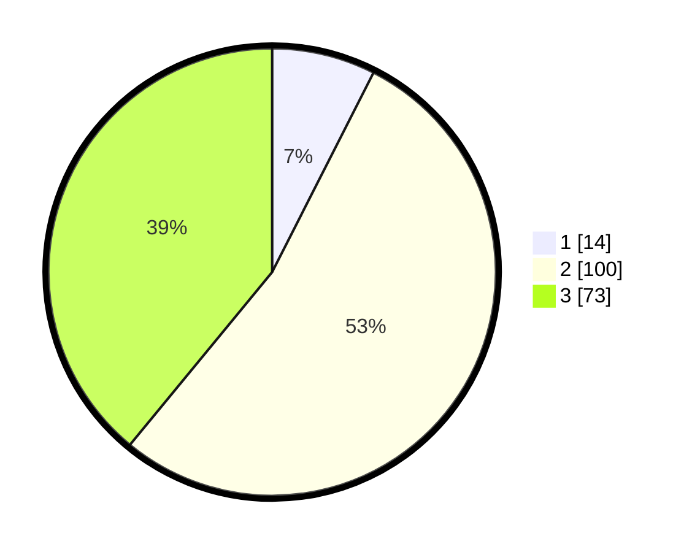

# Hasil

## Grafik

## Tabel

| No. | Nama Paslon    | Suara | Suara (raw) | Persentase |
|:--- |:-------------- | -----:| -----------:| ----------:|
| 1   | ANIES MUHAIMIN | 14    | [14][p-1]   | 7,49       |
| 2   | PRABOWO GIBRAN | 100   | [100][p-2]  | 53,48      |
| 3   | GANJAR MAHFUD  | 73    | [73][p-3]   | 39,04      |

[p-1]: https://github.com/gigit-pemilu/pemilu-2024-51-bali/blob/main/pilpres/hitung-suara/sub/51-bali/sub/71-kota-denpasar/sub/02-denpasar-timur/sub/2001-dangin-puri-kelod/sub/037-tps/sub/paslon-1.txt
[p-2]: https://github.com/gigit-pemilu/pemilu-2024-51-bali/blob/main/pilpres/hitung-suara/sub/51-bali/sub/71-kota-denpasar/sub/02-denpasar-timur/sub/2001-dangin-puri-kelod/sub/037-tps/sub/paslon-2.txt
[p-3]: https://github.com/gigit-pemilu/pemilu-2024-51-bali/blob/main/pilpres/hitung-suara/sub/51-bali/sub/71-kota-denpasar/sub/02-denpasar-timur/sub/2001-dangin-puri-kelod/sub/037-tps/sub/paslon-3.txt

## Foto C Plano

https://sirekap-obj-formc.kpu.go.id/be7d/pemilu/ppwp/51/71/02/20/01/5171022001037-20240214-220412--084b2d24-f4fc-4bbd-8965-f322e8d45632.jpg

https://sirekap-obj-formc.kpu.go.id/be7d/pemilu/ppwp/51/71/02/20/01/5171022001037-20240214-220441--27844553-64ab-4719-8f4b-dbcb84bcb785.jpg

https://sirekap-obj-formc.kpu.go.id/be7d/pemilu/ppwp/51/71/02/20/01/5171022001037-20240214-220458--0bf8b343-7678-4678-bcef-848536164190.jpg

## Metadata

| Key        | Value               |
| ---------- | ------------------- |
| Time Stamp | 2024-02-24 22:31:28 |

