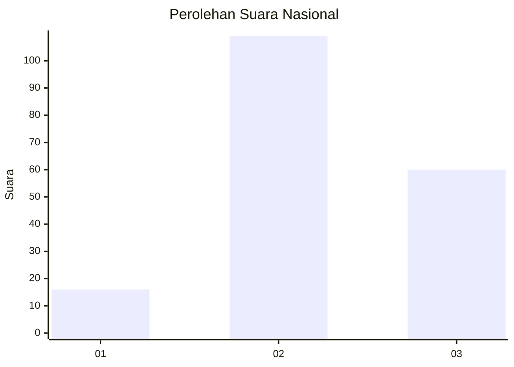
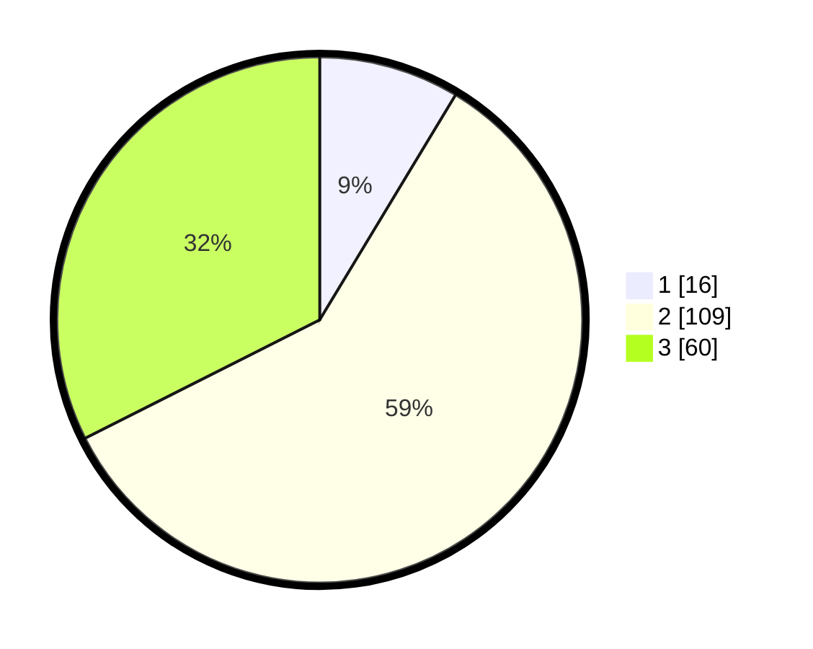

# Hasil

## Grafik

## Tabel

| No. | Nama Paslon    | Suara | Suara (raw) | Persentase |
|:--- |:-------------- | -----:| -----------:| ----------:|
| 1   | ANIES MUHAIMIN | 16    | [16][p-1]   | 8,65       |
| 2   | PRABOWO GIBRAN | 109   | [109][p-2]  | 58,92      |
| 3   | GANJAR MAHFUD  | 60    | [60][p-3]   | 32,43      |

[p-1]: https://github.com/gigit-pemilu/pemilu-2024/blob/main/pilpres/hitung-suara/sub/51-bali/sub/71-kota-denpasar/sub/02-denpasar-timur/sub/2002-sumerta-kelod/sub/001-tps/sub/paslon-1.txt
[p-2]: https://github.com/gigit-pemilu/pemilu-2024/blob/main/pilpres/hitung-suara/sub/51-bali/sub/71-kota-denpasar/sub/02-denpasar-timur/sub/2002-sumerta-kelod/sub/001-tps/sub/paslon-2.txt
[p-3]: https://github.com/gigit-pemilu/pemilu-2024/blob/main/pilpres/hitung-suara/sub/51-bali/sub/71-kota-denpasar/sub/02-denpasar-timur/sub/2002-sumerta-kelod/sub/001-tps/sub/paslon-3.txt

## Foto C Plano

https://sirekap-obj-formc.kpu.go.id/0ac7/pemilu/ppwp/51/71/02/20/02/5171022002001-20240216-185419--a62439a3-d48f-4295-b782-431381485844.jpg

https://sirekap-obj-formc.kpu.go.id/0ac7/pemilu/ppwp/51/71/02/20/02/5171022002001-20240216-192313--a942014c-3ef8-4354-8991-7ec8a9d50c03.jpg

https://sirekap-obj-formc.kpu.go.id/0ac7/pemilu/ppwp/51/71/02/20/02/5171022002001-20240216-193043--4ae633ef-98d1-4b54-97fb-31fa23959d9f.jpg

## Metadata

| Key        | Value               |
| ---------- | ------------------- |
| Time Stamp | 2024-02-20 11:00:00 |

## DATA PEMILIH TETAP

Jumlah pemilih dalam DPT: **254**.
 * L: **121**.
 * P: **133**.

## DATA PENGGUNA HAK PILIH

Jumlah pengguna hak pilih dalam DPT: **174**.
 * L: **82**.
 * P: **92**.

Jumlah pengguna hak pilih dalam DPTb: **12**.
 * L: **4**.
 * P: **8**.

Jumlah pengguna hak pilih dalam DPK: **0**.
 * L: **0**.
 * P: **0**.

Jumlah pengguna hak pilih: **186**.
 * L: **86**.
 * P: **100**.

## JUMLAH SUARA SAH DAN TIDAK SAH

JUMLAH SELURUH SUARA SAH: **185**.

JUMLAH SUARA TIDAK SAH: **1**.

JUMLAH SELURUH SUARA SAH DAN SUARA TIDAK SAH: **186**.

