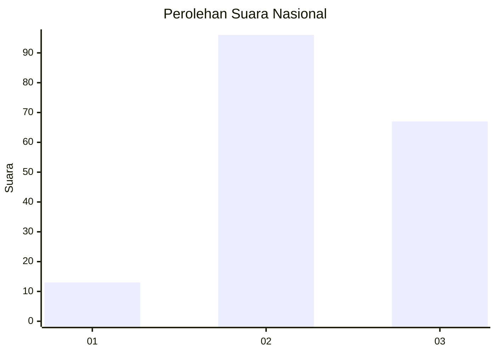
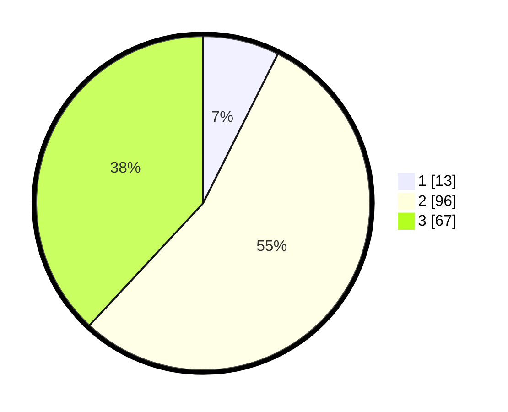

# Hasil

## Grafik

## Tabel

| No. | Nama Paslon    | Suara | Suara (raw) | Persentase |
|:--- |:-------------- | -----:| -----------:| ----------:|
| 1   | ANIES MUHAIMIN | 13    | [13][p-1]   | 7,39       |
| 2   | PRABOWO GIBRAN | 96    | [96][p-2]   | 54,55      |
| 3   | GANJAR MAHFUD  | 67    | [67][p-3]   | 38,07      |

[p-1]: https://github.com/gigit-pemilu/pemilu-2024/blob/main/pilpres/hitung-suara/sub/51-bali/sub/71-kota-denpasar/sub/02-denpasar-timur/sub/2002-sumerta-kelod/sub/002-tps/sub/paslon-1.txt
[p-2]: https://github.com/gigit-pemilu/pemilu-2024/blob/main/pilpres/hitung-suara/sub/51-bali/sub/71-kota-denpasar/sub/02-denpasar-timur/sub/2002-sumerta-kelod/sub/002-tps/sub/paslon-2.txt
[p-3]: https://github.com/gigit-pemilu/pemilu-2024/blob/main/pilpres/hitung-suara/sub/51-bali/sub/71-kota-denpasar/sub/02-denpasar-timur/sub/2002-sumerta-kelod/sub/002-tps/sub/paslon-3.txt

## Foto C Plano

https://sirekap-obj-formc.kpu.go.id/4131/pemilu/ppwp/51/71/02/20/02/5171022002002-20240215-023600--9df5f89b-e9ac-4a69-82de-275517956967.jpg

https://sirekap-obj-formc.kpu.go.id/4131/pemilu/ppwp/51/71/02/20/02/5171022002002-20240215-023052--4da3b145-1d6b-4d24-9969-0719b3a71fbf.jpg

https://sirekap-obj-formc.kpu.go.id/4131/pemilu/ppwp/51/71/02/20/02/5171022002002-20240215-023257--951dd3d7-fcad-4bf0-b016-72db871fab50.jpg

## Metadata

| Key        | Value               |
| ---------- | ------------------- |
| Time Stamp | 2024-02-24 22:31:28 |

## DATA PEMILIH TETAP

Jumlah pemilih dalam DPT: **252**.
 * L: **130**.
 * P: **122**.

## DATA PENGGUNA HAK PILIH

Jumlah pengguna hak pilih dalam DPT: **168**.
 * L: **86**.
 * P: **82**.

Jumlah pengguna hak pilih dalam DPTb: **10**.
 * L: **3**.
 * P: **7**.

Jumlah pengguna hak pilih dalam DPK: **1**.
 * L: **0**.
 * P: **1**.

Jumlah pengguna hak pilih: **179**.
 * L: **89**.
 * P: **90**.

## JUMLAH SUARA SAH DAN TIDAK SAH

JUMLAH SELURUH SUARA SAH: **176**.

JUMLAH SUARA TIDAK SAH: **3**.

JUMLAH SELURUH SUARA SAH DAN SUARA TIDAK SAH: **179**.

