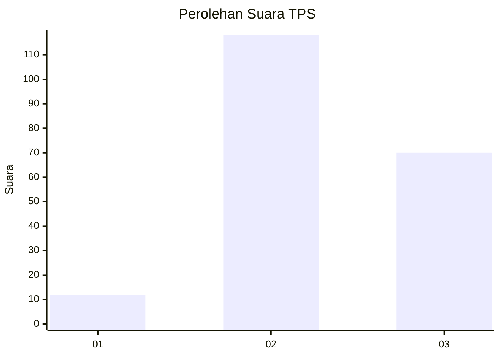
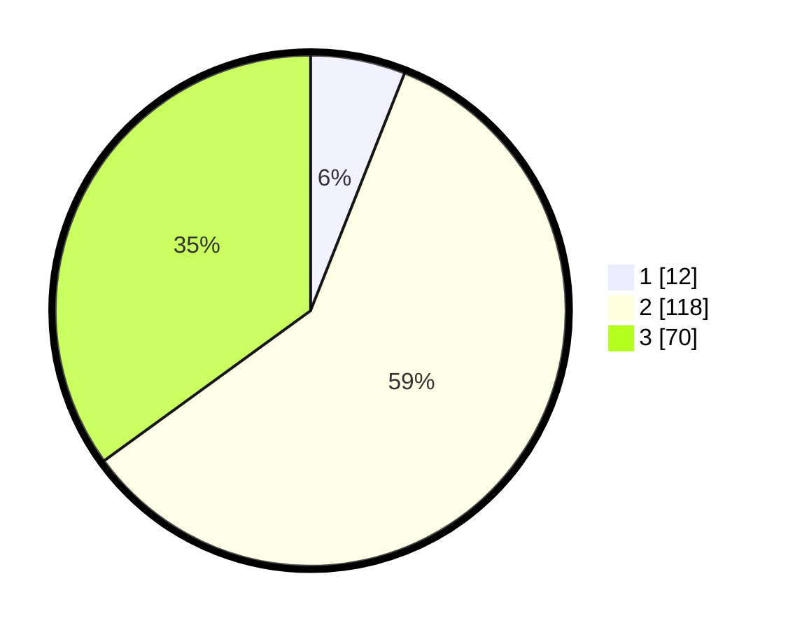

# Hasil

## Grafik

## Tabel

| No. | Nama Paslon    | Suara | Suara (raw) | Persentase |
|:--- |:-------------- | -----:| -----------:| ----------:|
| 1   | ANIES MUHAIMIN | 12    | [12][p-1]   | 6,00       |
| 2   | PRABOWO GIBRAN | 118   | [118][p-2]  | 59,00      |
| 3   | GANJAR MAHFUD  | 70    | [70][p-3]   | 35,00      |

[p-1]: https://github.com/gigit-pemilu/pemilu-2024-51-bali/blob/main/pilpres/hitung-suara/sub/51-bali/sub/71-kota-denpasar/sub/02-denpasar-timur/sub/2002-sumerta-kelod/sub/003-tps/sub/paslon-1.txt
[p-2]: https://github.com/gigit-pemilu/pemilu-2024-51-bali/blob/main/pilpres/hitung-suara/sub/51-bali/sub/71-kota-denpasar/sub/02-denpasar-timur/sub/2002-sumerta-kelod/sub/003-tps/sub/paslon-2.txt
[p-3]: https://github.com/gigit-pemilu/pemilu-2024-51-bali/blob/main/pilpres/hitung-suara/sub/51-bali/sub/71-kota-denpasar/sub/02-denpasar-timur/sub/2002-sumerta-kelod/sub/003-tps/sub/paslon-3.txt

## Foto C Plano

https://sirekap-obj-formc.kpu.go.id/2fa6/pemilu/ppwp/51/71/02/20/02/5171022002003-20240216-161612--66ae4310-efa1-472c-a1ec-c5e655dae030.jpg

https://sirekap-obj-formc.kpu.go.id/2fa6/pemilu/ppwp/51/71/02/20/02/5171022002003-20240216-161659--c1b30a9c-8518-43e9-bb2f-aad90f3a6cbe.jpg

https://sirekap-obj-formc.kpu.go.id/2fa6/pemilu/ppwp/51/71/02/20/02/5171022002003-20240216-161729--aa9e6bbc-92fa-49a8-9ff1-480f90d36925.jpg

## Metadata

| Key        | Value               |
| ---------- | ------------------- |
| Time Stamp | 2024-02-22 09:00:00 |

## DATA PEMILIH TETAP

Jumlah pemilih dalam DPT: **257**.
 * L: **130**.
 * P: **127**.

## DATA PENGGUNA HAK PILIH

Jumlah pengguna hak pilih dalam DPT: **168**.
 * L: **81**.
 * P: **87**.

Jumlah pengguna hak pilih dalam DPTb: **22**.
 * L: **8**.
 * P: **14**.

Jumlah pengguna hak pilih dalam DPK: **10**.
 * L: **3**.
 * P: **7**.

Jumlah pengguna hak pilih: **200**.
 * L: **92**.
 * P: **108**.

## JUMLAH SUARA SAH DAN TIDAK SAH

JUMLAH SELURUH SUARA SAH: **200**.

JUMLAH SUARA TIDAK SAH: **0**.

JUMLAH SELURUH SUARA SAH DAN SUARA TIDAK SAH: **200**.

