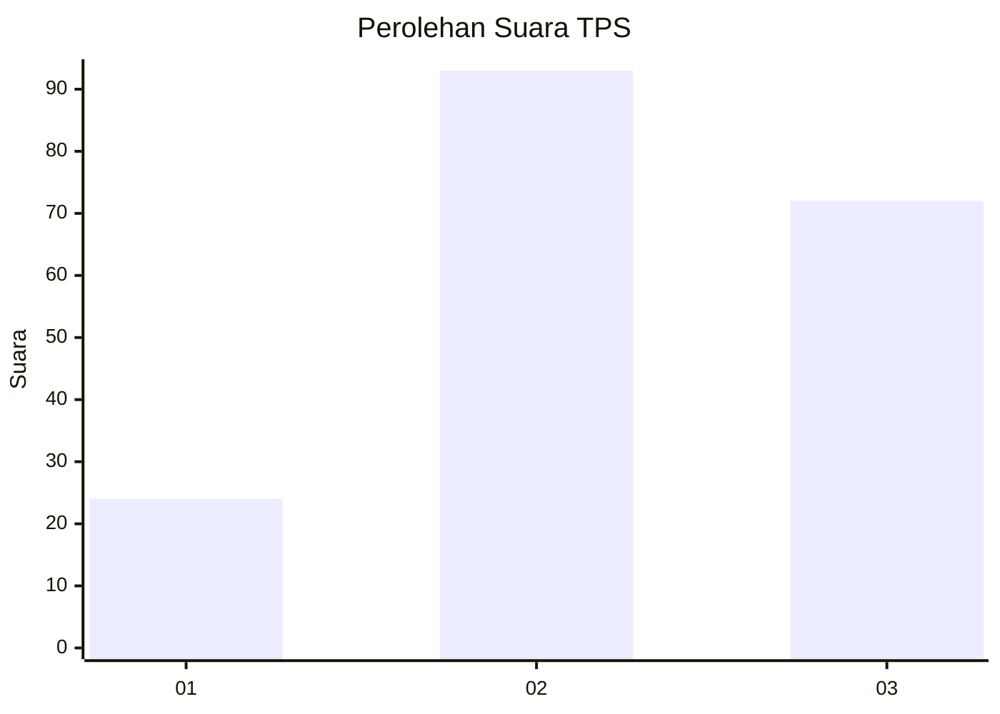
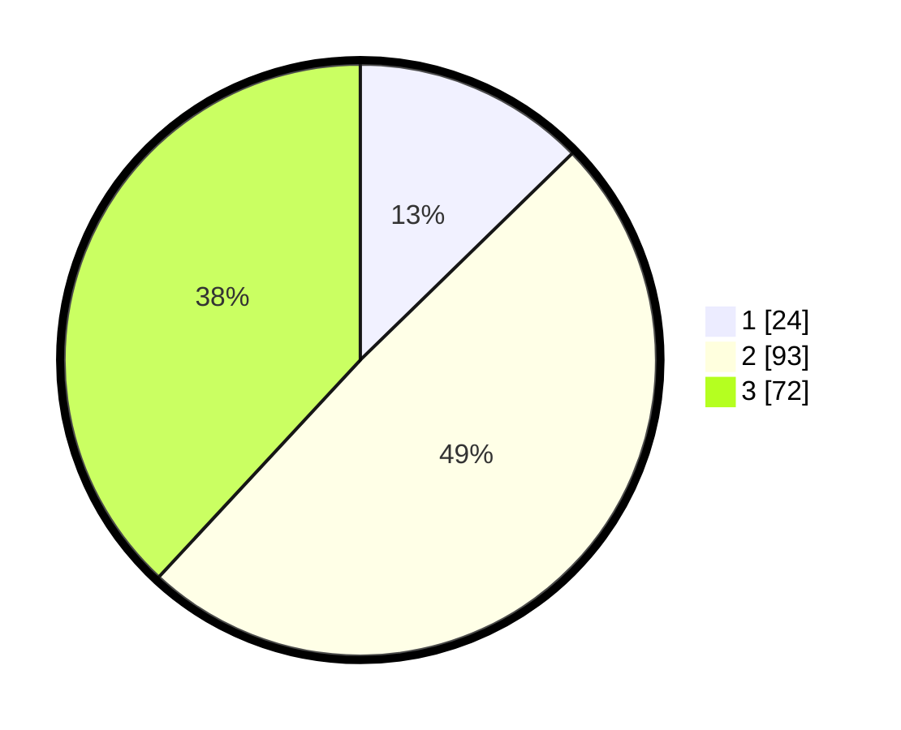

# Hasil

## Grafik

## Tabel

| No. | Nama Paslon    | Suara | Suara (raw) | Persentase |
|:--- |:-------------- | -----:| -----------:| ----------:|
| 1   | ANIES MUHAIMIN | 24    | [24][p-1]   | 12,70      |
| 2   | PRABOWO GIBRAN | 93    | [93][p-2]   | 49,21      |
| 3   | GANJAR MAHFUD  | 72    | [72][p-3]   | 38,10      |

[p-1]: https://github.com/gigit-pemilu/pemilu-2024-51-bali/blob/main/pilpres/hitung-suara/sub/51-bali/sub/71-kota-denpasar/sub/02-denpasar-timur/sub/2002-sumerta-kelod/sub/004-tps/sub/paslon-1.txt
[p-2]: https://github.com/gigit-pemilu/pemilu-2024-51-bali/blob/main/pilpres/hitung-suara/sub/51-bali/sub/71-kota-denpasar/sub/02-denpasar-timur/sub/2002-sumerta-kelod/sub/004-tps/sub/paslon-2.txt
[p-3]: https://github.com/gigit-pemilu/pemilu-2024-51-bali/blob/main/pilpres/hitung-suara/sub/51-bali/sub/71-kota-denpasar/sub/02-denpasar-timur/sub/2002-sumerta-kelod/sub/004-tps/sub/paslon-3.txt

## Foto C Plano

https://sirekap-obj-formc.kpu.go.id/2c67/pemilu/ppwp/51/71/02/20/02/5171022002004-20240219-200105--b3c17ab2-d3b3-4222-b8aa-fffd0aad6e7b.jpg

https://sirekap-obj-formc.kpu.go.id/2c67/pemilu/ppwp/51/71/02/20/02/5171022002004-20240219-201346--c4e9c479-2154-477e-a056-843c966116b3.jpg

https://sirekap-obj-formc.kpu.go.id/2c67/pemilu/ppwp/51/71/02/20/02/5171022002004-20240219-202223--deae739d-502a-46c0-9077-cf5bfd1a9bf2.jpg

## Metadata

| Key        | Value               |
| ---------- | ------------------- |
| Time Stamp | 2024-02-24 22:31:28 |

## DATA PEMILIH TETAP

Jumlah pemilih dalam DPT: **256**.
 * L: **122**.
 * P: **134**.

## DATA PENGGUNA HAK PILIH

Jumlah pengguna hak pilih dalam DPT: **178**.
 * L: **84**.
 * P: **94**.

Jumlah pengguna hak pilih dalam DPTb: **13**.
 * L: **4**.
 * P: **9**.

Jumlah pengguna hak pilih dalam DPK: **0**.
 * L: **0**.
 * P: **0**.

Jumlah pengguna hak pilih: **191**.
 * L: **88**.
 * P: **103**.

## JUMLAH SUARA SAH DAN TIDAK SAH

JUMLAH SELURUH SUARA SAH: **189**.

JUMLAH SUARA TIDAK SAH: **2**.

JUMLAH SELURUH SUARA SAH DAN SUARA TIDAK SAH: **191**.

