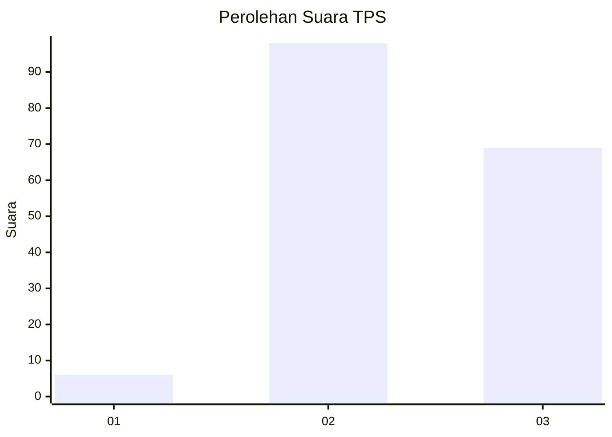
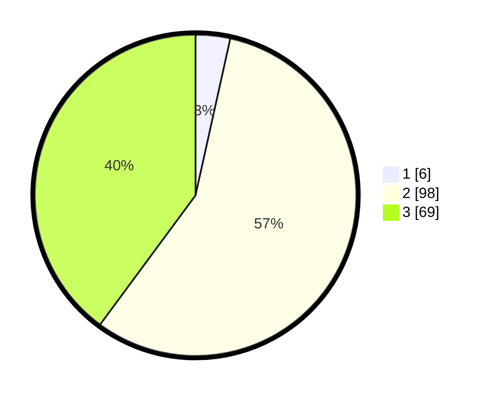

# Hasil

## Grafik

## Tabel

| No. | Nama Paslon    | Suara | Suara (raw) | Persentase |
|:--- |:-------------- | -----:| -----------:| ----------:|
| 1   | ANIES MUHAIMIN | 6     | [6][p-1]    | 3,47       |
| 2   | PRABOWO GIBRAN | 98    | [98][p-2]   | 56,65      |
| 3   | GANJAR MAHFUD  | 69    | [69][p-3]   | 39,88      |

[p-1]: https://github.com/gigit-pemilu/pemilu-2024-51-bali/blob/main/pilpres/hitung-suara/sub/51-bali/sub/71-kota-denpasar/sub/02-denpasar-timur/sub/2002-sumerta-kelod/sub/005-tps/sub/paslon-1.txt
[p-2]: https://github.com/gigit-pemilu/pemilu-2024-51-bali/blob/main/pilpres/hitung-suara/sub/51-bali/sub/71-kota-denpasar/sub/02-denpasar-timur/sub/2002-sumerta-kelod/sub/005-tps/sub/paslon-2.txt
[p-3]: https://github.com/gigit-pemilu/pemilu-2024-51-bali/blob/main/pilpres/hitung-suara/sub/51-bali/sub/71-kota-denpasar/sub/02-denpasar-timur/sub/2002-sumerta-kelod/sub/005-tps/sub/paslon-3.txt

## Foto C Plano

https://sirekap-obj-formc.kpu.go.id/9704/pemilu/ppwp/51/71/02/20/02/5171022002005-20240218-201554--7bd25cae-d12f-4e50-8cc3-e65eaa83fe64.jpg

https://sirekap-obj-formc.kpu.go.id/9704/pemilu/ppwp/51/71/02/20/02/5171022002005-20240220-162026--2356959a-7f08-46f0-b587-376efef4931c.jpg

https://sirekap-obj-formc.kpu.go.id/9704/pemilu/ppwp/51/71/02/20/02/5171022002005-20240219-114655--8707609e-6fc5-4545-a873-54f123e195dc.jpg

## Metadata

| Key        | Value               |
| ---------- | ------------------- |
| Time Stamp | 2024-02-21 16:00:00 |

## DATA PEMILIH TETAP

Jumlah pemilih dalam DPT: **235**.
 * L: **111**.
 * P: **124**.

## DATA PENGGUNA HAK PILIH

Jumlah pengguna hak pilih dalam DPT: **161**.
 * L: **80**.
 * P: **81**.

Jumlah pengguna hak pilih dalam DPTb: **11**.
 * L: **5**.
 * P: **6**.

Jumlah pengguna hak pilih dalam DPK: **3**.
 * L: **1**.
 * P: **2**.

Jumlah pengguna hak pilih: **175**.
 * L: **86**.
 * P: **89**.

## JUMLAH SUARA SAH DAN TIDAK SAH

JUMLAH SELURUH SUARA SAH: **173**.

JUMLAH SUARA TIDAK SAH: **2**.

JUMLAH SELURUH SUARA SAH DAN SUARA TIDAK SAH: **175**.

