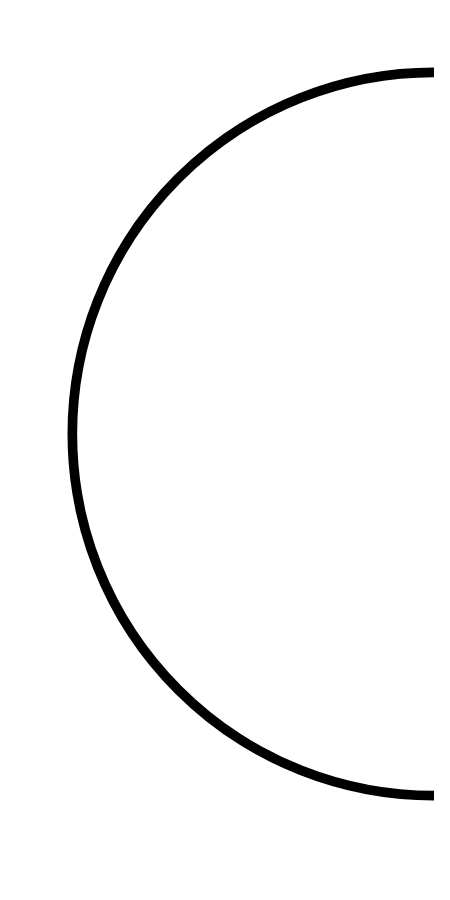

# Hasil

## Grafik

```mermaid
xychart-beta
    title "Perolehan Suara Nasional"
    x-axis []
    y-axis "Suara" 0 --> 0
    bar []
```



## Tabel

| No. | Nama Paslon | Suara | Suara (raw) | Persentase |
|:--- |:----------- | -----:| -----------:| ----------:|


[p-1]: https://github.com/gigit-pemilu/pemilu-2024/blob/main/pilpres/hitung-suara/sub/51-bali/sub/71-kota-denpasar/sub/02-denpasar-timur/sub/2002-sumerta-kelod/sub/006-tps/sub/paslon-1.txt
[p-2]: https://github.com/gigit-pemilu/pemilu-2024/blob/main/pilpres/hitung-suara/sub/51-bali/sub/71-kota-denpasar/sub/02-denpasar-timur/sub/2002-sumerta-kelod/sub/006-tps/sub/paslon-2.txt
[p-3]: https://github.com/gigit-pemilu/pemilu-2024/blob/main/pilpres/hitung-suara/sub/51-bali/sub/71-kota-denpasar/sub/02-denpasar-timur/sub/2002-sumerta-kelod/sub/006-tps/sub/paslon-3.txt

## Foto C Plano

https://sirekap-obj-formc.kpu.go.id/a16d/pemilu/ppwp/51/71/02/20/02/5171022002006-20240218-194056--35075bff-dce5-46c2-99dd-b2788c6ef5c3.jpg

https://sirekap-obj-formc.kpu.go.id/a16d/pemilu/ppwp/51/71/02/20/02/5171022002006-20240218-195328--4b1d11d1-2636-4496-a849-9783e4f25c15.jpg

https://sirekap-obj-formc.kpu.go.id/a16d/pemilu/ppwp/51/71/02/20/02/5171022002006-20240218-193521--a951ba73-3e83-45d1-ba22-90e3a385c041.jpg


## Metadata

| Key        | Value               |
| ---------- | ------------------- |
| Time Stamp | 2024-02-19 06:16:00 |


## DATA PEMILIH TETAP

Jumlah pemilih dalam DPT: **240**.
 * L: **116**.
 * P: **124**.

## DATA PENGGUNA HAK PILIH

Jumlah pengguna hak pilih dalam DPT: **166**.
 * L: **78**.
 * P: **88**.

Jumlah pengguna hak pilih dalam DPTb: **13**.
 * L: **7**.
 * P: **6**.

Jumlah pengguna hak pilih dalam DPK: **3**.
 * L: **2**.
 * P: **1**.

Jumlah pengguna hak pilih: **182**.
 * L: **87**.
 * P: **95**.

## JUMLAH SUARA SAH DAN TIDAK SAH

JUMLAH SELURUH SUARA SAH: **180**.

JUMLAH SUARA TIDAK SAH: **2**.

JUMLAH SELURUH SUARA SAH DAN SUARA TIDAK SAH: **182**.


